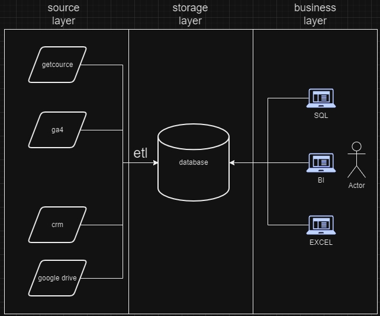

[Назад](../README.md)
# Модуль 1: Роль Аналитики в Организации
3 слоя архитектуры:

Source Layer - слой систем источников данных OLTP (Online Transactional Processing) - обработка транзакций; системы быстро работают на добавление данных в БД, но не рассчитаны на аналитические запросы; как правило данные создаются бизнес процессами; из первого слоя все данные поступают в хранилище данных;

Storage Layer - хранение данных для аналитики (DW, Data Lake, Data Platform); в хранилище данных желательно иметь два слоя: Staging - копия всех данных из первого слоя вместе; BL - модель данных;

Business Layer - слой доступа к данным для бизнес пользователей через инструменты BI (Tableau, Power BI, SAP BO, Excel, QlikView) или SQL. Происходит подключение к системам для просмотра отчётов.

Иногда используется ещё один слой - Processing/Compute Layer, где происходит трансформация данных перед загрузкой в хранилище.

## Домашнее задание:

В качестве домашнего задания нужно установить git,создать аккаунт на GitHub, нарисовать архитектуру решения в draw.io и построить дашборд на базе файлика, который нужно синхронизировать со своим локальным компьютером, используя git.

Решение:

На работе используется следующая архитектура аналитического решения:

