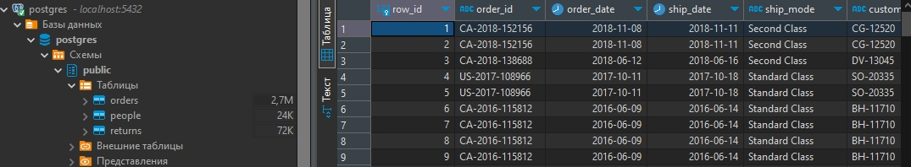

# Модуль 2: Базы данных и SQL

## Домашнее задание
1. Вам необходимо установить клиент SQL для подключения базы данных. Вы можете посмотреть инструкции по установки DBeaver. Так же вы можете использовать любой другой клиент для подключения к ваше БД.
2. Создайте 3 таблицы в БД и загрузите данные из Superstore Excel файл в вашу базу данных. Сохраните в вашем GitHub скрипт загрузки данных и создания таблиц.

[Данные магазина Superstore для загрузки](./assets/Sample%20-%20Superstore.xls)

### Решение
Необходимо подготовить скрипты для загрузки

1. [people.sql](./assets/people.sql)
2. [returns.sql](./assets/returns.sql)
3. [orders.sql](./assets/orders.sql)

С помощью DBeaver подключаемся к бд и последовательно выполяем вышеперечисленные скрипты. 

Резултат загрузки данных в БД

# 2.4: Модели Данных
## Задание
Вам необходимо нарисовать модель данных для нашего файлика Superstore:
- Концептуальную
- Логическую
- Физическую Вы можете использовать бесплатную версию SqlDBM или любой другой софт для создания моделей данных баз данных.

## Решение:
Модель данных по схеме "Звезда"
