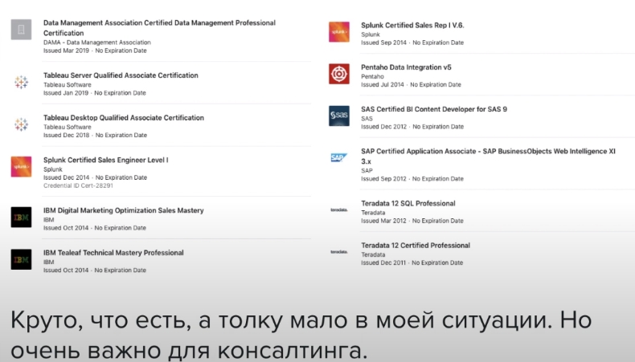

# Модуль 3: Визуализация данных, дашборды и отчетность - Business Intelligence

## 3.2. Что такое Business Intelligence (BI)

[BI](https://habr.com/ru/company/navicon/blog/250875/)

## 3.3. Обзор рынка решений BI
Бесплатные:
1. [Apache superset](https://superset.apache.org/)
2. [Redash](https://redash.io/)

Платные:

1. Power BI
2. Tableau

Для карьеры важно иметь опыт работы с известными инструментами (Power BI, Tableau). Например такие как "1с бизнес анализ" или "прогноз" на зарубежных рынках не используются. 

Также важно чтобы была возможность сертификации

Для MS PBI: Exam DA-100: Analyzing Data with Microsoft Power BI

Для Tableau: Specialist, Associete, Professional

Сертификаты автора курса:

