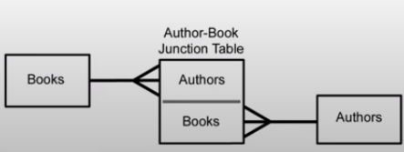
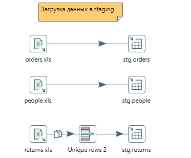
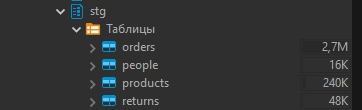
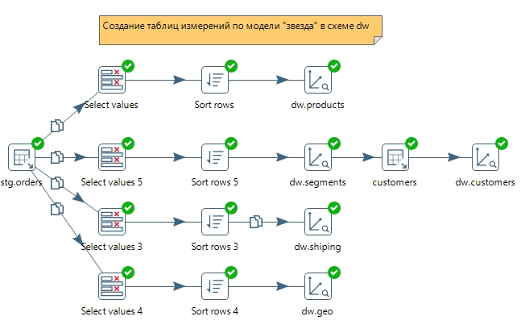
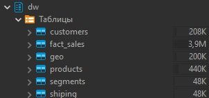
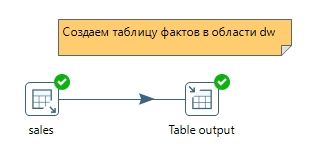

# Модуль 4: Интеграция и трансформация данных - ETL и ELT
## Рынок решений ETL
- AirFlow
- Apache NiFi
- Pentaho DI
- Azure Data Factory

## ETL подсистемы
### Data Delivery | 12 - Special Dimension Builder
Задача системы подобрать правильный тип для таблицы измерений (Dimension Table). Бывают следующие типы измерений:

- Junk Dimension - измерения, для которых нет своей таблицы. Часто это флаг "Yes/No" и другие измерения с низкой кардинальностью
- Mini Dimension - часто используются для разбивки гиганской таблицы измерения на более маленькие
- Shrunken or rolled dimension - дополнительная таблица измерений, созданая на базе существующей. Например для агрегированной таблицы фактов.
- Static dimension - LOOKUP таблица, которая крайне редко обновляется, часто вручную
- User maintained dimension - custom измерения, которые создаются пользователями

### Data Delivery | 15 - Multy-Valued Dimension Bridge Table Builder
Задача системы поддержать связки "многие-ко-многим" (many to many). 

Вопрос на собесе: как соединять таблицу фактов с таб измерений в которой со связью многие ко многим (\* : \*) ?

Ответ: с помощью bridge таблицы, таблица которая позволяет поддерживать связь \* : \*

## Практика
С помощью инструмента ETL построить модель данных типа "Звезда" (таблицы измерений и таблица фактов) на данных из модуля 2

Результат:

Читаем файл базы данных и загружаем данные в область staging

[Трансформация в staging](./assets/my_stage_orders.ktr)

Создаем слой модели данных dw

[Трансформация в dw](./assets/my_dim_tables.ktr)

Таблица фактов в слой dw

[Трансформация в dw](./assets/my_gen_fact_table.ktr)

Итоговый job

[job](./assets/my_job.kjb)

