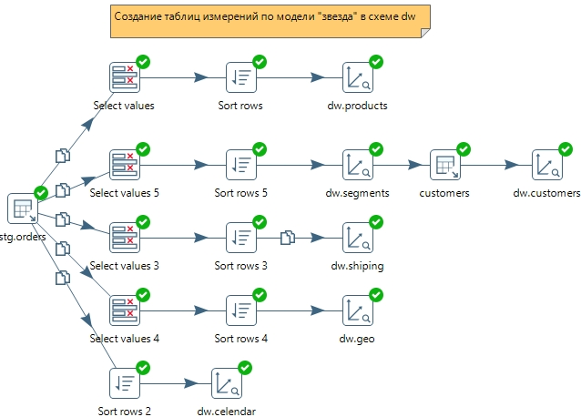

# Модуль 4: Интеграция и трансформация данных - ETL и ELT
## Рынок решений ETL
- AirFlow
- Apache NiFi
- Pentaho DI
- Azure Data Factory

## ETL подсистемы

### Data Extracting
#### 3 - Extracting System
Задача системы понять систему источник и уметь к ней подключаться, чтобы забирать данные:

- файлы (локально или удаленно, например FTP, Shared Folders)
- базы данных(коннектор, поддержка синтаксиса)
- приложения(CRM, ERP и другие). Внутри БД, но часто нужно использовать специальный коннектор
- web-based - api, RSS, HTTPS и другие

### Cleaning and Conforming Data
#### 4 - Data Cleaning and Quality Screen Handler System
Задача системы подготовить данные для анализа, необходимо очистить данные и проверить их качество, частые операции:

- замена NULL на "unknown" / "NA"
- форматирование даты и времени к общему формату
- unit tests(например, кол-во строк > 0)
- работа с текстом - UPPERCASE / LOWERCASE, TRIM и тп
- LOOKUP операции, чтобы использовать стандартизированные измерения
- валидация данных(например, email должен быть в правильном формате, город должен быть реальным и тп)

#### 5 - Error Event Handler
Задача системы отлавливать ошибки и принимать решения, что делать дальше, чтобы не сломать весь ETL процесс. Мы можем:

- пропустить плохие значения и загрузить хорошие
- записать плохие значения в лог или файл
- обработать плохие значения в отдельном job
- при сбое (например из-за отсутствия подключения), мы можем перезапустить job(операция retry)

#### 6 - Audit Data
Задача системы мониторить качество данных и выявлять отклонения

#### 7 - Dedublication System
Задача системы выявлять дубликаты записей (например, id, события и показатели) и устранять их. 

Пример SQL:

Таблица sales имеет гранулярность order_id. Каждый заказ уникален, чтобы выявить такие записи можно выполнить след. запрос:

    SELECT 
      order_id,
      count(*) AS rows
    FROM sales
    GROUP BY
      order_id
    HAVING count(*) > 1

#### 8 - Data Conformer
Задача системы согласовывать измерения и показатели из разных систем источников для использования их в отчетности (dimensions, measures) или data science (features / attributes)

### Data Delivery
#### 9 - Slowly Changing Dimension Processor
Задача системы отображать изменения в измерениях (dimension). Существует много типов изменений измерений (часто 6, но не удивляйтесь встретить SCD 7 и 8). Но важно знать 3 основных. Рассмотрим пример, в котором Боб жил в UK, а потом стал жить в US.

В зависимости от типа SCD мы можем отобразить это по разному:

- SCD Type 1 - наше измерение всегда имеет последнее значение. То есть, мы просто перезаписываем значение и нам не важно, какое было в прошлом                      

- SCD Type 2 - мы отслеживаем историю с помощью вспомогательных столбцов

- SCD Type 3 - мы сохраняем предыдущее значение в соседней колонке

#### 10 - Surrogate Key Creation System
Задача системы генерировать суррогатные ключи для наших натуральных ключей. Например, вместо номера заказа, у нас есть id заказа, вместо номера клиента мы создадим customer_id. Если из исходной системы приходит order_id, мы сделаем свой ключ - order_sur_id. Существуют следующие способы:

- использовать вычисление MAX(val) + 1
- исползовать SEQUENCE в БД
- использовать auto increment field

#### 11 - Hierarchy Dimension Builder
Задача системы создавать и поддерживать иерархии. Например:
- год, квартал, месяц, неделя, день
- категория, подкатегория, продукт

#### 12 - Special Dimension Builder
Задача системы подобрать правильный тип для таблицы измерений (Dimension Table). Бывают следующие типы измерений:

- Junk Dimension - измерения, для которых нет своей таблицы. Часто это флаг "Yes/No" и другие измерения с низкой кардинальностью
- Mini Dimension - часто используются для разбивки гиганской таблицы измерения на более маленькие
- Shrunken or rolled dimension - дополнительная таблица измерений, созданая на базе существующей. Например для агрегированной таблицы фактов.
- Static dimension - LOOKUP таблица, которая крайне редко обновляется, часто вручную
- User maintained dimension - custom измерения, которые создаются пользователями

#### 13 - Fact Table Loader
Задача системы выбрать правильный тип таблицы фатов:

- transaction grain fact table - классическая таблица фактов, где каждая строчка представляет какое-нибудь событие (заказ, звонок, клик, просмотр и тд)
- periodic snapshot fact table - мы делаем периодические снимки с заданным промежутком времени (день, месяц, неделя и тп)
- accumulation snapshot fact table - сводная таблица фактов моментального снимка: таблица фактов, в которой время и состояние из разных точек во времени помещаются как разные столбцы в одной строке. Строка описывает одного конкретного клиента.

#### 14 - Surrogate Key Pipeline
Задача системы использовать правильный суррогатный ключ при создании таблицы фактов.

Сначала мы заменяем натуральный ключ для Dimension и потом делаем Lookup операцию при загрузки в Хранилище

#### 15 - Multy-Valued Dimension Bridge Table Builder
Задача системы поддержать связки "многие-ко-многим" (many to many). 

Вопрос на собесе: как соединять таблицу фактов с таб измерений в которой со связью многие ко многим (\* : \*) ?

Ответ: с помощью bridge таблицы, таблица которая позволяет поддерживать связь \* : \*

#### 16 - Late-Arriving Data Handler
Задача системы обрабатывать данные Dimension, которые появились позже(late arriving). Обычно подходит для SCD-2 типа

#### 17 - Dimemsion Manager System
Задача системы упралять Dimensions

#### 18 - Fact Table Provide System
Задача системы управлять Fact Tables

#### 19 - Aggregate Builder
Задача системы создавать агригированные Fact Tables, для увелечения производительности запросов

#### 20 - Multidimensional (OLAP) Cube Builder
Задача системы создавать и управлять Multidimensional (OLAP) кубами. Пример системы - Microsoft Analysis Services

#### 21 - Data Integration Manager
Задача системы забирать данные из хранилища данных и загружать их в другие системы

## Практика
С помощью инструмента ETL построить модель данных типа "Звезда" (таблицы измерений и таблица фактов) на данных из модуля 2

Результат:

Читаем файл базы данных и загружаем данные в область staging

[Трансформация в staging](./assets/my_stage_orders.ktr)

Создаем слой модели данных dw

[Трансформация в dw](./assets/my_dim_tables.ktr)

Таблица фактов в слой dw

[Трансформация в dw](./assets/my_gen_fact_table.ktr)

Итоговый job

[job](./assets/my_job.kjb)

