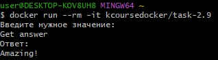
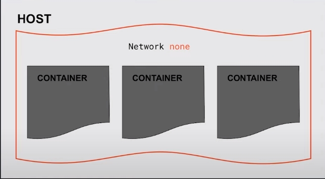
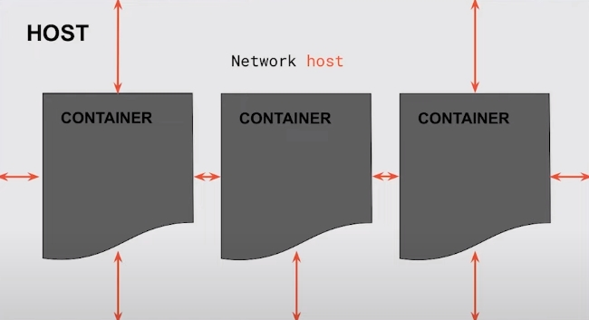
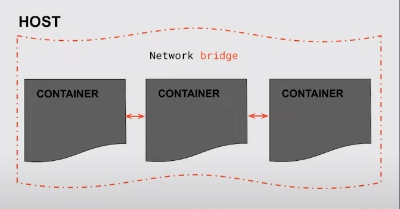
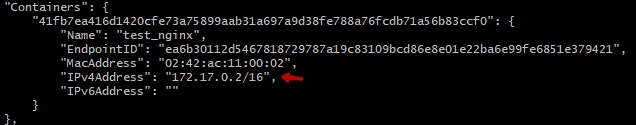

# Docker

## Контейнеры

### Запуск контейнера
С захватом терминала
```bash
docker run --name name_of_cont my_image
```

Без захвата терминала (в фоновом режиме)
```bash
docker run -d my_image
```

### Просмотр работающих контейнеров
```bash
docker ps
```

### Просмотр всех контейнеров
```bash
docker ps -a
```
Отображает все контейнеры, не только те которые сейчас работают, но и те которые остановились (например контейнер был запущен, но внутренний сервис не смог запуститься)

### Вход в работающий контейнер
```bash
docker exec -it my_cont bash
```
- i - интерактивный режим
- t - tty
- my_cont - название уже запущенного контейнра
- bash - какую команду запустить после захода в контейнер

### Интерактивное взаимодействие с контейнером
```sh
docker run -it image_name
```
Позволяет к примеру ввести значение через терминал для передачи его в программу контейнера


### Удаление контейнера
```sh
docker rm my_cont
```

### Остановка всех контейнеров
```shell
docker stop $(docker ps -q)
```
\$() - конструкция позволяет запустить внутри другую команду, в данном случае docker ps -q, который выводит все id контейнеров и так как мы вызываем stop, то докер гасит все запущенные контейнеры по id

### Commit контейнера
```sh
docker commit -a "author_name" -m "message" cont_name name_new_image
```
Позволяет сохранить текущее состояния контейнера. Т.е. делает из текущего состояния новый образ. Это полезно для того, что не устанавливать повторно программы каждый раз при запуске нового контейнера

## Образы
### Список образов
```sh
docker images
```
```sh
docker images ls
```

### Удалить образ
```sh
docker rmi my_image
```

### Узнать размер образов на диске
```sh
docker system df
```
Отображает информацию о занимаемом объеме на дисковом пространстве

### Создание своих образов
При определении файла сборки Dockerfile необходимо учитывать расположение команд. Более константные команды должны быть вверху, те которые подвержены изменению распологать ниже. Это нужно для того, чтобы оптимизировать сборку (слои в таком случае переиспользуются, т.к. docker будет брать пред. слои из кэша)

Пример простого файла сборки:

    FROM nginx                      # образ на основе которого делаем сборку
    
    # если нужно выполнить команды сборки, то указываем в RUN
    # RUN apt-get update && apt-get install -y vim wget curl git

    WORKDIR /home/my_home           # указываем раб. каталог
    COPY ./my_script.sh ./          # копируем файл в контейнер каталога WORKDIR
    ENTRYPOINT ["./my_script.sh"]   # запускаем скопированный скрипт при поднятии контейнера, 
                                      фиксировання точка входа
    CMD ["test"]                    # параметры по умолчанию для передачи в фикс. точку в ENTRYPOINT


Запуск сборки образа:
```sh
docker build -t image_name:version .
```

#### История изменения образа
```sh
docker history -H image_name
```
Позволяет увидеть последовательность слоев, которые были добавлены или изменены, чтобы создать текущий образ. Каждый слой представляет собой отдельное изменение или действие, такое как добавление файлов, установка пакетов или выполнение команд.

#### dockerignore
Файлы которые не должны попасть в сборку обязательно записываем в файл .dockerignore. Иначе это будет тормозить процесс сборки.

## Работа с файлами
Docker для сохранения данных вне жизненного цикла контейнера использует тома. Они позволяют сохранять данные даже после удаления контейнера.

### Создание volume
```sh
docker volume create <имя_тома> 
```
Создает том в системе докера, его можно использовать повторно в других контейнерах. В данном случае томом управляет докер (его видно в docker desctop)

### Прокинуть файл или каталог хоста в контейнер
```sh
docker run -v /home/user/data:/data my_image
```

или можно указать системный volume созданный с помощью docker volume crate
```sh
docker run -v volume_name:/data my_image
```

### Концепция Docker-in-Docker
При помощи bind mount можно прокинуть сокет докера, в результате чего мы получим доступ к демону внутри контейнера.

Такое может понадобиться, например, в CI/CD (про это поговорим в последнем уроке). Если кратко — нужно уметь внутри контейнера запускать, например, сборку образа (docker build).

При этом такой подход довольно опасен, поэтому нужно быть очень аккуратным!

Подробнее можно посмотреть вот тут:
- [stackoverflow](https://stackoverflow.com/questions/35110146/what-is-the-purpose-of-the-file-docker-sock)
- [оригинал статьи](https://jpetazzo.github.io/2015/09/03/do-not-use-docker-in-docker-for-ci/)
- [перевод статьи](https://habr.com/ru/companies/ua-hosting/articles/488536/)

Для этого понадобится образ [докера](https://hub.docker.com/_/docker)

А также нужно будет сделать bind mount как раз сокета:
```sh
docker run -it --rm -v /var/run/docker.sock:/var/run/docker.sock docker
```

На хосте остановите и удалите контейнер с редисом, если он у вас поднят (docker stop redis и docker rm redis). В общем чтоб у вас не было конфликта име

Затем зайдите в этот контейнер и выполните команду 
```sh
docker run --rm -d --name redis redis
```

На хосте появится контейнер с именем redis

### Удаление volume
```sh
docker volume prune
```
Удаляет все тома которые не используются в контейнерах, если volume используется в каком-нибудь контейнере, то он не будет удален

### Скопировать файл из контейнера
```sh
 docker cp nginx:/etc/nginx/nginx.conf ./nginx.conf
```

## Переменные окружения
### Прокинуть переменные окружения в контейнер
```sh
docker run --rm -it --env-file ./.env ubuntu
```
В каталоге должен быть файл .env с переменными окружения в виде VAR_NAME=VALUE

## Логи
Логи могут записываться в стандартный поток вывода(stdout) и в стандартный поток ошибок(stderror). Необходимо это учитывать при просмотре логов с помощью grep, head, tail. Эти команды ловят стандартный поток вывода.

Вывод 5 логов, если они писались в stderror и в stdout - то все равно выведется все.
```sh
docker logs lib | head -n 5
```

Чтобы исправить это, необходимо перенаправить stderror в stdout для команд head, tail, grep
```sh
docker logs lib 2>&1 | grep ERROR
# 2> - стандартный поток ошибок(stderror)
# &1 - стандартный поток вывода(stdout)
```

Просмотр всех логов контейнера
```sh
# вывод логов
docker logs my_container > logs.log

# следовать за логами, не отключаться
docker logs -f my_container > logs.log

# добавить время к логам
docker logs -t my_container > logs.log

# подсчет кол-ва строк
cat logs.log | wc -l
```
[Дополнительно](https://docs.docker.com/config/containers/logging/)

## Порты
```sh
docker run -p <порт_на_хосте>:<порт_в_контейнере> img_name
```
связывает порт внутри контейнера с портом на хосте.

EXPOSE - инструкция в Dockerfile, которая позволяет сообщить пользователю, какой(ие) порт(ы) слушает приложение внутри контейнера. Не прокидывает порты на хост

## Сети
Существуют:

- none
- host
- bridge
- overlay
- ipvlan
- macvlan
- Network plugins

### none
Полная изоляция от сети. Из сети интернет нет доступа к контейнеру и наоборот


### host
Убираем сетевую изоляцию. Мы говорим контейнеру, что ты теперь хост.


### bridge
В эту сеть контейнеры попадают по умолчанию. Контейнеры могут взаимодействовать друго с другом при этом обеспечивается внешняя изоляция от сети интернет. Изоляция достигается за счет блокирования портов и сети докера.


### Работа с сетью
```sh
docker network ls               # список сетей
docker inspect bridge           # информция об объектах сети, здесь же можно узнать ip контейнера
docker network create name_net  # создание кастомной сети на основе bridge
docker run --name name_of_cont --net=name_net my_image  # указываем какую сеть использовать при запуске
```
ip адрес контейнера test_nginx



Найденый ip адрес позволяет получить доступ к контейнеру не только из другого контейнера, но и с хоста в контейнер:
```sh
curl 172.17.0.2
```
Дополнительно:
- [Networking overview](https://docs.docker.com/network/)
- [Docker networking](https://www.youtube.com/watch?v=bKFMS5C4CG0)
- [как Docker использует iptables и интерфейсы Linux](https://habr.com/ru/articles/333874/)

### Кастомные сети
С помощью 
```sh
docker network create net_name
```
создаются кастомные сети. Они изолированы от других сетей. 

Самое главное приемущество кастомных сетей - это то, что вместо ip можно обращаться к сервису контейнера по имени контейнера, например:
```sh
curl my_cont:8080/test  # запрашиваем страницу через имя контейнера из другого контейнера в той же сети
```
в данном случае нам не нужно знать какой ip адрес имеет контейнер к которому нужно обратиться, досаточно знать его имя(к тому же ip адрес может изменить система)

С этого момента имена контейнера очень важны, нужно всега их указывать

Запуск контейнера с использованием кастомных сетей:
```sh
docker run --name name_of_cont --net=name_net my_image  # указываем какую сеть использовать при запуске
```