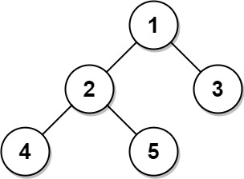

[back](../README.md)

# Database
## 175. Combine Two Tables

Write a solution to report the first name, last name, city, and state of each person in the Person table. If the address of a personId is not present in the Address table, report null instead.

Return the result table in any order.

The result format is in the following example.

    Example 1:

    Input: 
    Person table:
    +----------+----------+-----------+
    | personId | lastName | firstName |
    +----------+----------+-----------+
    | 1        | Wang     | Allen     |
    | 2        | Alice    | Bob       |
    +----------+----------+-----------+
    Address table:
    +-----------+----------+---------------+------------+
    | addressId | personId | city          | state      |
    +-----------+----------+---------------+------------+
    | 1         | 2        | New York City | New York   |
    | 2         | 3        | Leetcode      | California |
    +-----------+----------+---------------+------------+
    Output: 
    +-----------+----------+---------------+----------+
    | firstName | lastName | city          | state    |
    +-----------+----------+---------------+----------+
    | Allen     | Wang     | Null          | Null     |
    | Bob       | Alice    | New York City | New York |
    +-----------+----------+---------------+----------+
    Explanation: 
    There is no address in the address table for the personId = 1 so we return null in their city and state.
    addressId = 1 contains information about the address of personId = 2.

[Solution](./assets/175.sql)

## 181. Employees Earning More Than Their Managers
Write a solution to find the employees who earn more than their managers.

Return the result table in any order.

The result format is in the following example.

    Example 1:

    Input: 
    Employee table:
    +----+-------+--------+-----------+
    | id | name  | salary | managerId |
    +----+-------+--------+-----------+
    | 1  | Joe   | 70000  | 3         |
    | 2  | Henry | 80000  | 4         |
    | 3  | Sam   | 60000  | Null      |
    | 4  | Max   | 90000  | Null      |
    +----+-------+--------+-----------+
    Output: 
    +----------+
    | Employee |
    +----------+
    | Joe      |
    +----------+
    Explanation: Joe is the only employee who earns more than his manager.

[Solution](./assets/181.sql)

## 182. Duplicate Emails
Write a solution to report all the duplicate emails. Note that it's guaranteed that the email field is not NULL.

Return the result table in any order.

The result format is in the following example.

    Example 1:

    Input: 
    Person table:
    +----+---------+
    | id | email   |
    +----+---------+
    | 1  | a@b.com |
    | 2  | c@d.com |
    | 3  | a@b.com |
    +----+---------+
    Output: 
    +---------+
    | Email   |
    +---------+
    | a@b.com |
    +---------+
    Explanation: a@b.com is repeated two times.

[Solution](./assets/182.sql)

## 197. Rising Temperature
Write a solution to find all dates' Id with higher temperatures compared to its previous dates (yesterday).

Return the result table in any order.

The result format is in the following example.

    Example 1:

    Input: 
    Weather table:
    +----+------------+-------------+
    | id | recordDate | temperature |
    +----+------------+-------------+
    | 1  | 2015-01-01 | 10          |
    | 2  | 2015-01-02 | 25          |
    | 3  | 2015-01-03 | 20          |
    | 4  | 2015-01-04 | 30          |
    +----+------------+-------------+
    Output: 
    +----+
    | id |
    +----+
    | 2  |
    | 4  |
    +----+
    Explanation: 
    In 2015-01-02, the temperature was higher than the previous day (10 -> 25).
    In 2015-01-04, the temperature was higher than the previous day (20 -> 30).

[Solution](./assets/197.sql)

## 577. Employee Bonus

Write a solution to report the name and bonus amount of each employee with a bonus less than 1000.

Return the result table in any order.

The result format is in the following example.

    Example 1:

    Input: 
    Employee table:
    +-------+--------+------------+--------+
    | empId | name   | supervisor | salary |
    +-------+--------+------------+--------+
    | 3     | Brad   | null       | 4000   |
    | 1     | John   | 3          | 1000   |
    | 2     | Dan    | 3          | 2000   |
    | 4     | Thomas | 3          | 4000   |
    +-------+--------+------------+--------+
    Bonus table:
    +-------+-------+
    | empId | bonus |
    +-------+-------+
    | 2     | 500   |
    | 4     | 2000  |
    +-------+-------+
    Output: 
    +------+-------+
    | name | bonus |
    +------+-------+
    | Brad | null  |
    | John | null  |
    | Dan  | 500   |
    +------+-------+

[Solution](./assets/577.sql)

## 584. Find Customer Referee
Find the names of the customer that are not referred by the customer with id = 2.

Return the result table in any order.

The result format is in the following example.
 
    Example 1:

    Input: 
    Customer table:
    +----+------+------------+
    | id | name | referee_id |
    +----+------+------------+
    | 1  | Will | null       |
    | 2  | Jane | null       |
    | 3  | Alex | 2          |
    | 4  | Bill | null       |
    | 5  | Zack | 1          |
    | 6  | Mark | 2          |
    +----+------+------------+
    Output: 
    +------+
    | name |
    +------+
    | Will |
    | Jane |
    | Bill |
    | Zack |
    +------+

[Solution](./assets/577.sql)

## 610. Triangle Judgement
Report for every three line segments whether they can form a triangle.

Return the result table in any order.

The result format is in the following example.

    Example 1:

    Input: 
    Triangle table:
    +----+----+----+
    | x  | y  | z  |
    +----+----+----+
    | 13 | 15 | 30 |
    | 10 | 20 | 15 |
    +----+----+----+
    Output: 
    +----+----+----+----------+
    | x  | y  | z  | triangle |
    +----+----+----+----------+
    | 13 | 15 | 30 | No       |
    | 10 | 20 | 15 | Yes      |
    +----+----+----+----------+

[Solution](./assets/610.sql)

## 619. Biggest Single Number
A single number is a number that appeared only once in the MyNumbers table.

Find the largest single number. If there is no single number, report null.

The result format is in the following example.

    Example 1:

    Input: 
    MyNumbers table:
    +-----+
    | num |
    +-----+
    | 8   |
    | 8   |
    | 3   |
    | 3   |
    | 1   |
    | 4   |
    | 5   |
    | 6   |
    +-----+
    Output: 
    +-----+
    | num |
    +-----+
    | 6   |
    +-----+
    Explanation: The single numbers are 1, 4, 5, and 6.
    Since 6 is the largest single number, we return it.
    Example 2:

    Input: 
    MyNumbers table:
    +-----+
    | num |
    +-----+
    | 8   |
    | 8   |
    | 7   |
    | 7   |
    | 3   |
    | 3   |
    | 3   |
    +-----+
    Output: 
    +------+
    | num  |
    +------+
    | null |
    +------+
    Explanation: There are no single numbers in the input table so we return null.

[Solution](./assets/619.sql)

## 620. Not Boring Movies
Write a solution to report the movies with an odd-numbered ID and a description that is not "boring".

Return the result table ordered by rating in descending order.

The result format is in the following example.

    Example 1:

    Input: 
    Cinema table:
    +----+------------+-------------+--------+
    | id | movie      | description | rating |
    +----+------------+-------------+--------+
    | 1  | War        | great 3D    | 8.9    |
    | 2  | Science    | fiction     | 8.5    |
    | 3  | irish      | boring      | 6.2    |
    | 4  | Ice song   | Fantacy     | 8.6    |
    | 5  | House card | Interesting | 9.1    |
    +----+------------+-------------+--------+
    Output: 
    +----+------------+-------------+--------+
    | id | movie      | description | rating |
    +----+------------+-------------+--------+
    | 5  | House card | Interesting | 9.1    |
    | 1  | War        | great 3D    | 8.9    |
    +----+------------+-------------+--------+
    Explanation: 
    We have three movies with odd-numbered IDs: 1, 3, and 5. The movie with ID = 3 is boring so we do not include it in the answer.

[Solution](./assets/620.sql)

## 627. Swap Salary
Write a solution to swap all 'f' and 'm' values (i.e., change all 'f' values to 'm' and vice versa) with a single update statement and no intermediate temporary tables.

Note that you must write a single update statement, do not write any select statement for this problem.

The result format is in the following example.

    Example 1:

    Input: 
    Salary table:
    +----+------+-----+--------+
    | id | name | sex | salary |
    +----+------+-----+--------+
    | 1  | A    | m   | 2500   |
    | 2  | B    | f   | 1500   |
    | 3  | C    | m   | 5500   |
    | 4  | D    | f   | 500    |
    +----+------+-----+--------+
    Output: 
    +----+------+-----+--------+
    | id | name | sex | salary |
    +----+------+-----+--------+
    | 1  | A    | f   | 2500   |
    | 2  | B    | m   | 1500   |
    | 3  | C    | f   | 5500   |
    | 4  | D    | m   | 500    |
    +----+------+-----+--------+
    Explanation: 
    (1, A) and (3, C) were changed from 'm' to 'f'.
    (2, B) and (4, D) were changed from 'f' to 'm'.

[Solution](./assets/627.sql)

## 1068. Product Sales Analysis I
Write a solution to report the product_name, year, and price for each sale_id in the Sales table.

Return the resulting table in any order.

The result format is in the following example.

    Example 1:

    Input: 
    Sales table:
    +---------+------------+------+----------+-------+
    | sale_id | product_id | year | quantity | price |
    +---------+------------+------+----------+-------+ 
    | 1       | 100        | 2008 | 10       | 5000  |
    | 2       | 100        | 2009 | 12       | 5000  |
    | 7       | 200        | 2011 | 15       | 9000  |
    +---------+------------+------+----------+-------+
    Product table:
    +------------+--------------+
    | product_id | product_name |
    +------------+--------------+
    | 100        | Nokia        |
    | 200        | Apple        |
    | 300        | Samsung      |
    +------------+--------------+
    Output: 
    +--------------+-------+-------+
    | product_name | year  | price |
    +--------------+-------+-------+
    | Nokia        | 2008  | 5000  |
    | Nokia        | 2009  | 5000  |
    | Apple        | 2011  | 9000  |
    +--------------+-------+-------+
    Explanation: 
    From sale_id = 1, we can conclude that Nokia was sold for 5000 in the year 2008.
    From sale_id = 2, we can conclude that Nokia was sold for 5000 in the year 2009.
    From sale_id = 7, we can conclude that Apple was sold for 9000 in the year 2011.

[Solution](./assets/1068.sql)

## 1075. Project Employees I

Write an SQL query that reports the average experience years of all the employees for each project, rounded to 2 digits.

Return the result table in any order.

The query result format is in the following example.

    Example 1:

    Input: 
    Project table:
    +-------------+-------------+
    | project_id  | employee_id |
    +-------------+-------------+
    | 1           | 1           |
    | 1           | 2           |
    | 1           | 3           |
    | 2           | 1           |
    | 2           | 4           |
    +-------------+-------------+
    Employee table:
    +-------------+--------+------------------+
    | employee_id | name   | experience_years |
    +-------------+--------+------------------+
    | 1           | Khaled | 3                |
    | 2           | Ali    | 2                |
    | 3           | John   | 1                |
    | 4           | Doe    | 2                |
    +-------------+--------+------------------+
    Output: 
    +-------------+---------------+
    | project_id  | average_years |
    +-------------+---------------+
    | 1           | 2.00          |
    | 2           | 2.50          |
    +-------------+---------------+
    Explanation: The average experience years for the first project is (3 + 2 + 1) / 3 = 2.00 and for the second project is (3 + 2) / 2 = 2.50

[Solution](./assets/1075.sql)

## 1084. Sales Analysis III
Write a solution to report the products that were only sold in the first quarter of 2019. That is, between 2019-01-01 and 2019-03-31 inclusive.

Return the result table in any order.

The result format is in the following example. 

    Example 1:

    Input: 
    Product table:
    +------------+--------------+------------+
    | product_id | product_name | unit_price |
    +------------+--------------+------------+
    | 1          | S8           | 1000       |
    | 2          | G4           | 800        |
    | 3          | iPhone       | 1400       |
    +------------+--------------+------------+
    Sales table:
    +-----------+------------+----------+------------+----------+-------+
    | seller_id | product_id | buyer_id | sale_date  | quantity | price |
    +-----------+------------+----------+------------+----------+-------+
    | 1         | 1          | 1        | 2019-01-21 | 2        | 2000  |
    | 1         | 2          | 2        | 2019-02-17 | 1        | 800   |
    | 2         | 2          | 3        | 2019-06-02 | 1        | 800   |
    | 3         | 3          | 4        | 2019-05-13 | 2        | 2800  |
    +-----------+------------+----------+------------+----------+-------+
    Output: 
    +-------------+--------------+
    | product_id  | product_name |
    +-------------+--------------+
    | 1           | S8           |
    +-------------+--------------+
    Explanation: 
    The product with id 1 was only sold in the spring of 2019.
    The product with id 2 was sold in the spring of 2019 but was also sold after the spring of 2019.
    The product with id 3 was sold after spring 2019.
    We return only product 1 as it is the product that was only sold in the spring of 2019.

[Solution](./assets/1084.sql)

## 1141. User Activity for the Past 30 Days I
Write a solution to find the daily active user count for a period of 30 days ending 2019-07-27 inclusively. A user was active on someday if they made at least one activity on that day.

Return the result table in any order.

The result format is in the following example.

    Example 1:

    Input: 
    Activity table:
    +---------+------------+---------------+---------------+
    | user_id | session_id | activity_date | activity_type |
    +---------+------------+---------------+---------------+
    | 1       | 1          | 2019-07-20    | open_session  |
    | 1       | 1          | 2019-07-20    | scroll_down   |
    | 1       | 1          | 2019-07-20    | end_session   |
    | 2       | 4          | 2019-07-20    | open_session  |
    | 2       | 4          | 2019-07-21    | send_message  |
    | 2       | 4          | 2019-07-21    | end_session   |
    | 3       | 2          | 2019-07-21    | open_session  |
    | 3       | 2          | 2019-07-21    | send_message  |
    | 3       | 2          | 2019-07-21    | end_session   |
    | 4       | 3          | 2019-06-25    | open_session  |
    | 4       | 3          | 2019-06-25    | end_session   |
    +---------+------------+---------------+---------------+
    Output: 
    +------------+--------------+ 
    | day        | active_users |
    +------------+--------------+ 
    | 2019-07-20 | 2            |
    | 2019-07-21 | 2            |
    +------------+--------------+ 
    Explanation: Note that we do not care about days with zero active users.

Задание не корректно составлено, говорится, что "Note that we do not care about days with zero active users", но при этом правильноый ответ ожидает все записи и те кто ничего не сделал

[Solution](./assets/1141.sql)

## 1179. Reformat Department Table
Reformat the table such that there is a department id column and a revenue column for each month.

Return the result table in any order.

The result format is in the following example.

    Example 1:

    Input: 
    Department table:
    +------+---------+-------+
    | id   | revenue | month |
    +------+---------+-------+
    | 1    | 8000    | Jan   |
    | 2    | 9000    | Jan   |
    | 3    | 10000   | Feb   |
    | 1    | 7000    | Feb   |
    | 1    | 6000    | Mar   |
    +------+---------+-------+
    Output: 
    +------+-------------+-------------+-------------+-----+-------------+
    | id   | Jan_Revenue | Feb_Revenue | Mar_Revenue | ... | Dec_Revenue |
    +------+-------------+-------------+-------------+-----+-------------+
    | 1    | 8000        | 7000        | 6000        | ... | null        |
    | 2    | 9000        | null        | null        | ... | null        |
    | 3    | null        | 10000       | null        | ... | null        |
    +------+-------------+-------------+-------------+-----+-------------+
    Explanation: The revenue from Apr to Dec is null.
    Note that the result table has 13 columns (1 for the department id + 12 for the months).

[Solution](./assets/1179.sql)

## 1211. Queries Quality and Percentage
Table: Queries

    +-------------+---------+
    | Column Name | Type    |
    +-------------+---------+
    | query_name  | varchar |
    | result      | varchar |
    | position    | int     |
    | rating      | int     |
    +-------------+---------+
    This table may have duplicate rows.
    This table contains information collected from some queries on a database.
    The position column has a value from 1 to 500.
    The rating column has a value from 1 to 5. Query with rating less than 3 is a poor query.
 

We define query quality as:

    The average of the ratio between query rating and its position.

We also define poor query percentage as:

    The percentage of all queries with rating less than 3.

Write a solution to find each query_name, the quality and poor_query_percentage.

Both quality and poor_query_percentage should be rounded to 2 decimal places.

Return the result table in any order.

The result format is in the following example.

    Example 1:

    Input: 
    Queries table:
    +------------+-------------------+----------+--------+
    | query_name | result            | position | rating |
    +------------+-------------------+----------+--------+
    | Dog        | Golden Retriever  | 1        | 5      |
    | Dog        | German Shepherd   | 2        | 5      |
    | Dog        | Mule              | 200      | 1      |
    | Cat        | Shirazi           | 5        | 2      |
    | Cat        | Siamese           | 3        | 3      |
    | Cat        | Sphynx            | 7        | 4      |
    +------------+-------------------+----------+--------+
    Output: 
    +------------+---------+-----------------------+
    | query_name | quality | poor_query_percentage |
    +------------+---------+-----------------------+
    | Dog        | 2.50    | 33.33                 |
    | Cat        | 0.66    | 33.33                 |
    +------------+---------+-----------------------+
    Explanation: 
    Dog queries quality is ((5 / 1) + (5 / 2) + (1 / 200)) / 3 = 2.50
    Dog queries poor_ query_percentage is (1 / 3) * 100 = 33.33

    Cat queries quality equals ((2 / 5) + (3 / 3) + (4 / 7)) / 3 = 0.66
    Cat queries poor_ query_percentage is (1 / 3) * 100 = 33.33

[Solution](./assets/1211.sql)

## 1251. Average Selling Price
Write a solution to find the average selling price for each product. average_price should be rounded to 2 decimal places.

Return the result table in any order.

The result format is in the following example.

    Example 1:

    Input: 
    Prices table:
    +------------+------------+------------+--------+
    | product_id | start_date | end_date   | price  |
    +------------+------------+------------+--------+
    | 1          | 2019-02-17 | 2019-02-28 | 5      |
    | 1          | 2019-03-01 | 2019-03-22 | 20     |
    | 2          | 2019-02-01 | 2019-02-20 | 15     |
    | 2          | 2019-02-21 | 2019-03-31 | 30     |
    +------------+------------+------------+--------+
    UnitsSold table:
    +------------+---------------+-------+
    | product_id | purchase_date | units |
    +------------+---------------+-------+
    | 1          | 2019-02-25    | 100   |
    | 1          | 2019-03-01    | 15    |
    | 2          | 2019-02-10    | 200   |
    | 2          | 2019-03-22    | 30    |
    +------------+---------------+-------+
    Output: 
    +------------+---------------+
    | product_id | average_price |
    +------------+---------------+
    | 1          | 6.96          |
    | 2          | 16.96         |
    +------------+---------------+
    Explanation: 
    Average selling price = Total Price of Product / Number of products sold.
    Average selling price for product 1 = ((100 * 5) + (15 * 20)) / 115 = 6.96
    Average selling price for product 2 = ((200 * 15) + (30 * 30)) / 230 = 16.96

[Solution](./assets/1211.sql)

## 1327. List the Products Ordered in a Period
Write a solution to get the names of products that have at least 100 units ordered in February 2020 and their amount.

Return the result table in any order.

The result format is in the following example.

    Example 1:

    Input: 
    Products table:
    +-------------+-----------------------+------------------+
    | product_id  | product_name          | product_category |
    +-------------+-----------------------+------------------+
    | 1           | Leetcode Solutions    | Book             |
    | 2           | Jewels of Stringology | Book             |
    | 3           | HP                    | Laptop           |
    | 4           | Lenovo                | Laptop           |
    | 5           | Leetcode Kit          | T-shirt          |
    +-------------+-----------------------+------------------+
    Orders table:
    +--------------+--------------+----------+
    | product_id   | order_date   | unit     |
    +--------------+--------------+----------+
    | 1            | 2020-02-05   | 60       |
    | 1            | 2020-02-10   | 70       |
    | 2            | 2020-01-18   | 30       |
    | 2            | 2020-02-11   | 80       |
    | 3            | 2020-02-17   | 2        |
    | 3            | 2020-02-24   | 3        |
    | 4            | 2020-03-01   | 20       |
    | 4            | 2020-03-04   | 30       |
    | 4            | 2020-03-04   | 60       |
    | 5            | 2020-02-25   | 50       |
    | 5            | 2020-02-27   | 50       |
    | 5            | 2020-03-01   | 50       |
    +--------------+--------------+----------+
    Output: 
    +--------------------+---------+
    | product_name       | unit    |
    +--------------------+---------+
    | Leetcode Solutions | 130     |
    | Leetcode Kit       | 100     |
    +--------------------+---------+
    Explanation: 
    Products with product_id = 1 is ordered in February a total of (60 + 70) = 130.
    Products with product_id = 2 is ordered in February a total of 80.
    Products with product_id = 3 is ordered in February a total of (2 + 3) = 5.
    Products with product_id = 4 was not ordered in February 2020.
    Products with product_id = 5 is ordered in February a total of (50 + 50) = 100.

[Solution](./assets/1327.sql)

## 1407. Top Travellers
Write a solution to report the distance traveled by each user.

Return the result table ordered by travelled_distance in descending order, if two or more users traveled the same distance, order them by their name in ascending order.

The result format is in the following example.

    Example 1:

    Input: 
    Users table:
    +------+-----------+
    | id   | name      |
    +------+-----------+
    | 1    | Alice     |
    | 2    | Bob       |
    | 3    | Alex      |
    | 4    | Donald    |
    | 7    | Lee       |
    | 13   | Jonathan  |
    | 19   | Elvis     |
    +------+-----------+
    Rides table:
    +------+----------+----------+
    | id   | user_id  | distance |
    +------+----------+----------+
    | 1    | 1        | 120      |
    | 2    | 2        | 317      |
    | 3    | 3        | 222      |
    | 4    | 7        | 100      |
    | 5    | 13       | 312      |
    | 6    | 19       | 50       |
    | 7    | 7        | 120      |
    | 8    | 19       | 400      |
    | 9    | 7        | 230      |
    +------+----------+----------+
    Output: 
    +----------+--------------------+
    | name     | travelled_distance |
    +----------+--------------------+
    | Elvis    | 450                |
    | Lee      | 450                |
    | Bob      | 317                |
    | Jonathan | 312                |
    | Alex     | 222                |
    | Alice    | 120                |
    | Donald   | 0                  |
    +----------+--------------------+
    Explanation: 
    Elvis and Lee traveled 450 miles, Elvis is the top traveler as his name is alphabetically smaller than Lee.
    Bob, Jonathan, Alex, and Alice have only one ride and we just order them by the total distances of the ride.
    Donald did not have any rides, the distance traveled by him is 0.

[Solution](./assets/1407.sql)

## 1581. Customer Who Visited but Did Not Make Any Transactions
Write a solution to find the IDs of the users who visited without making any transactions and the number of times they made these types of visits.

Return the result table sorted in any order.

The result format is in the following example.

    Example 1:

    Input: 
    Visits
    +----------+-------------+
    | visit_id | customer_id |
    +----------+-------------+
    | 1        | 23          |
    | 2        | 9           |
    | 4        | 30          |
    | 5        | 54          |
    | 6        | 96          |
    | 7        | 54          |
    | 8        | 54          |
    +----------+-------------+
    Transactions
    +----------------+----------+--------+
    | transaction_id | visit_id | amount |
    +----------------+----------+--------+
    | 2              | 5        | 310    |
    | 3              | 5        | 300    |
    | 9              | 5        | 200    |
    | 12             | 1        | 910    |
    | 13             | 2        | 970    |
    +----------------+----------+--------+
    Output: 
    +-------------+----------------+
    | customer_id | count_no_trans |
    +-------------+----------------+
    | 54          | 2              |
    | 30          | 1              |
    | 96          | 1              |
    +-------------+----------------+
    Explanation: 
    Customer with id = 23 visited the mall once and made one transaction during the visit with id = 12.
    Customer with id = 9 visited the mall once and made one transaction during the visit with id = 13.
    Customer with id = 30 visited the mall once and did not make any transactions.
    Customer with id = 54 visited the mall three times. During 2 visits they did not make any transactions, and during one visit they made 3 transactions.
    Customer with id = 96 visited the mall once and did not make any transactions.
    As we can see, users with IDs 30 and 96 visited the mall one time without making any transactions. Also, user 54 visited the mall twice and did not make any transactions.

[Solution](./assets/1581.sql)

## 1587. Bank Account Summary II
Write a solution to report the name and balance of users with a balance higher than 10000. The balance of an account is equal to the sum of the amounts of all transactions involving that account.

Return the result table in any order.

The result format is in the following example.

    Example 1:

    Input: 
    Users table:
    +------------+--------------+
    | account    | name         |
    +------------+--------------+
    | 900001     | Alice        |
    | 900002     | Bob          |
    | 900003     | Charlie      |
    +------------+--------------+
    Transactions table:
    +------------+------------+------------+---------------+
    | trans_id   | account    | amount     | transacted_on |
    +------------+------------+------------+---------------+
    | 1          | 900001     | 7000       |  2020-08-01   |
    | 2          | 900001     | 7000       |  2020-09-01   |
    | 3          | 900001     | -3000      |  2020-09-02   |
    | 4          | 900002     | 1000       |  2020-09-12   |
    | 5          | 900003     | 6000       |  2020-08-07   |
    | 6          | 900003     | 6000       |  2020-09-07   |
    | 7          | 900003     | -4000      |  2020-09-11   |
    +------------+------------+------------+---------------+
    Output: 
    +------------+------------+
    | name       | balance    |
    +------------+------------+
    | Alice      | 11000      |
    +------------+------------+
    Explanation: 
    Alice's balance is (7000 + 7000 - 3000) = 11000.
    Bob's balance is 1000.
    Charlie's balance is (6000 + 6000 - 4000) = 8000.

[Solution](./assets/1587.sql)

## 1633. Percentage of Users Attended a Contest
Write a solution to find the percentage of the users registered in each contest rounded to two decimals.

Return the result table ordered by percentage in descending order. In case of a tie, order it by contest_id in ascending order.

The result format is in the following example.

    Example 1:

    Input: 
    Users table:
    +---------+-----------+
    | user_id | user_name |
    +---------+-----------+
    | 6       | Alice     |
    | 2       | Bob       |
    | 7       | Alex      |
    +---------+-----------+
    Register table:
    +------------+---------+
    | contest_id | user_id |
    +------------+---------+
    | 215        | 6       |
    | 209        | 2       |
    | 208        | 2       |
    | 210        | 6       |
    | 208        | 6       |
    | 209        | 7       |
    | 209        | 6       |
    | 215        | 7       |
    | 208        | 7       |
    | 210        | 2       |
    | 207        | 2       |
    | 210        | 7       |
    +------------+---------+
    Output: 
    +------------+------------+
    | contest_id | percentage |
    +------------+------------+
    | 208        | 100.0      |
    | 209        | 100.0      |
    | 210        | 100.0      |
    | 215        | 66.67      |
    | 207        | 33.33      |
    +------------+------------+
    Explanation: 
    All the users registered in contests 208, 209, and 210. The percentage is 100% and we sort them in the answer table by contest_id in ascending order.
    Alice and Alex registered in contest 215 and the percentage is ((2/3) * 100) = 66.67%
    Bob registered in contest 207 and the percentage is ((1/3) * 100) = 33.33%

[Solution](./assets/1633.sql)

## 1661. Average Time of Process per Machine
There is a factory website that has several machines each running the same number of processes. Write a solution to find the average time each machine takes to complete a process.

The time to complete a process is the 'end' timestamp minus the 'start' timestamp. The average time is calculated by the total time to complete every process on the machine divided by the number of processes that were run.

The resulting table should have the machine_id along with the average time as processing_time, which should be rounded to 3 decimal places.

Return the result table in any order.

The result format is in the following example. 

    Example 1:

    Input: 
    Activity table:
    +------------+------------+---------------+-----------+
    | machine_id | process_id | activity_type | timestamp |
    +------------+------------+---------------+-----------+
    | 0          | 0          | start         | 0.712     |
    | 0          | 0          | end           | 1.520     |
    | 0          | 1          | start         | 3.140     |
    | 0          | 1          | end           | 4.120     |
    | 1          | 0          | start         | 0.550     |
    | 1          | 0          | end           | 1.550     |
    | 1          | 1          | start         | 0.430     |
    | 1          | 1          | end           | 1.420     |
    | 2          | 0          | start         | 4.100     |
    | 2          | 0          | end           | 4.512     |
    | 2          | 1          | start         | 2.500     |
    | 2          | 1          | end           | 5.000     |
    +------------+------------+---------------+-----------+
    Output: 
    +------------+-----------------+
    | machine_id | processing_time |
    +------------+-----------------+
    | 0          | 0.894           |
    | 1          | 0.995           |
    | 2          | 1.456           |
    +------------+-----------------+
    Explanation: 
    There are 3 machines running 2 processes each.
    Machine 0's average time is ((1.520 - 0.712) + (4.120 - 3.140)) / 2 = 0.894
    Machine 1's average time is ((1.550 - 0.550) + (1.420 - 0.430)) / 2 = 0.995
    Machine 2's average time is ((4.512 - 4.100) + (5.000 - 2.500)) / 2 = 1.456

[Solution](./assets/1661.sql)

## 1729. Find Followers Count
Write a solution that will, for each user, return the number of followers.

Return the result table ordered by user_id in ascending order.

The result format is in the following example.

    Example 1:

    Input: 
    Followers table:
    +---------+-------------+
    | user_id | follower_id |
    +---------+-------------+
    | 0       | 1           |
    | 1       | 0           |
    | 2       | 0           |
    | 2       | 1           |
    +---------+-------------+
    Output: 
    +---------+----------------+
    | user_id | followers_count|
    +---------+----------------+
    | 0       | 1              |
    | 1       | 1              |
    | 2       | 2              |
    +---------+----------------+
    Explanation: 
    The followers of 0 are {1}
    The followers of 1 are {0}
    The followers of 2 are {0,1}

[Solution](./assets/1729.sql)

## 1731. The Number of Employees Which Report to Each Employee
For this problem, we will consider a manager an employee who has at least 1 other employee reporting to them.

Write a solution to report the ids and the names of all managers, the number of employees who report directly to them, and the average age of the reports rounded to the nearest integer.

Return the result table ordered by employee_id.

The result format is in the following example.

    Example 1:

    Input: 
    Employees table:
    +-------------+---------+------------+-----+
    | employee_id | name    | reports_to | age |
    +-------------+---------+------------+-----+
    | 9           | Hercy   | null       | 43  |
    | 6           | Alice   | 9          | 41  |
    | 4           | Bob     | 9          | 36  |
    | 2           | Winston | null       | 37  |
    +-------------+---------+------------+-----+
    Output: 
    +-------------+-------+---------------+-------------+
    | employee_id | name  | reports_count | average_age |
    +-------------+-------+---------------+-------------+
    | 9           | Hercy | 2             | 39          |
    +-------------+-------+---------------+-------------+
    Explanation: Hercy has 2 people report directly to him, Alice and Bob. Their average age is (41+36)/2 = 38.5, which is 39 after rounding it to the nearest integer.
    Example 2:

    Input: 
    Employees table:
    +-------------+---------+------------+-----+ 
    | employee_id | name    | reports_to | age |
    |-------------|---------|------------|-----|
    | 1           | Michael | null       | 45  |
    | 2           | Alice   | 1          | 38  |
    | 3           | Bob     | 1          | 42  |
    | 4           | Charlie | 2          | 34  |
    | 5           | David   | 2          | 40  |
    | 6           | Eve     | 3          | 37  |
    | 7           | Frank   | null       | 50  |
    | 8           | Grace   | null       | 48  |
    +-------------+---------+------------+-----+ 
    Output: 
    +-------------+---------+---------------+-------------+
    | employee_id | name    | reports_count | average_age |
    | ----------- | ------- | ------------- | ----------- |
    | 1           | Michael | 2             | 40          |
    | 2           | Alice   | 2             | 37          |
    | 3           | Bob     | 1             | 37          |
    +-------------+---------+---------------+-------------+

[Solution](./assets/1731.sql)

## 1789. Primary Department for Each Employee
Employees can belong to multiple departments. When the employee joins other departments, they need to decide which department is their primary department. Note that when an employee belongs to only one department, their primary column is 'N'.

Write a solution to report all the employees with their primary department. For employees who belong to one department, report their only department.

Return the result table in any order.

The result format is in the following example.

    Example 1:

    Input: 
    Employee table:
    +-------------+---------------+--------------+
    | employee_id | department_id | primary_flag |
    +-------------+---------------+--------------+
    | 1           | 1             | N            |
    | 2           | 1             | Y            |
    | 2           | 2             | N            |
    | 3           | 3             | N            |
    | 4           | 2             | N            |
    | 4           | 3             | Y            |
    | 4           | 4             | N            |
    +-------------+---------------+--------------+
    Output: 
    +-------------+---------------+
    | employee_id | department_id |
    +-------------+---------------+
    | 1           | 1             |
    | 2           | 1             |
    | 3           | 3             |
    | 4           | 3             |
    +-------------+---------------+
    Explanation: 
    - The Primary department for employee 1 is 1.
    - The Primary department for employee 2 is 1.
    - The Primary department for employee 3 is 3.
    - The Primary department for employee 4 is 3.

[Solution](./assets/1789.sql)

## 1890. The Latest Login in 2020
Write a solution to report the latest login for all users in the year 2020. Do not include the users who did not login in 2020.

Return the result table in any order.

The result format is in the following example.

    Example 1:

    Input: 
    Logins table:
    +---------+---------------------+
    | user_id | time_stamp          |
    +---------+---------------------+
    | 6       | 2020-06-30 15:06:07 |
    | 6       | 2021-04-21 14:06:06 |
    | 6       | 2019-03-07 00:18:15 |
    | 8       | 2020-02-01 05:10:53 |
    | 8       | 2020-12-30 00:46:50 |
    | 2       | 2020-01-16 02:49:50 |
    | 2       | 2019-08-25 07:59:08 |
    | 14      | 2019-07-14 09:00:00 |
    | 14      | 2021-01-06 11:59:59 |
    +---------+---------------------+
    Output: 
    +---------+---------------------+
    | user_id | last_stamp          |
    +---------+---------------------+
    | 6       | 2020-06-30 15:06:07 |
    | 8       | 2020-12-30 00:46:50 |
    | 2       | 2020-01-16 02:49:50 |
    +---------+---------------------+
    Explanation: 
    User 6 logged into their account 3 times but only once in 2020, so we include this login in the result table.
    User 8 logged into their account 2 times in 2020, once in February and once in December. We include only the latest one (December) in the result table.
    User 2 logged into their account 2 times but only once in 2020, so we include this login in the result table.
    User 14 did not login in 2020, so we do not include them in the result table.

[Solution](./assets/1890.sql)

## 1965. Employees With Missing Information
Write a solution to report the IDs of all the employees with missing information. The information of an employee is missing if:

The employee's name is missing, or
The employee's salary is missing.
Return the result table ordered by employee_id in ascending order.

The result format is in the following example.

    Example 1:

    Input: 
    Employees table:
    +-------------+----------+
    | employee_id | name     |
    +-------------+----------+
    | 2           | Crew     |
    | 4           | Haven    |
    | 5           | Kristian |
    +-------------+----------+
    Salaries table:
    +-------------+--------+
    | employee_id | salary |
    +-------------+--------+
    | 5           | 76071  |
    | 1           | 22517  |
    | 4           | 63539  |
    +-------------+--------+
    Output: 
    +-------------+
    | employee_id |
    +-------------+
    | 1           |
    | 2           |
    +-------------+
    Explanation: 
    Employees 1, 2, 4, and 5 are working at this company.
    The name of employee 1 is missing.
    The salary of employee 2 is missing.

[Solution](./assets/1965.sql)

## 1978. Employees Whose Manager Left the Company
Find the IDs of the employees whose salary is strictly less than $30000 and whose manager left the company. When a manager leaves the company, their information is deleted from the Employees table, but the reports still have their manager_id set to the manager that left.

Return the result table ordered by employee_id.

The result format is in the following example.

    Example 1:

    Input:  
    Employees table:
    +-------------+-----------+------------+--------+
    | employee_id | name      | manager_id | salary |
    +-------------+-----------+------------+--------+
    | 3           | Mila      | 9          | 60301  |
    | 12          | Antonella | null       | 31000  |
    | 13          | Emery     | null       | 67084  |
    | 1           | Kalel     | 11         | 21241  |
    | 9           | Mikaela   | null       | 50937  |
    | 11          | Joziah    | 6          | 28485  |
    +-------------+-----------+------------+--------+
    Output: 
    +-------------+
    | employee_id |
    +-------------+
    | 11          |
    +-------------+

    Explanation: 
    The employees with a salary less than $30000 are 1 (Kalel) and 11 (Joziah).
    Kalel's manager is employee 11, who is still in the company (Joziah).
    Joziah's manager is employee 6, who left the company because there is no row for employee 6 as it was deleted.

[Solution](./assets/1978.sql)

## 180. Consecutive Numbers
Find all numbers that appear at least three times consecutively.

Return the result table in any order.

The result format is in the following example.

    Example 1:

    Input: 
    Logs table:
    +----+-----+
    | id | num |
    +----+-----+
    | 1  | 1   |
    | 2  | 1   |
    | 3  | 1   |
    | 4  | 2   |
    | 5  | 1   |
    | 6  | 2   |
    | 7  | 2   |
    +----+-----+
    Output: 
    +-----------------+
    | ConsecutiveNums |
    +-----------------+
    | 1               |
    +-----------------+
    Explanation: 1 is the only number that appears consecutively for at least three times.

[Solution](./assets/180.sql)

## 550. Game Play Analysis IV
Write a solution to report the fraction of players that logged in again on the day after the day they first logged in, rounded to 2 decimal places. In other words, you need to count the number of players that logged in for at least two consecutive days starting from their first login date, then divide that number by the total number of players.

The result format is in the following example.

    Example 1:

    Input: 
    Activity table:
    +-----------+-----------+------------+--------------+
    | player_id | device_id | event_date | games_played |
    +-----------+-----------+------------+--------------+
    | 1         | 2         | 2016-03-01 | 5            |
    | 1         | 2         | 2016-03-02 | 6            |
    | 2         | 3         | 2017-06-25 | 1            |
    | 3         | 1         | 2016-03-02 | 0            |
    | 3         | 4         | 2018-07-03 | 5            |
    +-----------+-----------+------------+--------------+
    Output: 
    +-----------+
    | fraction  |
    +-----------+
    | 0.33      |
    +-----------+
    Explanation: 
    Only the player with id 1 logged back in after the first day he had logged in so the answer is 1/3 = 0.33

[Solution](./assets/550.sql)

## 585. Investments in 2016
Write a solution to report the sum of all total investment values in 2016 tiv_2016, for all policyholders who:

have the same tiv_2015 value as one or more other policyholders, and
are not located in the same city as any other policyholder (i.e., the (lat, lon) attribute pairs must be unique).
Round tiv_2016 to two decimal places.

The result format is in the following example.

    Example 1:

    Input: 
    Insurance table:
    +-----+----------+----------+-----+-----+
    | pid | tiv_2015 | tiv_2016 | lat | lon |
    +-----+----------+----------+-----+-----+
    | 1   | 10       | 5        | 10  | 10  |
    | 2   | 20       | 20       | 20  | 20  |
    | 3   | 10       | 30       | 20  | 20  |
    | 4   | 10       | 40       | 40  | 40  |
    +-----+----------+----------+-----+-----+
    Output: 
    +----------+
    | tiv_2016 |
    +----------+
    | 45.00    |
    +----------+
    Explanation: 
    The first record in the table, like the last record, meets both of the two criteria.
    The tiv_2015 value 10 is the same as the third and fourth records, and its location is unique.

    The second record does not meet any of the two criteria. Its tiv_2015 is not like any other policyholders and its location is the same as the third record, which makes the third record fail, too.
    So, the result is the sum of tiv_2016 of the first and last record, which is 45.

[Solution](./assets/585.sql)

## 602. Friend Requests II: Who Has the Most Friends
Write a solution to find the people who have the most friends and the most friends number.

The test cases are generated so that only one person has the most friends.

The result format is in the following example.

    Example 1:

    Input: 
    RequestAccepted table:
    +--------------+-------------+-------------+
    | requester_id | accepter_id | accept_date |
    +--------------+-------------+-------------+
    | 1            | 2           | 2016/06/03  |
    | 1            | 3           | 2016/06/08  |
    | 2            | 3           | 2016/06/08  |
    | 3            | 4           | 2016/06/09  |
    +--------------+-------------+-------------+
    Output: 
    +----+-----+
    | id | num |
    +----+-----+
    | 3  | 3   |
    +----+-----+
    Explanation: 
    The person with id 3 is a friend of people 1, 2, and 4, so he has three friends in total, which is the most number than any others.

[Solution](./assets/602.sql)

## 608. Tree Node
Each node in the tree can be one of three types:

- "Leaf": if the node is a leaf node.
- "Root": if the node is the root of the tree.
- "Inner": If the node is neither a leaf node nor a root node.

Write a solution to report the type of each node in the tree.

Return the result table in any order.

The result format is in the following example.

Example 1:

    Input: 
    Tree table:
    +----+------+
    | id | p_id |
    +----+------+
    | 1  | null |
    | 2  | 1    |
    | 3  | 1    |
    | 4  | 2    |
    | 5  | 2    |
    +----+------+
    Output: 
    +----+-------+
    | id | type  |
    +----+-------+
    | 1  | Root  |
    | 2  | Inner |
    | 3  | Leaf  |
    | 4  | Leaf  |
    | 5  | Leaf  |
    +----+-------+
    Explanation: 
    Node 1 is the root node because its parent node is null and it has child nodes 2 and 3.
    Node 2 is an inner node because it has parent node 1 and child node 4 and 5.
    Nodes 3, 4, and 5 are leaf nodes because they have parent nodes and they do not have child nodes.

Example 2:

    Input: 
    Tree table:
    +----+------+
    | id | p_id |
    +----+------+
    | 1  | null |
    +----+------+
    Output: 
    +----+-------+
    | id | type  |
    +----+-------+
    | 1  | Root  |
    +----+-------+
    Explanation: If there is only one node on the tree, you only need to output its root attributes.

[Solution](./assets/608.sql)

## 626. Exchange Seats
Write a solution to swap the seat id of every two consecutive students. If the number of students is odd, the id of the last student is not swapped.

Return the result table ordered by id in ascending order.

The result format is in the following example.

 

Example 1:

    Input: 
    Seat table:
    +----+---------+
    | id | student |
    +----+---------+
    | 1  | Abbot   |
    | 2  | Doris   |
    | 3  | Emerson |
    | 4  | Green   |
    | 5  | Jeames  |
    +----+---------+
    Output: 
    +----+---------+
    | id | student |
    +----+---------+
    | 1  | Doris   |
    | 2  | Abbot   |
    | 3  | Green   |
    | 4  | Emerson |
    | 5  | Jeames  |
    +----+---------+
    Explanation: 
    Note that if the number of students is odd, there is no need to change the last one's seat.

[Solution](./assets/626.sql)

## 1158. Market Analysis I
Write a solution to find for each user, the join date and the number of orders they made as a buyer in 2019.

Return the result table in any order.

The result format is in the following example.

Example 1:

    Input: 
    Users table:
    +---------+------------+----------------+
    | user_id | join_date  | favorite_brand |
    +---------+------------+----------------+
    | 1       | 2018-01-01 | Lenovo         |
    | 2       | 2018-02-09 | Samsung        |
    | 3       | 2018-01-19 | LG             |
    | 4       | 2018-05-21 | HP             |
    +---------+------------+----------------+
    Orders table:
    +----------+------------+---------+----------+-----------+
    | order_id | order_date | item_id | buyer_id | seller_id |
    +----------+------------+---------+----------+-----------+
    | 1        | 2019-08-01 | 4       | 1        | 2         |
    | 2        | 2018-08-02 | 2       | 1        | 3         |
    | 3        | 2019-08-03 | 3       | 2        | 3         |
    | 4        | 2018-08-04 | 1       | 4        | 2         |
    | 5        | 2018-08-04 | 1       | 3        | 4         |
    | 6        | 2019-08-05 | 2       | 2        | 4         |
    +----------+------------+---------+----------+-----------+
    Items table:
    +---------+------------+
    | item_id | item_brand |
    +---------+------------+
    | 1       | Samsung    |
    | 2       | Lenovo     |
    | 3       | LG         |
    | 4       | HP         |
    +---------+------------+
    Output: 
    +-----------+------------+----------------+
    | buyer_id  | join_date  | orders_in_2019 |
    +-----------+------------+----------------+
    | 1         | 2018-01-01 | 1              |
    | 2         | 2018-02-09 | 2              |
    | 3         | 2018-01-19 | 0              |
    | 4         | 2018-05-21 | 0              |
    +-----------+------------+----------------+

[Solution](./assets/1158.sql)

## 1164. Product Price at a Given Date
Write a solution to find the prices of all products on 2019-08-16. Assume the price of all products before any change is 10.

Return the result table in any order.

The result format is in the following example.

Example 1:

    Input: 
    Products table:
    +------------+-----------+-------------+
    | product_id | new_price | change_date |
    +------------+-----------+-------------+
    | 1          | 20        | 2019-08-14  |
    | 2          | 50        | 2019-08-14  |
    | 1          | 30        | 2019-08-15  |
    | 1          | 35        | 2019-08-16  |
    | 2          | 65        | 2019-08-17  |
    | 3          | 20        | 2019-08-18  |
    +------------+-----------+-------------+
    Output: 
    +------------+-------+
    | product_id | price |
    +------------+-------+
    | 2          | 50    |
    | 1          | 35    |
    | 3          | 10    |
    +------------+-------+

[Solution](./assets/1164.sql)

## 1174. Immediate Food Delivery II
Table: Delivery

    +-----------------------------+---------+
    | Column Name                 | Type    |
    +-----------------------------+---------+
    | delivery_id                 | int     |
    | customer_id                 | int     |
    | order_date                  | date    |
    | customer_pref_delivery_date | date    |
    +-----------------------------+---------+
    delivery_id is the column of unique values of this table.
    The table holds information about food delivery to customers that make orders at some date and specify a preferred delivery date (on the same order date or after it).
 
If the customer's preferred delivery date is the same as the order date, then the order is called immediate; otherwise, it is called scheduled.

The first order of a customer is the order with the earliest order date that the customer made. It is guaranteed that a customer has precisely one first order.

Write a solution to find the percentage of immediate orders in the first orders of all customers, rounded to 2 decimal places.

The result format is in the following example.

Example 1:

    Input: 
    Delivery table:
    +-------------+-------------+------------+-----------------------------+
    | delivery_id | customer_id | order_date | customer_pref_delivery_date |
    +-------------+-------------+------------+-----------------------------+
    | 1           | 1           | 2019-08-01 | 2019-08-02                  |
    | 2           | 2           | 2019-08-02 | 2019-08-02                  |
    | 3           | 1           | 2019-08-11 | 2019-08-12                  |
    | 4           | 3           | 2019-08-24 | 2019-08-24                  |
    | 5           | 3           | 2019-08-21 | 2019-08-22                  |
    | 6           | 2           | 2019-08-11 | 2019-08-13                  |
    | 7           | 4           | 2019-08-09 | 2019-08-09                  |
    +-------------+-------------+------------+-----------------------------+
    Output: 
    +----------------------+
    | immediate_percentage |
    +----------------------+
    | 50.00                |
    +----------------------+
    Explanation: 
    The customer id 1 has a first order with delivery id 1 and it is scheduled.
    The customer id 2 has a first order with delivery id 2 and it is immediate.
    The customer id 3 has a first order with delivery id 5 and it is scheduled.
    The customer id 4 has a first order with delivery id 7 and it is immediate.
    Hence, half the customers have immediate first orders.

[Solution](./assets/1174.sql)

## 1193. Monthly Transactions I
Table: Transactions

    +---------------+---------+
    | Column Name   | Type    |
    +---------------+---------+
    | id            | int     |
    | country       | varchar |
    | state         | enum    |
    | amount        | int     |
    | trans_date    | date    |
    +---------------+---------+
    id is the primary key of this table.
    The table has information about incoming transactions.
    The state column is an enum of type ["approved", "declined"].
 
Write an SQL query to find for each month and country, the number of transactions and their total amount, the number of approved transactions and their total amount.

Return the result table in any order.

The query result format is in the following example.

Example 1:

    Input: 
    Transactions table:
    +------+---------+----------+--------+------------+
    | id   | country | state    | amount | trans_date |
    +------+---------+----------+--------+------------+
    | 121  | US      | approved | 1000   | 2018-12-18 |
    | 122  | US      | declined | 2000   | 2018-12-19 |
    | 123  | US      | approved | 2000   | 2019-01-01 |
    | 124  | DE      | approved | 2000   | 2019-01-07 |
    +------+---------+----------+--------+------------+
    Output: 
    +----------+---------+-------------+----------------+--------------------+-----------------------+
    | month    | country | trans_count | approved_count | trans_total_amount | approved_total_amount |
    +----------+---------+-------------+----------------+--------------------+-----------------------+
    | 2018-12  | US      | 2           | 1              | 3000               | 1000                  |
    | 2019-01  | US      | 1           | 1              | 2000               | 2000                  |
    | 2019-01  | DE      | 1           | 1              | 2000               | 2000                  |
    +----------+---------+-------------+----------------+--------------------+-----------------------+

[Solution](./assets/1193.sql)

## 1045. Customers Who Bought All Products
Table: Customer

    +-------------+---------+
    | Column Name | Type    |
    +-------------+---------+
    | customer_id | int     |
    | product_key | int     |
    +-------------+---------+
    This table may contain duplicates rows. 
    customer_id is not NULL.
    product_key is a foreign key (reference column) to Product table.
 
Table: Product

    +-------------+---------+
    | Column Name | Type    |
    +-------------+---------+
    | product_key | int     |
    +-------------+---------+
    product_key is the primary key (column with unique values) for this table.
 
Write a solution to report the customer ids from the Customer table that bought all the products in the Product table.

Return the result table in any order.

The result format is in the following example.

Example 1:

    Input: 
    Customer table:
    +-------------+-------------+
    | customer_id | product_key |
    +-------------+-------------+
    | 1           | 5           |
    | 2           | 6           |
    | 3           | 5           |
    | 3           | 6           |
    | 1           | 6           |
    +-------------+-------------+
    Product table:
    +-------------+
    | product_key |
    +-------------+
    | 5           |
    | 6           |
    +-------------+
    Output: 
    +-------------+
    | customer_id |
    +-------------+
    | 1           |
    | 3           |
    +-------------+
    Explanation: 
    The customers who bought all the products (5 and 6) are customers with IDs 1 and 3.

[Solution](./assets/1045.sql)

## 1070. Product Sales Analysis III
Table: Sales

    +-------------+-------+
    | Column Name | Type  |
    +-------------+-------+
    | sale_id     | int   |
    | product_id  | int   |
    | year        | int   |
    | quantity    | int   |
    | price       | int   |
    +-------------+-------+
    (sale_id, year) is the primary key (combination of columns with unique values) of this table.
    product_id is a foreign key (reference column) to Product table.
    Each row of this table shows a sale on the product product_id in a certain year.
    Note that the price is per unit.
 
Table: Product

    +--------------+---------+
    | Column Name  | Type    |
    +--------------+---------+
    | product_id   | int     |
    | product_name | varchar |
    +--------------+---------+
    product_id is the primary key (column with unique values) of this table.
    Each row of this table indicates the product name of each product.
 

Write a solution to select the product id, year, quantity, and price for the first year of every product sold.

Return the resulting table in any order.

The result format is in the following example.

Example 1:

    Input: 
    Sales table:
    +---------+------------+------+----------+-------+
    | sale_id | product_id | year | quantity | price |
    +---------+------------+------+----------+-------+ 
    | 1       | 100        | 2008 | 10       | 5000  |
    | 2       | 100        | 2009 | 12       | 5000  |
    | 7       | 200        | 2011 | 15       | 9000  |
    +---------+------------+------+----------+-------+
    Product table:
    +------------+--------------+
    | product_id | product_name |
    +------------+--------------+
    | 100        | Nokia        |
    | 200        | Apple        |
    | 300        | Samsung      |
    +------------+--------------+
    Output: 
    +------------+------------+----------+-------+
    | product_id | first_year | quantity | price |
    +------------+------------+----------+-------+ 
    | 100        | 2008       | 10       | 5000  |
    | 200        | 2011       | 15       | 9000  |
    +------------+------------+----------+-------+

[Solution](./assets/1070.sql)

## 1204. Last Person to Fit in the Bus
Table: Queue

    +-------------+---------+
    | Column Name | Type    |
    +-------------+---------+
    | person_id   | int     |
    | person_name | varchar |
    | weight      | int     |
    | turn        | int     |
    +-------------+---------+
    person_id column contains unique values.
    This table has the information about all people waiting for a bus.
    The person_id and turn columns will contain all numbers from 1 to n, where n is the number of rows in the table.
    turn determines the order of which the people will board the bus, where turn=1 denotes the first person to board and turn=n denotes the last person to board.
    weight is the weight of the person in kilograms.
 

There is a queue of people waiting to board a bus. However, the bus has a weight limit of 1000 kilograms, so there may be some people who cannot board.

Write a solution to find the person_name of the last person that can fit on the bus without exceeding the weight limit. The test cases are generated such that the first person does not exceed the weight limit.

The result format is in the following example.

Example 1:

    Input: 
    Queue table:
    +-----------+-------------+--------+------+
    | person_id | person_name | weight | turn |
    +-----------+-------------+--------+------+
    | 5         | Alice       | 250    | 1    |
    | 4         | Bob         | 175    | 5    |
    | 3         | Alex        | 350    | 2    |
    | 6         | John Cena   | 400    | 3    |
    | 1         | Winston     | 500    | 6    |
    | 2         | Marie       | 200    | 4    |
    +-----------+-------------+--------+------+
    Output: 
    +-------------+
    | person_name |
    +-------------+
    | John Cena   |
    +-------------+
    Explanation: The folowing table is ordered by the turn for simplicity.
    +------+----+-----------+--------+--------------+
    | Turn | ID | Name      | Weight | Total Weight |
    +------+----+-----------+--------+--------------+
    | 1    | 5  | Alice     | 250    | 250          |
    | 2    | 3  | Alex      | 350    | 600          |
    | 3    | 6  | John Cena | 400    | 1000         | (last person to board)
    | 4    | 2  | Marie     | 200    | 1200         | (cannot board)
    | 5    | 4  | Bob       | 175    | ___          |
    | 6    | 1  | Winston   | 500    | ___          |
    +------+----+-----------+--------+--------------+

[Solution](./assets/1204.sql)

## 1321. Restaurant Growth
Table: Customer

    +---------------+---------+
    | Column Name   | Type    |
    +---------------+---------+
    | customer_id   | int     |
    | name          | varchar |
    | visited_on    | date    |
    | amount        | int     |
    +---------------+---------+
    In SQL,(customer_id, visited_on) is the primary key for this table.
    This table contains data about customer transactions in a restaurant.
    visited_on is the date on which the customer with ID (customer_id) has visited the restaurant.
    amount is the total paid by a customer.
 

You are the restaurant owner and you want to analyze a possible expansion (there will be at least one customer every day).

Compute the moving average of how much the customer paid in a seven days window (i.e., current day + 6 days before). average_amount should be rounded to two decimal places.

Return the result table ordered by visited_on in ascending order.

The result format is in the following example.

Example 1:

    Input: 
    Customer table:
    +-------------+--------------+--------------+-------------+
    | customer_id | name         | visited_on   | amount      |
    +-------------+--------------+--------------+-------------+
    | 1           | Jhon         | 2019-01-01   | 100         |
    | 2           | Daniel       | 2019-01-02   | 110         |
    | 3           | Jade         | 2019-01-03   | 120         |
    | 4           | Khaled       | 2019-01-04   | 130         |
    | 5           | Winston      | 2019-01-05   | 110         | 
    | 6           | Elvis        | 2019-01-06   | 140         | 
    | 7           | Anna         | 2019-01-07   | 150         |
    | 8           | Maria        | 2019-01-08   | 80          |
    | 9           | Jaze         | 2019-01-09   | 110         | 
    | 1           | Jhon         | 2019-01-10   | 130         | 
    | 3           | Jade         | 2019-01-10   | 150         | 
    +-------------+--------------+--------------+-------------+
    Output: 
    +--------------+--------------+----------------+
    | visited_on   | amount       | average_amount |
    +--------------+--------------+----------------+
    | 2019-01-07   | 860          | 122.86         |
    | 2019-01-08   | 840          | 120            |
    | 2019-01-09   | 840          | 120            |
    | 2019-01-10   | 1000         | 142.86         |
    +--------------+--------------+----------------+
    Explanation: 
    1st moving average from 2019-01-01 to 2019-01-07 has an average_amount of (100 + 110 + 120 + 130 + 110 + 140 + 150)/7 = 122.86
    2nd moving average from 2019-01-02 to 2019-01-08 has an average_amount of (110 + 120 + 130 + 110 + 140 + 150 + 80)/7 = 120
    3rd moving average from 2019-01-03 to 2019-01-09 has an average_amount of (120 + 130 + 110 + 140 + 150 + 80 + 110)/7 = 120
    4th moving average from 2019-01-04 to 2019-01-10 has an average_amount of (130 + 110 + 140 + 150 + 80 + 110 + 130 + 150)/7 = 142.86

[Solution](./assets/1321.sql)

## 1341. Movie Rating
Table: Movies

    +---------------+---------+
    | Column Name   | Type    |
    +---------------+---------+
    | movie_id      | int     |
    | title         | varchar |
    +---------------+---------+
    movie_id is the primary key (column with unique values) for this table.
    title is the name of the movie.
 
Table: Users

    +---------------+---------+
    | Column Name   | Type    |
    +---------------+---------+
    | user_id       | int     |
    | name          | varchar |
    +---------------+---------+
    user_id is the primary key (column with unique values) for this table.
 
Table: MovieRating

    +---------------+---------+
    | Column Name   | Type    |
    +---------------+---------+
    | movie_id      | int     |
    | user_id       | int     |
    | rating        | int     |
    | created_at    | date    |
    +---------------+---------+
    (movie_id, user_id) is the primary key (column with unique values) for this table.
    This table contains the rating of a movie by a user in their review.
    created_at is the user's review date. 
 

Write a solution to:

- Find the name of the user who has rated the greatest number of movies. In case of a tie, return the lexicographically smaller user name.
- Find the movie name with the highest average rating in February 2020. In case of a tie, return the lexicographically smaller movie name.

The result format is in the following example.

Example 1:

    Input: 
    Movies table:
    +-------------+--------------+
    | movie_id    |  title       |
    +-------------+--------------+
    | 1           | Avengers     |
    | 2           | Frozen 2     |
    | 3           | Joker        |
    +-------------+--------------+
    Users table:
    +-------------+--------------+
    | user_id     |  name        |
    +-------------+--------------+
    | 1           | Daniel       |
    | 2           | Monica       |
    | 3           | Maria        |
    | 4           | James        |
    +-------------+--------------+
    MovieRating table:
    +-------------+--------------+--------------+-------------+
    | movie_id    | user_id      | rating       | created_at  |
    +-------------+--------------+--------------+-------------+
    | 1           | 1            | 3            | 2020-01-12  |
    | 1           | 2            | 4            | 2020-02-11  |
    | 1           | 3            | 2            | 2020-02-12  |
    | 1           | 4            | 1            | 2020-01-01  |
    | 2           | 1            | 5            | 2020-02-17  | 
    | 2           | 2            | 2            | 2020-02-01  | 
    | 2           | 3            | 2            | 2020-03-01  |
    | 3           | 1            | 3            | 2020-02-22  | 
    | 3           | 2            | 4            | 2020-02-25  | 
    +-------------+--------------+--------------+-------------+
    Output: 
    +--------------+
    | results      |
    +--------------+
    | Daniel       |
    | Frozen 2     |
    +--------------+
    Explanation: 
    Daniel and Monica have rated 3 movies ("Avengers", "Frozen 2" and "Joker") but Daniel is smaller lexicographically.
    Frozen 2 and Joker have a rating average of 3.5 in February but Frozen 2 is smaller lexicographically.

[Solution](./assets/1341.sql)

## 1393. Capital Gain/Loss
Table: Stocks

    +---------------+---------+
    | Column Name   | Type    |
    +---------------+---------+
    | stock_name    | varchar |
    | operation     | enum    |
    | operation_day | int     |
    | price         | int     |
    +---------------+---------+
    (stock_name, operation_day) is the primary key (combination of columns with unique values) for this table.
    The operation column is an ENUM (category) of type ('Sell', 'Buy')
    Each row of this table indicates that the stock which has stock_name had an operation on the day operation_day with the price.
    It is guaranteed that each 'Sell' operation for a stock has a corresponding 'Buy' operation in a previous day. It is also guaranteed that each 'Buy' operation for a stock has a corresponding 'Sell' operation in an upcoming day.
 
Write a solution to report the Capital gain/loss for each stock.

The Capital gain/loss of a stock is the total gain or loss after buying and selling the stock one or many times.

Return the result table in any order.

The result format is in the following example.

Example 1:

    Input: 
    Stocks table:
    +---------------+-----------+---------------+--------+
    | stock_name    | operation | operation_day | price  |
    +---------------+-----------+---------------+--------+
    | Leetcode      | Buy       | 1             | 1000   |
    | Corona Masks  | Buy       | 2             | 10     |
    | Leetcode      | Sell      | 5             | 9000   |
    | Handbags      | Buy       | 17            | 30000  |
    | Corona Masks  | Sell      | 3             | 1010   |
    | Corona Masks  | Buy       | 4             | 1000   |
    | Corona Masks  | Sell      | 5             | 500    |
    | Corona Masks  | Buy       | 6             | 1000   |
    | Handbags      | Sell      | 29            | 7000   |
    | Corona Masks  | Sell      | 10            | 10000  |
    +---------------+-----------+---------------+--------+
    Output: 
    +---------------+-------------------+
    | stock_name    | capital_gain_loss |
    +---------------+-------------------+
    | Corona Masks  | 9500              |
    | Leetcode      | 8000              |
    | Handbags      | -23000            |
    +---------------+-------------------+
    Explanation: 
    Leetcode stock was bought at day 1 for 1000$ and was sold at day 5 for 9000$. Capital gain = 9000 - 1000 = 8000$.
    Handbags stock was bought at day 17 for 30000$ and was sold at day 29 for 7000$. Capital loss = 7000 - 30000 = -23000$.
    Corona Masks stock was bought at day 1 for 10$ and was sold at day 3 for 1010$. It was bought again at day 4 for 1000$ and was sold at day 5 for 500$. At last, it was bought at day 6 for 1000$ and was sold at day 10 for 10000$. Capital gain/loss is the sum of capital gains/losses for each ('Buy' --> 'Sell') operation = (1010 - 10) + (500 - 1000) + (10000 - 1000) = 1000 - 500 + 9000 = 9500$.

[Solution](./assets/1393.sql)

## 1934. Confirmation Rate
Table: Signups

    +----------------+----------+
    | Column Name    | Type     |
    +----------------+----------+
    | user_id        | int      |
    | time_stamp     | datetime |
    +----------------+----------+
    user_id is the column of unique values for this table.
    Each row contains information about the signup time for the user with ID user_id.
 
Table: Confirmations

    +----------------+----------+
    | Column Name    | Type     |
    +----------------+----------+
    | user_id        | int      |
    | time_stamp     | datetime |
    | action         | ENUM     |
    +----------------+----------+
    (user_id, time_stamp) is the primary key (combination of columns with unique values) for this table.
    user_id is a foreign key (reference column) to the Signups table.
    action is an ENUM (category) of the type ('confirmed', 'timeout')
    Each row of this table indicates that the user with ID user_id requested a confirmation message at time_stamp and that confirmation message was either confirmed ('confirmed') or expired without confirming ('timeout').
 

The confirmation rate of a user is the number of 'confirmed' messages divided by the total number of requested confirmation messages. The confirmation rate of a user that did not request any confirmation messages is 0. Round the confirmation rate to two decimal places.

Write a solution to find the confirmation rate of each user.

Return the result table in any order.

The result format is in the following example.

Example 1:

    Input: 
    Signups table:
    +---------+---------------------+
    | user_id | time_stamp          |
    +---------+---------------------+
    | 3       | 2020-03-21 10:16:13 |
    | 7       | 2020-01-04 13:57:59 |
    | 2       | 2020-07-29 23:09:44 |
    | 6       | 2020-12-09 10:39:37 |
    +---------+---------------------+
    Confirmations table:
    +---------+---------------------+-----------+
    | user_id | time_stamp          | action    |
    +---------+---------------------+-----------+
    | 3       | 2021-01-06 03:30:46 | timeout   |
    | 3       | 2021-07-14 14:00:00 | timeout   |
    | 7       | 2021-06-12 11:57:29 | confirmed |
    | 7       | 2021-06-13 12:58:28 | confirmed |
    | 7       | 2021-06-14 13:59:27 | confirmed |
    | 2       | 2021-01-22 00:00:00 | confirmed |
    | 2       | 2021-02-28 23:59:59 | timeout   |
    +---------+---------------------+-----------+
    Output: 
    +---------+-------------------+
    | user_id | confirmation_rate |
    +---------+-------------------+
    | 6       | 0.00              |
    | 3       | 0.00              |
    | 7       | 1.00              |
    | 2       | 0.50              |
    +---------+-------------------+
    Explanation: 
    User 6 did not request any confirmation messages. The confirmation rate is 0.
    User 3 made 2 requests and both timed out. The confirmation rate is 0.
    User 7 made 3 requests and all were confirmed. The confirmation rate is 1.
    User 2 made 2 requests where one was confirmed and the other timed out. The confirmation rate is 1 / 2 = 0.5.

[Solution](./assets/1934.sql)

## 185. Department Top Three Salaries
Table: Employee

    +--------------+---------+
    | Column Name  | Type    |
    +--------------+---------+
    | id           | int     |
    | name         | varchar |
    | salary       | int     |
    | departmentId | int     |
    +--------------+---------+
    id is the primary key (column with unique values) for this table.
    departmentId is a foreign key (reference column) of the ID from the Department table.
    Each row of this table indicates the ID, name, and salary of an employee. It also contains the ID of their department.
 
Table: Department

    +-------------+---------+
    | Column Name | Type    |
    +-------------+---------+
    | id          | int     |
    | name        | varchar |
    +-------------+---------+
    id is the primary key (column with unique values) for this table.
    Each row of this table indicates the ID of a department and its name.
 

A company's executives are interested in seeing who earns the most money in each of the company's departments. A high earner in a department is an employee who has a salary in the top three unique salaries for that department.

Write a solution to find the employees who are high earners in each of the departments.

Return the result table in any order.

The result format is in the following example.

Example 1:

    Input: 
    Employee table:
    +----+-------+--------+--------------+
    | id | name  | salary | departmentId |
    +----+-------+--------+--------------+
    | 1  | Joe   | 85000  | 1            |
    | 2  | Henry | 80000  | 2            |
    | 3  | Sam   | 60000  | 2            |
    | 4  | Max   | 90000  | 1            |
    | 5  | Janet | 69000  | 1            |
    | 6  | Randy | 85000  | 1            |
    | 7  | Will  | 70000  | 1            |
    +----+-------+--------+--------------+
    Department table:
    +----+-------+
    | id | name  |
    +----+-------+
    | 1  | IT    |
    | 2  | Sales |
    +----+-------+
    Output: 
    +------------+----------+--------+
    | Department | Employee | Salary |
    +------------+----------+--------+
    | IT         | Max      | 90000  |
    | IT         | Joe      | 85000  |
    | IT         | Randy    | 85000  |
    | IT         | Will     | 70000  |
    | Sales      | Henry    | 80000  |
    | Sales      | Sam      | 60000  |
    +------------+----------+--------+
    Explanation: 
    In the IT department:
    - Max earns the highest unique salary
    - Both Randy and Joe earn the second-highest unique salary
    - Will earns the third-highest unique salary

    In the Sales department:
    - Henry earns the highest salary
    - Sam earns the second-highest salary
    - There is no third-highest salary as there are only two employees

[Solution](./assets/185.sql)

## 262. Trips and Users
Table: Trips

    +-------------+----------+
    | Column Name | Type     |
    +-------------+----------+
    | id          | int      |
    | client_id   | int      |
    | driver_id   | int      |
    | city_id     | int      |
    | status      | enum     |
    | request_at  | date     |     
    +-------------+----------+
    id is the primary key (column with unique values) for this table.
    The table holds all taxi trips. Each trip has a unique id, while client_id and driver_id are foreign keys to the users_id at the Users table.
    Status is an ENUM (category) type of ('completed', 'cancelled_by_driver', 'cancelled_by_client').
 
Table: Users

    +-------------+----------+
    | Column Name | Type     |
    +-------------+----------+
    | users_id    | int      |
    | banned      | enum     |
    | role        | enum     |
    +-------------+----------+
    users_id is the primary key (column with unique values) for this table.
    The table holds all users. Each user has a unique users_id, and role is an ENUM type of ('client', 'driver', 'partner').
    banned is an ENUM (category) type of ('Yes', 'No').
 
The cancellation rate is computed by dividing the number of canceled (by client or driver) requests with unbanned users by the total number of requests with unbanned users on that day.

Write a solution to find the cancellation rate of requests with unbanned users (both client and driver must not be banned) each day between "2013-10-01" and "2013-10-03". Round Cancellation Rate to two decimal points.

Return the result table in any order.

The result format is in the following example.

Example 1:

    Input: 
    Trips table:
    +----+-----------+-----------+---------+---------------------+------------+
    | id | client_id | driver_id | city_id | status              | request_at |
    +----+-----------+-----------+---------+---------------------+------------+
    | 1  | 1         | 10        | 1       | completed           | 2013-10-01 |
    | 2  | 2         | 11        | 1       | cancelled_by_driver | 2013-10-01 |
    | 3  | 3         | 12        | 6       | completed           | 2013-10-01 |
    | 4  | 4         | 13        | 6       | cancelled_by_client | 2013-10-01 |
    | 5  | 1         | 10        | 1       | completed           | 2013-10-02 |
    | 6  | 2         | 11        | 6       | completed           | 2013-10-02 |
    | 7  | 3         | 12        | 6       | completed           | 2013-10-02 |
    | 8  | 2         | 12        | 12      | completed           | 2013-10-03 |
    | 9  | 3         | 10        | 12      | completed           | 2013-10-03 |
    | 10 | 4         | 13        | 12      | cancelled_by_driver | 2013-10-03 |
    +----+-----------+-----------+---------+---------------------+------------+
    Users table:
    +----------+--------+--------+
    | users_id | banned | role   |
    +----------+--------+--------+
    | 1        | No     | client |
    | 2        | Yes    | client |
    | 3        | No     | client |
    | 4        | No     | client |
    | 10       | No     | driver |
    | 11       | No     | driver |
    | 12       | No     | driver |
    | 13       | No     | driver |
    +----------+--------+--------+
    Output: 
    +------------+-------------------+
    | Day        | Cancellation Rate |
    +------------+-------------------+
    | 2013-10-01 | 0.33              |
    | 2013-10-02 | 0.00              |
    | 2013-10-03 | 0.50              |
    +------------+-------------------+
    Explanation: 
    On 2013-10-01:
      - There were 4 requests in total, 2 of which were canceled.
      - However, the request with Id=2 was made by a banned client (User_Id=2), so it is ignored in the calculation.
      - Hence there are 3 unbanned requests in total, 1 of which was canceled.
      - The Cancellation Rate is (1 / 3) = 0.33
    On 2013-10-02:
      - There were 3 requests in total, 0 of which were canceled.
      - The request with Id=6 was made by a banned client, so it is ignored.
      - Hence there are 2 unbanned requests in total, 0 of which were canceled.
      - The Cancellation Rate is (0 / 2) = 0.00
    On 2013-10-03:
      - There were 3 requests in total, 1 of which was canceled.
      - The request with Id=8 was made by a banned client, so it is ignored.
      - Hence there are 2 unbanned request in total, 1 of which were canceled.
      - The Cancellation Rate is (1 / 2) = 0.50

[Solution](./assets/262.sql)

## 601. Human Traffic of Stadium
Table: Stadium

    +---------------+---------+
    | Column Name   | Type    |
    +---------------+---------+
    | id            | int     |
    | visit_date    | date    |
    | people        | int     |
    +---------------+---------+
    visit_date is the column with unique values for this table.
    Each row of this table contains the visit date and visit id to the stadium with the number of people during the visit.
    As the id increases, the date increases as well.
 
Write a solution to display the records with three or more rows with consecutive id's, and the number of people is greater than or equal to 100 for each.

Return the result table ordered by visit_date in ascending order.

The result format is in the following example.

Example 1:

    Input: 
    Stadium table:
    +------+------------+-----------+
    | id   | visit_date | people    |
    +------+------------+-----------+
    | 1    | 2017-01-01 | 10        |
    | 2    | 2017-01-02 | 109       |
    | 3    | 2017-01-03 | 150       |
    | 4    | 2017-01-04 | 99        |
    | 5    | 2017-01-05 | 145       |
    | 6    | 2017-01-06 | 1455      |
    | 7    | 2017-01-07 | 199       |
    | 8    | 2017-01-09 | 188       |
    +------+------------+-----------+
    Output: 
    +------+------------+-----------+
    | id   | visit_date | people    |
    +------+------------+-----------+
    | 5    | 2017-01-05 | 145       |
    | 6    | 2017-01-06 | 1455      |
    | 7    | 2017-01-07 | 199       |
    | 8    | 2017-01-09 | 188       |
    +------+------------+-----------+
    Explanation: 
    The four rows with ids 5, 6, 7, and 8 have consecutive ids and each of them has >= 100 people attended. Note that row 8 was included even though the visit_date was not the next day after row 7.
    The rows with ids 2 and 3 are not included because we need at least three consecutive ids.

[Solution](./assets/601.sql)
