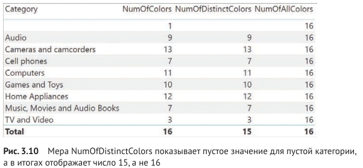
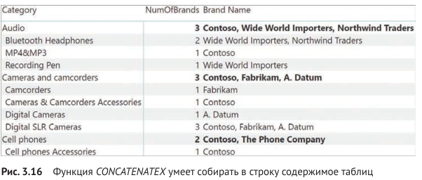
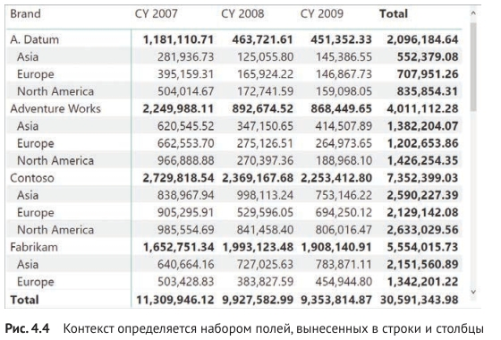
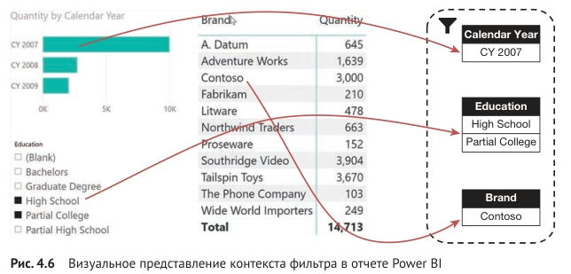
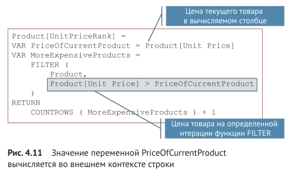

# POWER BI (расширенный)

## Рекомендации
### Оптимизация
1. Во время оптимизации хорошей отправной точкой является любой запрос DAX длительностью более 120 миллисекунд, таким образом если для отображения данных в виз. элементе требуется больше 120 мл, то следует его оптимизировать.
2. Удалить ненужные данные как можно ближе к источнику, чтобы это не пришлось делать в power query
3. [Методы уменьшения объема данных для моделирования импорта.](https://learn.microsoft.com/ru-ru/power-bi/guidance/import-modeling-data-reduction/)
4. Тип данных "дата и время" рекомендуется разбить на две колонки либо оставить только одну с датой
5. Отключить настройку "применение автоматической даты и времени". В этом случае нужно позаботиться о таблице "календарь" и исправить все фильтры по датам с которые были построены на автоматической дате и времени. [Подробнее о функции](https://learn.microsoft.com/ru-ru/power-bi/transform-model/desktop-auto-date-time/)
6. Типом данных Integer (целое число) обрабатываются лучше, чем столбцы с типом данных Text (текст).
7. [Оптимизация модели DirectQuery с хранилищем на уровне таблиц](https://learn.microsoft.com/ru-ru/power-bi/guidance/directquery-model-guidance/), [Ограничения использования DirectQuery](https://learn.microsoft.com/ru-ru/power-bi/connect-data/desktop-directquery-about#implications-of-using-directquery) и [Рекомендации по успешному использованию DirectQuery](https://learn.microsoft.com/ru-ru/power-bi/connect-data/desktop-directquery-about#guidance-for-using-directquery-successfully/?azure-portal=true)
8. Использовать агрегаты в семантической модели, чтобы уменьшить размер файла данных и увеличить производительность. Например: выполнить агрегирование данных о продажах на уровне дня.

### Соглашения по синтаксису
- меры пишем через ":="

        Sales Amount := SUMX ( Sales; Sales[Quantity] * Sales[Net Price] )
- обращение к колонкам таблицы по полному пути Sales[Quantity]
- вызов меры без названия таблицы

## Вопросы к данным
Вычисления логики операций со временем могут помочь ответить на следующие вопросы, связанные со временем:

- Каково накопление дохода за год, квартал или месяц?
- Какой доход получен за тот же период прошлого года?
- Какой рост дохода достигнут за тот же период прошлого года?
- Сколько новых заказчиков сделали первый заказ в каждом месяце?
- Какова стоимость складских запасов продуктов компании?

## Формулы
### Продажи с накоплением
    Sales YTD = TOTALYTD(SUM(Sales[Sales]), 'Date'[Date], "6-30")

### Продажи по сравнению с пред. периодом
    Sales YoY Growth = 
    VAR sales_prev_year =     
      CALCULATE(
        SUM(Sales[Sales]),
        PARALLELPERIOD(
          'Date'[Date],
          -12,
          MONTH
        )
      )
      
    RETURN
      DIVIDE(
        (SUM(Sales[Sales]) - sales_prev_year),
        sales_prev_year
      )
### Ранжирование по колонке
Ранжирование по кол-ву, используем так называемое "плотное ранжирование" - указан DENSE (исключает пропуски)

    Product Quantity Rank =
    IF(
      HASONEVALUE('Product'[Product]),
      RANKX(
        ALL('Product'[Product]),
        [Quantity],
        ,
        ,
        DENSE
      )
    )

### Доля доходности в %
Вычисляет долю доходности в %, используется REMOVEFILTERS для сброса контекста фильтра (позволяет получить общий доход)

    Revenue % Total Region =
    VAR CurrentRegionRevenue = [Revenue]
    VAR TotalRegionRevenue =
      CALCULATE (
        [Revenue],
        REMOVEFILTERS ( 'Sales Territory' )
      )
    RETURN
      DIVIDE (
        CurrentRegionRevenue,
        TotalRegionRevenue
      )

### Вывод даты последнего обновления
В power query (pq) сделать таблицу простую, столбец неважно, доб. настр. столбец с формулой: 

    DateTime.LocalNow()

### Новые пользователи
Мера вычисляет прирост новых пользователей по сравнению с предущим периодом

    New Customers = 
    VAR CustomersLTD =
        CALCULATE(
            DISTINCTCOUNT(Sales[CustomerKey]),
            DATESBETWEEN(
                'Date'[Date],
                BLANK(),
                MAX('Date'[Date])
            ),
            'Sales Order'[Channel] = "Internet"
        )
    
    VAR CustomersPrior =
        CALCULATE(
            DISTINCTCOUNT(Sales[CustomerKey]),
            DATESBETWEEN(
                'Date'[Date],
                BLANK(),
                MIN('Date'[Date]) - 1
            ),
            'Sales Order'[Channel] = "Internet"
        )
    RETURN
        CustomersLTD - CustomersPrior

### Вычисление моментальных снимков
Мера вычисляет остаток на последнюю дату. Актуально для случаев когда необходимо получить остаток на дату, т.е. скрипт делает снимок остатоков по продуктам на каждый день и записывается в таблицу остатков в виде Дата, Ид продукта, Остаток. Таким образом чтобы получить остаток на дату необходимо применит формулу:

    Stock on Hand Last Date = 
    CALCULATE(
        SUM(Inventory[UnitsBalance]),
        LASTNONBLANK(
            'Date'[Date],
            CALCULATE(SUM(Inventory[UnitsBalance]))
        )
    )

Важно: LASTNONBLANK - позволяет получить остаток даже в случае когда остаток не был на сегодня выгружен, но при этом он есть за пред. день, функция получит последний существующий.

Если применить формулу:

    Stock on Hand = 
    CALCULATE(
        SUM(Inventory[UnitsBalance]),
        LASTDATE('Date'[Date])
    )
то мы получим остатки только если была выгрузка, а нам нужно взять последний остаток который есть в таблице. На картинке ниже демонстрируется различая между формулами (таб. 2 - верное решение, есть остаток июнь 2020; таб. 1 - данные на июнь 2020 отсутствуют, хотя они есть на май 2020)

### Формат даты
Выч. колонка в виде "Год Месяц_буквами"
    
    Month = FORMAT('Date'[Date], "yyyy MMM")

### Ключ даты
Выч. колонка формирует ключ даты. Используется в календаре дат, для корректной сортировки в отчетах

     MonthKey =
     (YEAR('Date'[Date]) * 100) + MONTH('Date'[Date])

### Неактивные отношения
USERELATIONSHIP - позволяет активировать неактивную связь таблицы. Например, когда у таблицы фактов есть две даты (дата продажи и дата отгрузки). Обе даты ссылаются на общую таблицу дат, т.е. имеет место так называемое "ролевое измерение" (отчет можем стоить по дате продажи или по дате отгрузки)

    Sales Shipped = 
    CALCULATE(
        SUM('Sales'[Sales Amount]),
        USERELATIONSHIP('Date'[DateKey], 'Sale'[ShipDateKey])
    )

### Получить значение по связи 
RELATEDTABLE - если нужно обратиться по связи со стороны "один" к стороне "«многие" (в этом случае значений будет несколько)

    'Product Category'[NumOfProducts] = COUNTROWS ( RELATEDTABLE ( Product ) )

RELATED - обеспечивает доступ по связи со стороны "многие" к стороне "один", поскольку в этом случае у нас будет максимум одна целевая строка

    Sales[AdjustedCost] =
    IF (
        RELATED ( 'Product Category'[Category] ) = "Cell Phone";
        Sales[Unit Cost] * 0,95;
        Sales[Unit Cost]
    )

### Табличные функции
FILTER - результатом выполнения этой функции является набор строк из исходной таблицы, удовлетворяющих заданному условию       

    FabrikamHighMarginProducts =
    FILTER (
        'Product';
        AND (
            'Product'[Brand] = "Fabrikam";
            'Product'[Unit Price] > 'Product'[Unit Cost] * 3
        )
    )
    
ALL - возвращает все строки таблицы или все значения из одного или нескольких столбцов в зависимости от переданных параметров. Она игнорирует все ранее наложенные фильтры при вычислении результата. След. пример получить все уникальные категории
    
    Categories = ALL ( 'Product'[Category] )

Пример:
Для демонстрации работы ALL в качестве табличной функции представим, что нам нужно создать панель мониторинга (dashboard) с отображением категории и подкатегории товаров, сумма продажи по которым минимум в два раза превышает среднюю сумму продажи. Для этого мы сначала должны вычислить среднюю сумму продажи по подкатегории, а затем, когда значение будет получено, вывести список подкатегорий, сумма продажи по которым минимум вдвое больше этого среднего значения. Следующий код осуществляет нужный нам расчет

    BestCategories =
    VAR Subcategories =
        ALL ( 'Product'[Category]; 'Product'[Subcategory] )
    
    VAR AverageSales =
        AVERAGEX (
            Subcategories;
            SUMX ( RELATEDTABLE ( Sales ); Sales[Quantity] * Sales[Net Price] )
        )
    
    VAR TopCategories =
        FILTER (
            Subcategories;
        
            VAR SalesOfCategory =
                SUMX ( RELATEDTABLE ( Sales ); Sales[Quantity] * Sales[Net Price] )
            RETURN
                SalesOfCategory >= AverageSales * 2
        )
        
    RETURN
        TopCategories

RELATEDTABLE - в приведенном примере соединяет данные благодаря существованию связей в модели данных
VALUES - возвращает набор уникальных значений в рамках наложенных фильтров, если использовать в мерах то получит только видимые значения т.к. смотрит на контект фильтров. Но в выч. колонке таблицы работает без фильтров.
DISTINCT - работает практически так же как и VALUES. Разница заключается в обработке пустых строк: VALUES - возвращает пустую строку если она есть (например в связанной таблице отсутствует запись). DISTINCT - не учитывает пустые строки в отчетах

HASONEVALUE - проверяет столбец на единственное видимое значение

    Brand Name :=
    IF (
        HASONEVALUE ( 'Product'[Brand] );
        VALUES ( 'Product'[Brand] )
    )

SELECTEDVALUE - автоматически проверяет столбец на единственное значение и возвращающает его в виде скалярной величины. Для множественных вхождений допустимо задать в функции значение по умолчанию

    Brand Name := SELECTEDVALUE ( 'Product'[Brand]; "Multiple brands" )

CONCATENATEX - умеет собирать в строку значения колонки (по факту конкатенация значчений в одну строку)

    [Brand Name] :=
        CONCATENATEX (
            VALUES ( 'Product'[Brand] );
            'Product'[Brand];
            ", "
        )

ALLSELECTED - применяется для извлечения списка значений из таблицы или столбца с учетом только внешних фильтров, не входящих в элемент визуализации

### Контекст вычисления
В DAX существует два контекста вычисления (evaluation context): контекст фильтра (filter context) и контекст строки (row context).Контекст фильтра ограничивает выводимые данные, тогда как контекст строки осуществляет итерации по таблице. Когда в DAX идут итерации по таблице, фильтрация не осуществляется, и наоборот.

Всякий раз, когда вам вдруг покажется, что два контекста вычисления выглядят похоже, остановитесь и повторите, словно мантру: "Контекст фильтра ограничивает выводимые данные, а контекст строки осуществляет итерации по таблице. Это не одно и то же".

**В DAX все вычисления производятся в соответствующем контексте. Одна и та же формула может давать совершенно разные результаты, будучи примененной к разным наборам данных.**

#### Контекст фильтра
Контекст фильтра осуществляет фильтрацию таблиц.

Теперь контекст фильтра в каждой ячейке матрицы состоит из бренда, континента и года. Иными словами, контекст фильтра состоит из полного набора полей, которые пользователь выносит в строки и столбцы своего отчета.
На этом этапе должно быть уже ясны правила игры: чем больше столбцов мы будем использовать в нашем отчете, тем больше столбцов будет затрагивать контекст фильтра в каждой отдельной ячейке матрицы

Поле может находиться в строках или столбцах отчета, в срезах или фильтрах уровня страниы, отчета или визуализации либо в других фильтрующих элементах это абсолютно не важно.

Контекст фильтра из примера на рис. 4.6 состоит из трех фильтров. Первый фильтр содержит кортеж по полю "Celendar Year" с единственным значением CY 2007. Второй фильтр представляет собой два кортежа для поля Education со значениями High School и Partial College. В третьем фильтре присутствует один кортеж для поля Brand со значением Contoso. Вы могли заметить, что
каждый отдельный фильтр содержит кортежи для одного столбца.

    Sales Amount := SUMX ( Sales; Sales[Quantity] * Sales[Net Price] )

Вот как правильно звучит предназначение этой меры: мера вычисляет сумму произведений столбцов Quantity и Net Price для всех строк таблицы Sales видимых в текущем контексте фильтра.

То же самое применимо и к более простым агрегациям. Рассмотрим такую меру:

    Total Quantity := SUM ( Sales[Quantity] )

#### Контекст строки
Контекст строки не является инструментом для фильтрации таблиц. Его забота – осуществлять итерации по таблице и вычислять значения в столбцах.

Контекст строки ссылается на конкретную строку в результате табличного выражения DAX. Не стоит путать его со строкой в отчете. У DAX нет возможности напрямую ссылаться на строки или столбцы в отчетах. Значения, показываемые в матрице в Power BI и сводной таблице Excel, являются результатом вычисления мер в контексте фильтра или значениями, сохраненными в обычных или вычисляемых столбцах таблицы

Пример активации контекста строки:

    Gross Margin :=
        SUMX (
            Sales;
            Sales[Quantity] * ( Sales[Net Price] - Sales[Unit Cost] )
        )
В этом случае, поскольку мы имеем дело с мерой, контекст строки автоматически не создается. Функция SUMX будучи итератором, создает контекст строки, который начинает проходить по таблице Sales построчно. Во время итерации происходит запуск второго выражения с функцией SUMX внутри контекста строки. Таким образом, на каждой итерации DAX знает, какие значения использовать для трех столбцов, присутствующих в выражении. Контекст строки появляется, когда мы создаем вычисляемый столбец или рассчитываем выражение внутри итерации. Другого способа создать контекст строки не существует. Можно считать, что контекст строки необходим нам для извлечения значения столбца для конкретной строки

Например, следующее выражение для меры недопустимо. Формула пытается вычислить значение столбца Sales[Net Price], но в отсутствие контекста строки не может получить информацию о строке, для которой необходимо произвести вычисление:

    Gross Margin := Sales[Quantity] * ( Sales[Net Price] - Sales[Unit Cost] )

Эта формула будет вполне допустимой для вычисляемого столбца, но не для меры. И причина не в том, что вычисляемые столбцы и меры как-то поразному используют формулы DAX. Просто вычисляемый столбец располагает контекстом строки, созданным автоматически, а мера – нет. Если вам необходимо внутри меры вычислить определенное выражение построчно, вам придется использовать итерационную функцию для принудительного создания контекста строки.

#### Вложенные контексты строки в разных таблицах
Выражение, выполняемое внутри итерационной функциив может включать в себя дополнительные итерации. Представленном ниже коде мы видим сразу три уровня вложенности итераторов, сканирующих три разные таблицы: "Product Category", Product и Sales.

    SUMX (
        'Product Category';                         -- Сканируем таблицу Product Category
        SUMX (                                      -- Для каждой категории
            RELATEDTABLE ( 'Product' );             -- Сканируем товары
            SUMX (                                  -- Для каждого товара
                RELATEDTABLE ( 'Sales' );           -- Сканируем продажи по товару
                Sales[Quantity]                     --
                    * 'Product'[Unit Price]         -- Получаем сумму по этой продаже
                    * 'Product Category'[Discount]
            )
        )
    )

Показанный код является далеко не самым оптимальным с точки зрения читаемости и производительности. Вкладывать итераторы один в другой принято только в случае, если строк для перебора будет не так много: сотни – нормально, тысячи – приемлемо, миллионы – плохо. Данную формулу можно было написать гораздо более лаконично с использованием единого контекста строки и функции RELATED:

    SUMX (
        Sales;
        Sales[Quantity]
            * RELATED ( 'Product'[Unit Price] )
            * RELATED ( 'Product Category'[Discount] )
    )
Когда у нас есть множество контекстов строки в рамках разных таблиц, мы можем использовать их для ссылки на эти таблицы в одном выражении DAX

#### Вложенные контексты строки в одной таблице
Пример множественного контекста строки в одной таблице. Необходимо ранжировать товары по их цене без использования RANKX:

    'Product'[UnitPriceRankDense] =
        VAR PriceOfCurrentProduct = 'Product'[Unit Price]
        VAR HigherPrices =
            FILTER (
                VALUES ( 'Product'[Unit Price] );
                'Product'[Unit Price] > PriceOfCurrentProduct
            )
    RETURN
        COUNTROWS ( HigherPrices ) + 1

Лучшим способом управления множественными контекстами в рамках одной таблицы является создание вспомогательных переменных
