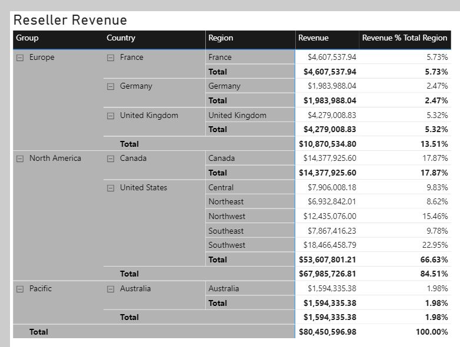
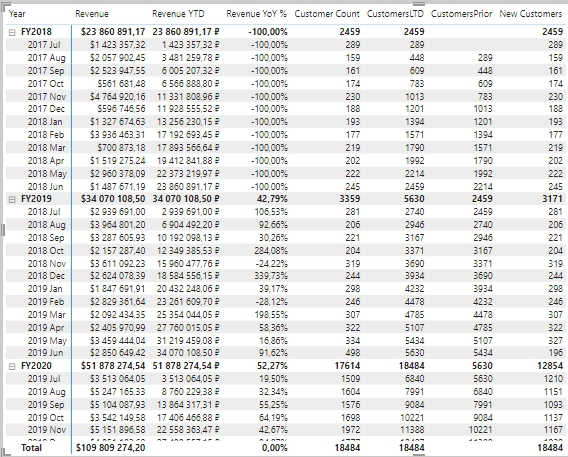
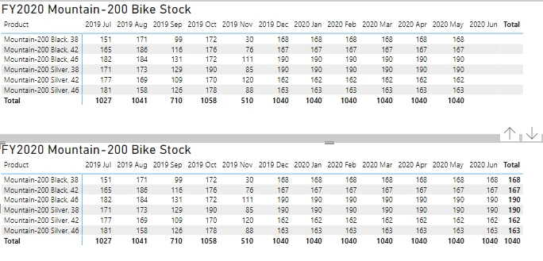

# POWER BI (расширенный)

## Рекомендации
### Оптимизация
1. Во время оптимизации хорошей отправной точкой является любой запрос DAX длительностью более 120 миллисекунд, таким образом если для отображения данных в виз. элементе требуется больше 120 мл, то следует его оптимизировать.
2. Удалить ненужные данные как можно ближе к источнику, чтобы это не пришлось делать в power query
3. [Методы уменьшения объема данных для моделирования импорта.](https://learn.microsoft.com/ru-ru/power-bi/guidance/import-modeling-data-reduction/)
4. Тип данных "дата и время" рекомендуется разбить на две колонки либо оставить только одну с датой
5. Отключить настройку "применение автоматической даты и времени". В этом случае нужно позаботиться о таблице "календарь" и исправить все фильтры по датам с которые были построены на автоматической дате и времени. [Подробнее о функции](https://learn.microsoft.com/ru-ru/power-bi/transform-model/desktop-auto-date-time/)
6. Типом данных Integer (целое число) обрабатываются лучше, чем столбцы с типом данных Text (текст).
7. [Оптимизация модели DirectQuery с хранилищем на уровне таблиц](https://learn.microsoft.com/ru-ru/power-bi/guidance/directquery-model-guidance/), [Ограничения использования DirectQuery](https://learn.microsoft.com/ru-ru/power-bi/connect-data/desktop-directquery-about#implications-of-using-directquery) и [Рекомендации по успешному использованию DirectQuery](https://learn.microsoft.com/ru-ru/power-bi/connect-data/desktop-directquery-about#guidance-for-using-directquery-successfully/?azure-portal=true)
8. Использовать агрегаты в семантической модели, чтобы уменьшить размер файла данных и увеличить производительность. Например: выполнить агрегирование данных о продажах на уровне дня.

## Вопросы к данным
Вычисления логики операций со временем могут помочь ответить на следующие вопросы, связанные со временем:

- Каково накопление дохода за год, квартал или месяц?
- Какой доход получен за тот же период прошлого года?
- Какой рост дохода достигнут за тот же период прошлого года?
- Сколько новых заказчиков сделали первый заказ в каждом месяце?
- Какова стоимость складских запасов продуктов компании?

## Формулы
### Продажи с накоплением
    Sales YTD = TOTALYTD(SUM(Sales[Sales]), 'Date'[Date], "6-30")

### Продажи по сравнению с пред. периодом
    Sales YoY Growth = 
    VAR sales_prev_year =     
      CALCULATE(
        SUM(Sales[Sales]),
        PARALLELPERIOD(
          'Date'[Date],
          -12,
          MONTH
        )
      )
      
    RETURN
      DIVIDE(
        (SUM(Sales[Sales]) - sales_prev_year),
        sales_prev_year
      )
### Ранжирование по колонке
Ранжирование по кол-ву, используем так называемое "плотное ранжирование" - указан DENSE (исключает пропуски)

    Product Quantity Rank =
    IF(
      HASONEVALUE('Product'[Product]),
      RANKX(
        ALL('Product'[Product]),
        [Quantity],
        ,
        ,
        DENSE
      )
    )

### Доля доходности в %
Вычисляет долю доходности в %, используется REMOVEFILTERS для сброса контекста фильтра (позволяет получить общий доход)

    Revenue % Total Region =
    VAR CurrentRegionRevenue = [Revenue]
    VAR TotalRegionRevenue =
      CALCULATE (
        [Revenue],
        REMOVEFILTERS ( 'Sales Territory' )
      )
    RETURN
      DIVIDE (
        CurrentRegionRevenue,
        TotalRegionRevenue
      )

### Вывод даты последнего обновления
В power query (pq) сделать таблицу простую, столбец неважно, доб. настр. столбец с формулой: 

    DateTime.LocalNow()

### Новые пользователи
Мера вычисляет прирост новых пользователей по сравнению с предущим периодом

    New Customers = 
    VAR CustomersLTD =
        CALCULATE(
            DISTINCTCOUNT(Sales[CustomerKey]),
            DATESBETWEEN(
                'Date'[Date],
                BLANK(),
                MAX('Date'[Date])
            ),
            'Sales Order'[Channel] = "Internet"
        )
    
    VAR CustomersPrior =
        CALCULATE(
            DISTINCTCOUNT(Sales[CustomerKey]),
            DATESBETWEEN(
                'Date'[Date],
                BLANK(),
                MIN('Date'[Date]) - 1
            ),
            'Sales Order'[Channel] = "Internet"
        )
    RETURN
        CustomersLTD - CustomersPrior

### Вычисление моментальных снимков
Мера вычисляет остаток на последнюю дату. Актуально для случаев когда необходимо получить остаток на дату, т.е. скрипт делает снимок остатоков по продуктам на каждый день и записывается в таблицу остатков в виде Дата, Ид продукта, Остаток. Таким образом чтобы получить остаток на дату необходимо применит формулу:

    Stock on Hand Last Date = 
    CALCULATE(
        SUM(Inventory[UnitsBalance]),
        LASTNONBLANK(
            'Date'[Date],
            CALCULATE(SUM(Inventory[UnitsBalance]))
        )
    )

Важно: LASTNONBLANK - позволяет получить остаток даже в случае когда остаток не был на сегодня выгружен, но при этом он есть за пред. день, функция получит последний существующий.

Если применить формулу:

    Stock on Hand = 
    CALCULATE(
        SUM(Inventory[UnitsBalance]),
        LASTDATE('Date'[Date])
    )
то мы получим остатки только если была выгрузка, а нам нужно взять последний остаток который есть в таблице. На картинке ниже демонстрируется различая между формулами (таб. 2 - верное решение, есть остаток июнь 2020; таб. 1 - данные на июнь 2020 отсутствуют, хотя они есть на май 2020)

### Формат даты
Выч. колонка в виде "Год Месяц_буквами"
    
    Month = FORMAT('Date'[Date], "yyyy MMM")

### Ключ даты
Выч. колонка формирует ключ даты. Используется в календаре дат, для корректной сортировки в отчетах

     MonthKey =
     (YEAR('Date'[Date]) * 100) + MONTH('Date'[Date])

### Неактивные отношения
USERELATIONSHIP - позволяет активировать неактивную связь таблицы. Например, когда у таблицы фактов есть две даты (дата продажи и дата отгрузки). Обе даты ссылаются на общую таблицу дат, т.е. имеет место так называемое "ролевое измерение" (отчет можем стоить по дате продажи или по дате отгрузки)

    Sales Shipped = 
    CALCULATE(
        SUM('Sales'[Sales Amount]),
        USERELATIONSHIP('Date'[DateKey], 'Sale'[ShipDateKey])
    )
