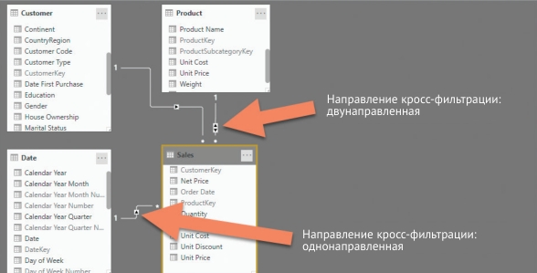

# POWER BI (расширенный)

## Рекомендации
### Оптимизация
1. Во время оптимизации хорошей отправной точкой является любой запрос DAX длительностью более 120 миллисекунд, таким образом если для отображения данных в виз. элементе требуется больше 120 мл, то следует его оптимизировать.
2. Удалить ненужные данные как можно ближе к источнику, чтобы это не пришлось делать в power query
3. [Методы уменьшения объема данных для моделирования импорта.](https://learn.microsoft.com/ru-ru/power-bi/guidance/import-modeling-data-reduction/)
4. Тип данных "дата и время" рекомендуется разбить на две колонки либо оставить только одну с датой
5. Отключить настройку "применение автоматической даты и времени". В этом случае нужно позаботиться о таблице "календарь" и исправить все фильтры по датам с которые были построены на автоматической дате и времени. [Подробнее о функции](https://learn.microsoft.com/ru-ru/power-bi/transform-model/desktop-auto-date-time/)
6. Типом данных Integer (целое число) обрабатываются лучше, чем столбцы с типом данных Text (текст).
7. [Оптимизация модели DirectQuery с хранилищем на уровне таблиц](https://learn.microsoft.com/ru-ru/power-bi/guidance/directquery-model-guidance/), [Ограничения использования DirectQuery](https://learn.microsoft.com/ru-ru/power-bi/connect-data/desktop-directquery-about#implications-of-using-directquery) и [Рекомендации по успешному использованию DirectQuery](https://learn.microsoft.com/ru-ru/power-bi/connect-data/desktop-directquery-about#guidance-for-using-directquery-successfully/?azure-portal=true)
8. Использовать агрегаты в семантической модели, чтобы уменьшить размер файла данных и увеличить производительность. Например: выполнить агрегирование данных о продажах на уровне дня.
9. Двунаправленную фильтрацию использовать только в крайней необходимости, и лучше это делать через в мере через CROSSFILTER
10. Используя итерационные функции совместно с преобразованием контекста, необходимо тщательно следить за их кратностью – она должна быть достаточно мала. Кроме того, нужно постараться гарантировать уникальность строк в таблице, по которой осуществляются итерации. В противном случае вы рискуете, что код будет выполняться медленно и с ошибками
11. Лучше отключюить автоматическое создание таблиц даты и времени через настройки pbi desktop. Option - Data load - Time intelligence, снять флаг с "Auto Date/Time". Когда эта настройка включена(по умолчанию), Power BI автоматически создает отдельную таблицу для каждого столбца типа Date или DateTime в модели данных, такие таблицы невидимы для пользователя и недоступны для редактирования. Это приводит к образованию большого количества не связанных между собой таблиц в модели.

### Соглашения по синтаксису
- меры пишем через ":="

        Sales Amount := SUMX ( Sales; Sales[Quantity] * Sales[Net Price] )
- обращение к колонкам таблицы по полному пути Sales[Quantity]
- вызов меры без названия таблицы
- Если в расчете участвует функция CALCULATE, нужно сделать все, чтобы она была видимой. Это сделает код более очевидным, в том числе из-за преобразования контекста, который может быть инициирован функцией CALCULATE

## Вопросы к данным
Вычисления логики операций со временем могут помочь ответить на следующие вопросы, связанные со временем:

- Каково накопление дохода за год, квартал или месяц?
- Какой доход получен за тот же период прошлого года?
- Какой рост дохода достигнут за тот же период прошлого года?
- Сколько новых заказчиков сделали первый заказ в каждом месяце?
- Какова стоимость складских запасов продуктов компании?

## Создание контекста фильтра
Функция CALCULATE позволяет создавать новые контексты фильтра путем манипулирования фильтрами в текущем контексте

Переданные в функцию CALCULATE аргументы фильтра не являются логическими выражениями, это таблицы. Всякий раз, когда в качестве параметра в функцию CALCULATE поступает логическое выражение, DAX переводит его в таблицу значений

    Contoso GM :=
    CALCULATE (
        [Gross Margin];              -- Рассчитываем валовую прибыль
        'Product'[Brand] = "Contoso" -- в контексте фильтра, где бренд = Contoso
    )

На самом деле предыдущую формулу нужно читать так:

    Contoso GM :=
    CALCULATE (
        [Gross Margin];                     -- Рассчитываем валовую прибыль
        FILTER (                            -- с использованием допустимых значений
                                            -- Product[Brand]
            ALL ( 'Product'[Brand] );       -- все значения Product[Brand],
            'Product'[Brand] = "Contoso"    -- содержащие строку "Contoso"
        )
    )

Функция CALCULATE оценивает свой аргумент фильтра, возвращающий таблицу с брендами, содержащую только бренд Contoso. Созданный фильтр перезаписывает существующий фильтр, который был установлен
на тот же столбец. Графический это выглядит так:

Функция CALCULATE не перезаписывает весь исходный контекст фильтра. Она заменяет на новые фильтры по столбцам, которые присутствуют и в старом контексте, и в новом. Фактически если заменить срез в отчете, вынеся в строки категории товаров вместо брендов, результат будет иным, пример:

Семантические особенности CALCULATE:
- функция CALCULATE создает копию существующего контекста фильтра
- функция CALCULATE оценивает каждый аргумент фильтра и для каждого условия создает список доступных значений по указанным столбцам
- если аргументы фильтра затрагивают один и тот же столбец, фильтры по ним объединяются при помощи оператора AND (или, как сказали бы математики, посредством пересечения множеств)
- функция CALCULATE использует новое условие для замены существующих фильтров по столбцам в модели данных. Если на столбец уже действует фильтр, новый фильтр заменит его. В противном случае новый фильтр просто добавится к текущему контексту фильтра
- по готовности нового контекста фильтра функция CALCULATE применяет его к модели данных и производит вычисление выражения, переданного в первом параметре. По завершении работы функция CALCULATE восстанавливает исходный контекст фильтра, возвращая вычисленный результат.

Функция CALCULATE выполняет еще одно важное действие, а именно трансформирует любой существующий контекст строки в эквивалентный контекст фильтра. Надо помнить, что она создает контекст фильтра на основе существвующего контекста строки

В CALCULATE есть возможность частично востановить фильтр после сброса, например

### Функция KEEPFILTERS
Если необходимо, чтобы CALCULATE не перезаписывала существующие фильтры, можyj обернуть аргумент фильтра в функцию KEEPFILTERS. Например, если вы хотите показывать сумму продаж по категории Audio в случае ее присутствия в контексте фильтра, а в противном случае выводить пустое значение, вы можете написать следующую формулу

    Audio Sales KeepFilters :=
        CALCULATE (
            [Sales Amount];
            KEEPFILTERS ( 'Product'[Category] = "Audio" )
    )

Два аргумента фильтра функции CALCULATE применяются к текущему контексту фильтра, в результате чего создается новый контекст фильтра, содержа-щий единственный фильтр "Celendar Year". В знаменателе формулы вычисляется общая сумма продаж в рамках контекста фильтра, состоящего из одного года

## Преобразование контекста
Контекст строки создается всякий раз, когда по таблице начинают осуществляться итерации. Внутри одной итерации значения столбцов зависят от контекста строки, пример:

    Sales Amount :=
        SUMX (Sales;
        Sales[Quantity] * Sales[Unit Price]
    )

На каждой итерации в столбцах Quantity и Unit Price содержится свое значение, зависящее от текущего контекста строки. В предыдущем разделе мы показывали, что если выражение внутри итерации не привязано к контексту строки, оно будет вычисляться в контексте фильтра.
Вызванная в рамках контекста строки, она отменяет его действие еще до вычисления своего выражения. Внутри выражения, вычисляемого функцией CALCULATE, все предыдущие контексты строки утрачивают свое действие. Таким образом, следующее выражение для меры будет недопустимым, выдаст синтаксическую ошибку:

    Sales Amount :=
        SUMX (
        Sales;
        CALCULATE ( Sales[Quantity] ) -- Нет контекста строки внутри CALCULATE, ОШИБКА !
    )

Причина в том, что значение столбца Sales[Quantity] не может быть получено внутри функции CALCULATE, поскольку она отменяет действие контекста строки, в котором была вызвана. Главное заключается в том, что функция CALCULATE переносит все столбцы из текущего контекста строки вместе с их значениями в аргументы фильтра. Посмотрите на следующий код:

    Sales Amount :=
        SUMX (
            Sales;
            CALCULATE ( 
                SUM ( Sales[Quantity] ) -- функция SUM не требует наличия контекста
            )                           -- строки
    )

У этой функции CALCULATE нет аргументов фильтра, она молча создаст множество аргументов фильтра. Фактически для каждого столбца в таблице, по которой осуществляются итерации, будет
создан свой фильтр.

После начала итераций функция CALCULATE попадает в первую строку таблицы и пытается вычислить выражение SUM ( Sales[Quantity] ). При этом она создает по одному аргументу фильтра для каждого столбца в таблице, по которой осуществляются итерации. В нашем примере таких столбцов три: Product, Quantity и Net Price. Созданный в результате преобразования из контекста строки контекст фильтра содержит текущие значения (A, 1, 11.00) для каждого столбца (Product, Quantity и Net Price). Конечно, подобная операция выполняется для каждой из трех строк во время итераций функции SUMX.
По сути, результат предыдущего выражения эквивалентен следующему:

    CALCULATE (
        SUM ( Sales[Quantity] );
        Sales[Product] = "A";
        Sales[Quantity] = 1;
        Sales[Net Price] = 11
    ) +
    CALCULATE (
        SUM ( Sales[Quantity] );
        Sales[Product] = "B";
        Sales[Quantity] = 2;
        Sales[Net Price] = 25
    ) +
    CALCULATE (
        SUM ( Sales[Quantity] );
        Sales[Product] = "A";
        Sales[Quantity] = 2;
        Sales[Net Price] = 10,99
    )

Эти аргументы фильтра скрыты. Они добавляются движком DAX автоматически, и повлиять на этот процесс никак нельзя

## Преобразование контекстра в мерах
Каждая ссылка на меру неявным образом обрамляется в функцию CALCULATE. Это приводит к тому, что обращение к мере в присутствии любого контекста строки автоматически ведет к преобразованию контекста. Пример:

    -- определение меры
    Sales Amount :=
        SUMX (
            Sales;
            Sales[Quantity] * Sales[Net Price]
        )

    -- вызов меры в выч. колонке
    'Product'[Product Sales] = [Sales Amount]

Вычисляемый столбец Product[Product Sales], как мы и ожидали, рассчитывает меру [Sales Amount] только для текущего товара в таблице Product. На самом деле код вычисляемого столбца Product[Product Sales] при обращении к мере неявным образом оборачивает ее в функцию CALCULATE, что приводит к такой формуле:

    'Product'[Product Sales] =
        CALCULATE(
            SUMX (
                Sales;
                Sales[Quantity] * Sales[Net Price]
        )
    )

Без функции CALCULATE вычисляемый столбец оказался бы заполненным одинаковыми значениями, суммирующими продажи по всем товарам. Присутствие функции CALCULATE запускает операцию преобразования контекста, что и позволяет добиться правильного результата. Таким образом, ссылка на меру всегда вызывает функцию CALCULATE

## Циклические зависимости
Если написать один вычисляемый столбец с использованием функции CALCULATE, ничего страшного не произойдет. Проблема возникнет, если создать сразу два вычисляемых столбца в таблице с применением функции CALCULATE, инициирующей преобразование контекста для обоих столбцов. Так что попытка создания следующего вычисляемого столбца завершится неудачей:

    -- при добавлени AllSalesQty проблем нет
    Sales[AllSalesQty] = CALCULATE ( SUM ( Sales[Quantity] ) )

    -- но при добавлении NewAllSalesQty будет ошибка
    -- циклической зависимости
    Sales[NewAllSalesQty] = CALCULATE ( SUM ( Sales[Quantity] ) )

Причина возникновения ошибки в том, что функция CALCULATE автомати- чески принимает все столбцы таблицы в качестве аргументов фильтра. А добавление в таблицу нового столбца влияет на определение других столбцов. Если бы DAX позволил нам создать столбец NewAllSalesQty, код двух вычисляе-
мых столбцов выглядел бы примерно так:

    Sales[AllSalesQty] =
        CALCULATE (
            SUM ( Sales[Quantity] );
            Sales[ProductKey] = <CurrentValueOfProductKey>;
            ...;
            Sales[Margin] = <CurrentValueOfMargin>;
            Sales[NewAllSalesQty] = <CurrentValueOfNewAllSalesQty>
        )
    
    Sales[NewAllSalesQty] =
        CALCULATE (
            SUM ( Sales[Quantity] );
            Sales[ProductKey] = <CurrentValueOfProductKey>;
            ...;
            Sales[Margin] = <CurrentValueOfMargin>;
            Sales[AllSalesQty] = <CurrentValueOfAllSalesQty>
        )

Получается, что столбец AllSalesQty зависит от значения столбца NewAllSalesQty, который, в свою очередь, находится в зависимости от AllSalesQty. В результате мы получаем циклическую зависимость

Если в таблице, в которой создаются вычисляемые столбцы с функцией CALCULATE, присутствует столбец с уникальными записями и DAX знает об этом, при преобразовании контекста будет фильтроваться значение только этого столбца. Например, если в таблице Product сделать тоже самое, что и и в таблице Sales, то проблем не будет т.к. Producnt имеет уникальные записи (она находится на стороне "один"). А значит, во время преобразования контекста движок не будет добавлять фильтр для каждого столбца таблицы

## Формулы

### Расчет скользящего среднего
Если просто построить график по дневным продажам за период, понять по нему что-то будет сложно из-за больших отклонений. Чтобы сгладить линию графика, обычно используется техника расчета средних значений за определенное количество дней раньше текущего. В нашем примере мы будем вычислять среднее по 30 последним дням. Таким образом, в каждой точке на графике будет показано усредненное значение по продажам за предыдущие 30 дней. Этот метод поможет убрать пики с графика и облегчит понимание тренда.

    Avg Sales 30 = 
        VAR LastVisibleDate = MAX('Date'[Date])

        VAR NumberOfDay = 30

        VAR PeriodTuUse = 
            FILTER(
                ALL('Date'[Date]),
                AND(
                    'Date'[Date] > LastVisibleDate - NumberOfDay,
                    'Date'[Date] <= LastVisibleDate
                )
            )
            
        VAR Res = 
            CALCULATE(
                -- если необходимо дни с отсутствующими продажами учитывать как нулевые, 
                -- то лучше использовать обычную функцию деления, поскольку преобразование
                -- контекста, возникающее при использовании AVERAGEX - требует большей памяти
                -- и времени для выполнения.
                -- DIVIDE ( [Sales Amount], COUNTROWS ( 'Date' ) );                                                                
                AVERAGEX('Date', [Sales Amount]),
                PeriodTuUse
            )

        RETURN Res

### Расчет скользящей годовой суммы (MAT)
Сумма продаж за последний год (12 месяцев). Для каждой ячейки с месяцем выполняется отсчет минус 12 месяцы и суммируется за этот период, т.е. для каждого месяца будет смещение на 12

    MAT Sales = 
        CALCULATE(                  -- Рассчитаем меру в новом контексте фильтра,
            [Sales Amount],         -- измененном следующим аргументом фильтра.
            DATESINPERIOD(          -- Возвращает таблицу, содержащую
                'Date'[Date],       -- значения Date[Date]
                MAX('Date'[Date]),  -- начиная с последней видимой даты
                -1,                 -- и заканчивая датой, отстающей
                YEAR                -- от нее на год назад
            )
        )

### Расчет скользащей средне-готовой суммы (MAA)
Общая сумма за последние 12 месцев поделенная на 12 месяцев

    MAA Sales = 
        CALCULATE(
            DIVIDE(
                [Sales Amount],
                DISTINCTCOUNT('Date'[Calendar Year Month])
            ),
            DATESINPERIOD(
                'Date'[Date],
                MAX('Date'[Date]),
                -1,
                YEAR
            )
        )

### Сравнение с предыдущим периодом
    Sameperiod Sales = 
        CALCULATE(
            [Sales Amount],
            SAMEPERIODLASTYEAR('Date'[Date])
        )

### Нарастающий итог
    -- вариант 1
    Sales Amount YTD :=
        CALCULATE (
            SUMX ( Sales; Sales[Net Price] * Sales[Quantity] );
            DATESYTD ( 'Date'[Date] )
        )

    -- вариант 2
    Sales Amount YTD = 
        TOTALYTD(
            [Sales Amount],  -- мера
            'Date'[Date]
        )

    -- DATESYTD ( 'Date'[Date] ), эту функцию в 
    -- расширенном виде можно переписать так
    CALCULATETABLE (
        VAR LastDateInSelection = MAX ( 'Date'[Date] )
        RETURN
            FILTER (
                ALL ( 'Date'[Date] );
                'Date'[Date] <= LastDateInSelection
                && YEAR ( 'Date'[Date] ) = YEAR ( LastDateInSelection )
            )
    )

### Удаление фильтров с таблицы
С помощью ALL можно снять все фильтры которые существуют в CALCULATE, таким образом мы снимаем влияние на расчеты всех таблицы которые могут повлиять на это:

    VAR AllSales =
        CALCULATE (
            [Sales Amount];
            ALL ( Sales ) -- снимает все фильтры с таблицы фактов
    )

При этом мы можем не только удалить контекст фильтра, но и добавить новый:

    VAR AllSalesInCurrentYear =
        CALCULATE (
            [Sales Amount];
            ALL ( Sales );                      -- снимаем фильтры
            VALUES ( 'Date'[Calendar Year] )    -- добавляем новый
    )

### Шаблон создания таблицы календаря
    Date = 
        VAR MinYear = YEAR ( MIN ( Sales[Order Date] ) )
        VAR MaxYear = YEAR ( MAX ( Sales[Order Date] ) )
        RETURN
            ADDCOLUMNS (
                FILTER (
                    CALENDARAUTO ( ),
                    YEAR ( [Date] ) >= MinYear &&
                    YEAR ( [Date] ) <= MaxYear
                ),
                "Year", YEAR ( [Date] ),
                "Quarter Number", INT ( FORMAT ( [Date], "q" ) ),
                "Quarter", "Q" & INT ( FORMAT ( [Date], "q" ) ),
                "Month Number", MONTH ( [Date] ),
                "Month", FORMAT ( [Date], "mmmm" ),
                "Week Day Number", WEEKDAY ( [Date] ),
                "Week Day", FORMAT ( [Date], "dddd" ),
                "Year Month Number", YEAR ( [Date] ) * 100 + MONTH ( [Date] ),
                "Year Month", FORMAT ( [Date], "mmmm" ) & " " & YEAR ( [Date] ),
                "Year Quarter Number", YEAR ( [Date] ) * 100 + INT ( FORMAT ( [Date], "q" ) ),
                "Year Quarter", "Q" & FORMAT ( [Date], "q" ) & "-" & YEAR ( [Date] )
            )

### Выбранный диапазон дат
    PM Range = 
    CALCULATE (  
        VAR MinDate = MIN ( 'Date'[Date] )
        VAR MaxDate = MAX ( 'Date'[Date] )
        VAR Result =
            FORMAT ( MinDate, "MM/DD/YYYY - " ) & FORMAT ( MaxDate, "MM/DD/YYYY" )
        RETURN
            Result,
        DATEADD ( 'Date'[Date], -1, MONTH )
    )

### Получить выбранные значения в контексте фильтра
Можно вывести значения которые возвращаются с учетом применения контекста фильтра. Например, ниже мера соединяет значения в строку:

    -- #1
    -- смотрим какие значения попали в выбранный период
    Selected date = 
        "Selected date: " & 
            CONCATENATEX(
                VALUES('Date'[Date]),
                'Date'[Date],
                ", ",
                'Date'[Date],
                ASC
            )

    -- # 2
    -- если нужно посмотреть какие значения возвращает
    -- DATEADD в контексте фильта (в виз. элементе)
    Selected date = 
        "Selected date: " & 
        CONCATENATEX(
            DATEADD ( 'Date'[Date], -1, MONTH ),
            'Date'[Date],
            ", ",
            'Date'[Date],
            ASC
        )

### Продажи с накоплением
    Sales YTD = TOTALYTD(SUM(Sales[Sales]), 'Date'[Date], "6-30")

### Продажи по сравнению с пред. периодом
    Sales YoY Growth = 
    VAR sales_prev_year =     
      CALCULATE(
        SUM(Sales[Sales]),
        PARALLELPERIOD(
          'Date'[Date],
          -12,
          MONTH
        )
      )
      
    RETURN
      DIVIDE(
        (SUM(Sales[Sales]) - sales_prev_year),
        sales_prev_year
      )

### Расчет цен на начало квартала
    SOQ v2 = 
        VAR FirstDateInQ =
            CALCULATETABLE(
                FIRSTNONBLANK(
                    'Date'[Date],
                    COUNTROWS(RELATEDTABLE(MSFT))
                ),
                PARALLELPERIOD(
                    'Date'[Date],
                    0,
                    QUARTER
                )
            )

        VAR res = 
            CALCULATE(
                AVERAGE(MSFT[Value]),
                FirstDateInQ
            )

        RETURN res

### Ранжирование по колонке
Ранжирование по кол-ву, используем так называемое "плотное ранжирование" - указан DENSE (исключает пропуски)

    Product Quantity Rank =
    IF(
      HASONEVALUE('Product'[Product]),
      RANKX(
        ALL('Product'[Product]),
        [Quantity],
        ,
        ,
        DENSE
      )
    )

### Вывод выбранных фильтров
Для отображения значений фильтров, выбранных пользователем в отчете можно использовать CANCATENATEX:

    Selected Color = 
    "Selected colors: " & 
    CONCATENATEX(
        VALUES('Product'[Color]),
        'Product'[Color],
        ", ",
        'Product'[Color],
        ASC
    )

### Доля доходности в %
Вычисляет долю доходности в %, используется REMOVEFILTERS для сброса контекста фильтра (позволяет получить общий доход)

    Revenue % Total Region =
    VAR CurrentRegionRevenue = [Revenue]
    VAR TotalRegionRevenue =
      CALCULATE (
        [Revenue],
        REMOVEFILTERS ( 'Sales Territory' )
      )
    RETURN
      DIVIDE (
        CurrentRegionRevenue,
        TotalRegionRevenue
      )

### Средний возраст покупателей

Вычисляемый столбец:

    Sales[Customer Age] = 
    DATEDIFF(
        RELATED(Customer[Birth Date]),
        Sales[Order Date],
        YEAR
    )

Мера:

    Age Average Correct := 
    VAR tab = 
        SUMMARIZE(
            Sales,
            Sales[CustomerKey],
            Sales[Customer Age]
        )
    
    RETURN
        AVERAGEX(
            tab,
            Sales[Customer Age]
        )

### Вывод даты последнего обновления
В power query (pq) сделать таблицу простую, столбец неважно, доб. настр. столбец с формулой: 

    DateTime.LocalNow()

### Новые пользователи
Мера вычисляет прирост новых пользователей по сравнению с предущим периодом

    New Customers = 
    VAR CustomersLTD =
        CALCULATE(
            DISTINCTCOUNT(Sales[CustomerKey]),
            DATESBETWEEN(
                'Date'[Date],
                BLANK(),
                MAX('Date'[Date])
            ),
            'Sales Order'[Channel] = "Internet"
        )
    
    VAR CustomersPrior =
        CALCULATE(
            DISTINCTCOUNT(Sales[CustomerKey]),
            DATESBETWEEN(
                'Date'[Date],
                BLANK(),
                MIN('Date'[Date]) - 1
            ),
            'Sales Order'[Channel] = "Internet"
        )
    RETURN
        CustomersLTD - CustomersPrior

### Вычисление моментальных снимков
Мера вычисляет остаток на последнюю дату. Актуально для случаев когда необходимо получить остаток на дату, т.е. скрипт делает снимок остатоков по продуктам на каждый день и записывается в таблицу остатков в виде Дата, Ид продукта, Остаток. Таким образом чтобы получить остаток на дату необходимо применит формулу:

    Stock on Hand Last Date = 
    CALCULATE(
        SUM(Inventory[UnitsBalance]),
        LASTNONBLANK(
            'Date'[Date],
            CALCULATE(SUM(Inventory[UnitsBalance]))
        )
    )

Важно: LASTNONBLANK - позволяет получить остаток даже в случае когда остаток не был на сегодня выгружен, но при этом он есть за пред. день, функция получит последний существующий.

Если применить формулу:

    Stock on Hand = 
    CALCULATE(
        SUM(Inventory[UnitsBalance]),
        LASTDATE('Date'[Date])
    )
то мы получим остатки только если была выгрузка, а нам нужно взять последний остаток который есть в таблице. На картинке ниже демонстрируется различая между формулами (таб. 2 - верное решение, есть остаток июнь 2020; таб. 1 - данные на июнь 2020 отсутствуют, хотя они есть на май 2020)

### Формат даты
Выч. колонка в виде "Год Месяц_буквами"
    
    Month = FORMAT('Date'[Date], "yyyy MMM")

### Ключ даты
Выч. колонка формирует ключ даты. Используется в календаре дат, для корректной сортировки в отчетах

     MonthKey =
     (YEAR('Date'[Date]) * 100) + MONTH('Date'[Date])

### Неактивные отношения
USERELATIONSHIP - позволяет активировать неактивную связь таблицы. Например, когда у таблицы фактов есть две даты (дата продажи и дата отгрузки). Обе даты ссылаются на общую таблицу дат, т.е. имеет место так называемое "ролевое измерение" (отчет можем стоить по дате продажи или по дате отгрузки)

    Sales Shipped = 
    CALCULATE(
        SUM('Sales'[Sales Amount]),
        USERELATIONSHIP('Date'[DateKey], 'Sale'[ShipDateKey])
    )

### Получить значение по связи 
RELATEDTABLE - если нужно обратиться по связи со стороны "один" к стороне "«многие" (в этом случае значений будет несколько)

    'Product Category'[NumOfProducts] = COUNTROWS ( RELATEDTABLE ( Product ) )

RELATED - обеспечивает доступ по связи со стороны "многие" к стороне "один", поскольку в этом случае у нас будет максимум одна целевая строка

    Sales[AdjustedCost] =
    IF (
        RELATED ( 'Product Category'[Category] ) = "Cell Phone";
        Sales[Unit Cost] * 0,95;
        Sales[Unit Cost]
    )

### Табличные функции
FILTER - результатом выполнения этой функции является набор строк из исходной таблицы, удовлетворяющих заданному условию       

    FabrikamHighMarginProducts =
    FILTER (
        'Product';
        AND (
            'Product'[Brand] = "Fabrikam";
            'Product'[Unit Price] > 'Product'[Unit Cost] * 3
        )
    )
    
ALL - возвращает все строки таблицы или все значения из одного или нескольких столбцов в зависимости от переданных параметров. Она игнорирует все ранее наложенные фильтры при вычислении результата. След. пример получить все уникальные категории
    
    Categories = ALL ( 'Product'[Category] )

Пример:
Для демонстрации работы ALL в качестве табличной функции представим, что нам нужно создать панель мониторинга (dashboard) с отображением категории и подкатегории товаров, сумма продажи по которым минимум в два раза превышает среднюю сумму продажи. Для этого мы сначала должны вычислить среднюю сумму продажи по подкатегории, а затем, когда значение будет получено, вывести список подкатегорий, сумма продажи по которым минимум вдвое больше этого среднего значения. Следующий код осуществляет нужный нам расчет

    BestCategories =
    VAR Subcategories =
        ALL ( 'Product'[Category]; 'Product'[Subcategory] )
    
    VAR AverageSales =
        AVERAGEX (
            Subcategories;
            SUMX ( RELATEDTABLE ( Sales ); Sales[Quantity] * Sales[Net Price] )
        )
    
    VAR TopCategories =
        FILTER (
            Subcategories;
        
            VAR SalesOfCategory =
                SUMX ( RELATEDTABLE ( Sales ); Sales[Quantity] * Sales[Net Price] )
            RETURN
                SalesOfCategory >= AverageSales * 2
        )
        
    RETURN
        TopCategories

RELATEDTABLE - в приведенном примере соединяет данные благодаря существованию связей в модели данных
VALUES - возвращает набор уникальных значений в рамках наложенных фильтров, если использовать в мерах то получит только видимые значения т.к. смотрит на контект фильтров. Но в выч. колонке таблицы работает без фильтров.
DISTINCT - работает практически так же как и VALUES. Разница заключается в обработке пустых строк: VALUES - возвращает пустую строку если она есть (например в связанной таблице отсутствует запись). DISTINCT - не учитывает пустые строки в отчетах

HASONEVALUE - проверяет столбец на единственное видимое значение

    Brand Name :=
    IF (
        HASONEVALUE ( 'Product'[Brand] );
        VALUES ( 'Product'[Brand] )
    )

SELECTEDVALUE - автоматически проверяет столбец на единственное значение и возвращающает его в виде скалярной величины. Для множественных вхождений допустимо задать в функции значение по умолчанию

    Brand Name := SELECTEDVALUE ( 'Product'[Brand]; "Multiple brands" )

CONCATENATEX - умеет собирать в строку значения колонки (по факту конкатенация значчений в одну строку)

    [Brand Name] :=
        CONCATENATEX (
            VALUES ( 'Product'[Brand] );
            'Product'[Brand];
            ", "
        )

ALLSELECTED - применяется для извлечения списка значений из таблицы или столбца с учетом только внешних фильтров, не входящих в элемент визуализации

### Контекст вычисления
В DAX существует два контекста вычисления (evaluation context): контекст фильтра (filter context) и контекст строки (row context).Контекст фильтра ограничивает выводимые данные, тогда как контекст строки осуществляет итерации по таблице. Когда в DAX идут итерации по таблице, фильтрация не осуществляется, и наоборот.

Всякий раз, когда вам вдруг покажется, что два контекста вычисления выглядят похоже, остановитесь и повторите, словно мантру: "Контекст фильтра ограничивает выводимые данные, а контекст строки осуществляет итерации по таблице. Это не одно и то же".

**В DAX все вычисления производятся в соответствующем контексте. Одна и та же формула может давать совершенно разные результаты, будучи примененной к разным наборам данных.**

#### Контекст фильтра
Контекст фильтра осуществляет фильтрацию таблиц.

Теперь контекст фильтра в каждой ячейке матрицы состоит из бренда, континента и года. Иными словами, контекст фильтра состоит из полного набора полей, которые пользователь выносит в строки и столбцы своего отчета.
На этом этапе должно быть уже ясны правила игры: чем больше столбцов мы будем использовать в нашем отчете, тем больше столбцов будет затрагивать контекст фильтра в каждой отдельной ячейке матрицы

Поле может находиться в строках или столбцах отчета, в срезах или фильтрах уровня страниы, отчета или визуализации либо в других фильтрующих элементах это абсолютно не важно.

Контекст фильтра из примера на рис. 4.6 состоит из трех фильтров. Первый фильтр содержит кортеж по полю "Celendar Year" с единственным значением CY 2007. Второй фильтр представляет собой два кортежа для поля Education со значениями High School и Partial College. В третьем фильтре присутствует один кортеж для поля Brand со значением Contoso. Вы могли заметить, что
каждый отдельный фильтр содержит кортежи для одного столбца.

    Sales Amount := SUMX ( Sales; Sales[Quantity] * Sales[Net Price] )

Вот как правильно звучит предназначение этой меры: мера вычисляет сумму произведений столбцов Quantity и Net Price для всех строк таблицы Sales видимых в текущем контексте фильтра.

То же самое применимо и к более простым агрегациям. Рассмотрим такую меру:

    Total Quantity := SUM ( Sales[Quantity] )

#### Контекст строки
Контекст строки не является инструментом для фильтрации таблиц. Его забота – осуществлять итерации по таблице и вычислять значения в столбцах.

Контекст строки ссылается на конкретную строку в результате табличного выражения DAX. Не стоит путать его со строкой в отчете. У DAX нет возможности напрямую ссылаться на строки или столбцы в отчетах. Значения, показываемые в матрице в Power BI и сводной таблице Excel, являются результатом вычисления мер в контексте фильтра или значениями, сохраненными в обычных или вычисляемых столбцах таблицы

Пример активации контекста строки:

    Gross Margin :=
        SUMX (
            Sales;
            Sales[Quantity] * ( Sales[Net Price] - Sales[Unit Cost] )
        )
В этом случае, поскольку мы имеем дело с мерой, контекст строки автоматически не создается. Функция SUMX будучи итератором, создает контекст строки, который начинает проходить по таблице Sales построчно. Во время итерации происходит запуск второго выражения с функцией SUMX внутри контекста строки. Таким образом, на каждой итерации DAX знает, какие значения использовать для трех столбцов, присутствующих в выражении. Контекст строки появляется, когда мы создаем вычисляемый столбец или рассчитываем выражение внутри итерации. Другого способа создать контекст строки не существует. Можно считать, что контекст строки необходим нам для извлечения значения столбца для конкретной строки

Например, следующее выражение для меры недопустимо. Формула пытается вычислить значение столбца Sales[Net Price], но в отсутствие контекста строки не может получить информацию о строке, для которой необходимо произвести вычисление:

    Gross Margin := Sales[Quantity] * ( Sales[Net Price] - Sales[Unit Cost] )

Эта формула будет вполне допустимой для вычисляемого столбца, но не для меры. И причина не в том, что вычисляемые столбцы и меры как-то поразному используют формулы DAX. Просто вычисляемый столбец располагает контекстом строки, созданным автоматически, а мера – нет. Если вам необходимо внутри меры вычислить определенное выражение построчно, вам придется использовать итерационную функцию для принудительного создания контекста строки.

#### Вложенные контексты строки в разных таблицах
Выражение, выполняемое внутри итерационной функциив может включать в себя дополнительные итерации. Представленном ниже коде мы видим сразу три уровня вложенности итераторов, сканирующих три разные таблицы: "Product Category", Product и Sales.

    SUMX (
        'Product Category';                         -- Сканируем таблицу Product Category
        SUMX (                                      -- Для каждой категории
            RELATEDTABLE ( 'Product' );             -- Сканируем товары
            SUMX (                                  -- Для каждого товара
                RELATEDTABLE ( 'Sales' );           -- Сканируем продажи по товару
                Sales[Quantity]                     --
                    * 'Product'[Unit Price]         -- Получаем сумму по этой продаже
                    * 'Product Category'[Discount]
            )
        )
    )

Показанный код является далеко не самым оптимальным с точки зрения читаемости и производительности. Вкладывать итераторы один в другой принято только в случае, если строк для перебора будет не так много: сотни – нормально, тысячи – приемлемо, миллионы – плохо. Данную формулу можно было написать гораздо более лаконично с использованием единого контекста строки и функции RELATED:

    SUMX (
        Sales;
        Sales[Quantity]
            * RELATED ( 'Product'[Unit Price] )
            * RELATED ( 'Product Category'[Discount] )
    )
Когда у нас есть множество контекстов строки в рамках разных таблиц, мы можем использовать их для ссылки на эти таблицы в одном выражении DAX

#### Вложенные контексты строки в одной таблице
Пример множественного контекста строки в одной таблице. Необходимо ранжировать товары по их цене без использования RANKX:

    'Product'[UnitPriceRankDense] =
        VAR PriceOfCurrentProduct = 'Product'[Unit Price]
        VAR HigherPrices =
            FILTER (
                VALUES ( 'Product'[Unit Price] );
                'Product'[Unit Price] > PriceOfCurrentProduct
            )
    RETURN
        COUNTROWS ( HigherPrices ) + 1

Лучшим способом управления множественными контекстами в рамках одной таблицы является создание вспомогательных переменных

### Контекст строки и связи
Для успешного прохождения по цепочке все связи должны быть одного типа, то есть «один ко многим» или «многие к одному». Если две таблицы будут связаны через промежуточную таблицу-мост (bridge table) связями «один ко многим» и «многие к одному» соответственно, ни RELATED ни RELATEDTABLE не будут корректно работать при условии, что все связи будут однонаправленными. При этом из этих двух функций только RELATEDTABLE умеет работать с двунаправленными связями, как будет показано далее.

### Контекст фильтра и связи
Тепрь мы можем немного обновить нашу мантру, посвященную контекстам вычисления, чтобы она отражала истинную картину:
*Контекст фильтра фильтрует модель данных а контекст строки осуществляет итерации по таблице*

Customers может получить доспуп к строка таблицы Product. При этом Product не может получить доступ к Customers. Причина в направлении фильтров. Между Sales и Product двунаправленный фильтр - это дает возможно из Customers получить доступ к Product, но у Sales с Customers - однонаправленная свзять.

## Группы вычислений
Позволяют создавать шаблон вычислений для меры. Например, можно написсать шаблон вычисления за пред. год:

    -- Calculation item 
    SPLY := 
    CALCULATE(
        SELECTEDMEASURE(),
        SAMEPERIODLASTYEAR('Date'[Date])
    )

    -- К примеру, это мера которая определена 
    -- в модели данных. Если ее выбрать в матрицу и в колонки добавить 
    -- Calculation item то получим расчет по выбранному шаблону.
    -- Можно выбрать любую меру, расчет будет выполнен по выбранному шаблону
    Sales Amount := 
        SUMX ( Sales, Sales[Quantity] * Sales[Net Price] )
SELECTEDMEASURE подставляет выбранную в отчете меру. Таким образом у нас появляется возможность получать вычисления за пред. год для любой меры. Без группы вычислений нам бы пришлось для каждой меры по которой мы хотим посчитать пред. год - создавать новую меру.

