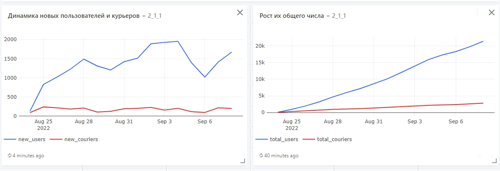
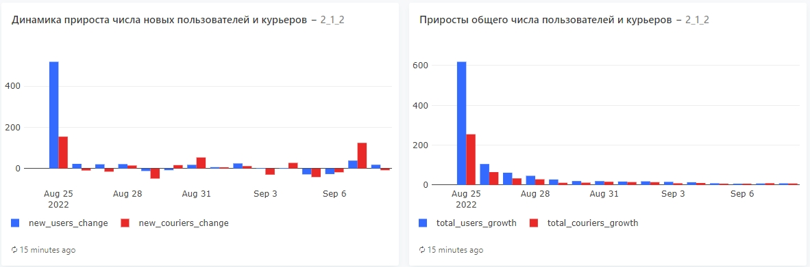
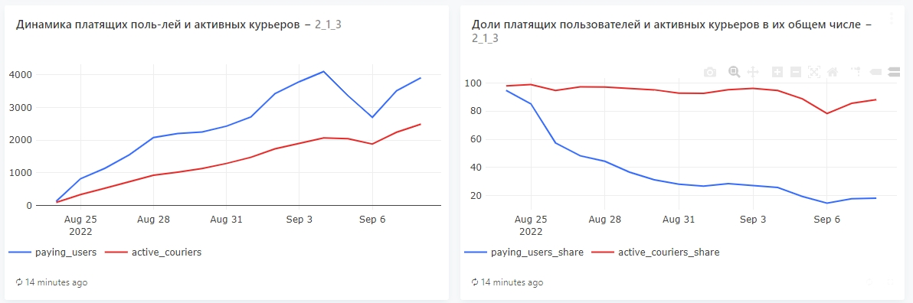
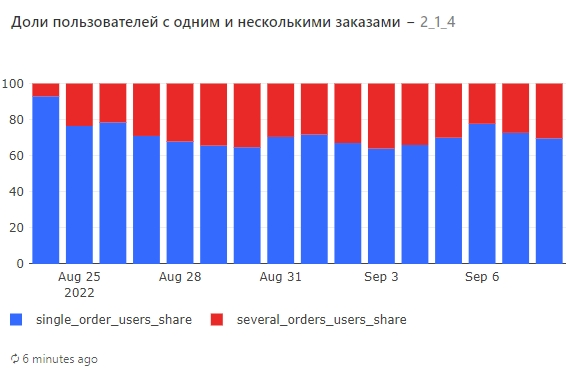
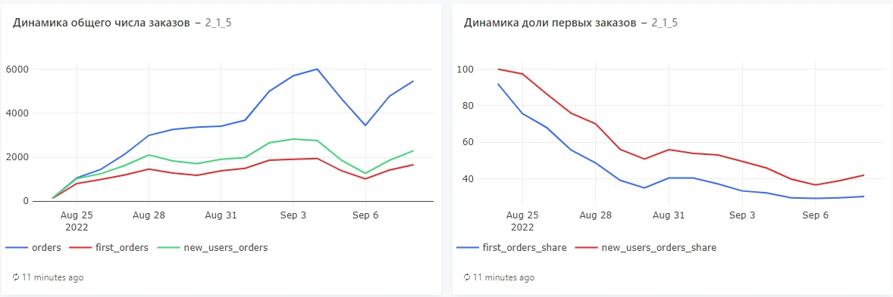
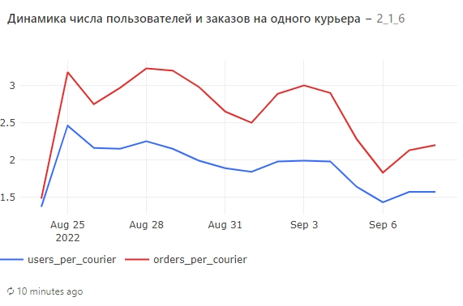
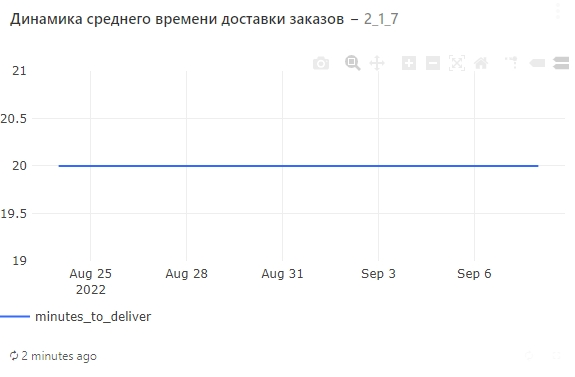

# Решаем продуктовые задачи

## Задание 1
Для каждого дня, представленного в таблицах user_actions и courier_actions, рассчитайте следующие показатели:

1. Число новых пользователей.
2. Число новых курьеров.
3. Общее число пользователей на текущий день.
4. Общее число курьеров на текущий день.

Колонки с показателями назовите соответственно new_users, new_couriers, total_users, total_couriers. Колонку с датами назовите date. Проследите за тем, чтобы показатели были выражены целыми числами. Результат должен быть отсортирован по возрастанию даты.

Поля в результирующей таблице: date, new_users, new_couriers, total_users, total_couriers

Пояснение: 

Новыми будем считать тех пользователей и курьеров, которые в данный день совершили своё первое действие в нашем сервисе. Общее число пользователей/курьеров на текущий день — это результат сложения числа новых пользователей/курьеров в текущий день со значениями аналогичного показателя всех предыдущих дней.

### Решение:

Вариан 1

    WITH main_table AS (
      SELECT
        CAST('user' AS VARCHAR(10)) AS user_type,
        user_id AS user_id,
        MIN(time :: DATE) as date
      FROM
        user_actions
      GROUP BY
        user_type,
        user_id
      union
      SELECT
        CAST('courier' AS VARCHAR(10)) AS user_type,
        courier_id,
        MIN(time :: DATE) as date
      FROM
        courier_actions
      GROUP BY
        user_type,
        courier_id
    )
    SELECT
      t1.date,
      new_users,
      new_couriers,
      SUM(new_users) OVER(
        ORDER BY
          t1.date
      ) :: int AS total_users,
      SUM(new_couriers) OVER(
        ORDER BY
          t1.date
      ) :: int AS total_couriers
    FROM
      (
        SELECT
          date,
          COUNT(user_id) FILTER(
            WHERE
              user_type = 'user'
          ) AS new_users,
          COUNT(user_id) FILTER(
            WHERE
              user_type = 'courier'
          ) AS new_couriers
        FROM
          main_table
        GROUP by
          date
        ORDER BY
          date
      ) t1

Вариант 2

    SELECT
      start_date as date,
      new_users,
      new_couriers,
      (
        sum(new_users) OVER (
          ORDER BY
            start_date
        )
      ) :: int as total_users,
      (
        sum(new_couriers) OVER (
          ORDER BY
            start_date
        )
      ) :: int as total_couriers
    FROM
      (
        SELECT
          start_date,
          count(courier_id) as new_couriers
        FROM
          (
            SELECT
              courier_id,
              min(time :: date) as start_date
            FROM
              courier_actions
            GROUP BY
              courier_id
          ) t1
        GROUP BY
          start_date
      ) t2
      LEFT JOIN (
        SELECT
          start_date,
          count(user_id) as new_users
        FROM
          (
            SELECT
              user_id,
              min(time :: date) as start_date
            FROM
              user_actions
            GROUP BY
              user_id
          ) t3
        GROUP BY
          start_date
      ) t4 using (start_date)

Визуализация

## Задание 2
Дополните запрос из предыдущего задания и теперь для каждого дня, представленного в таблицах user_actions и courier_actions, дополнительно рассчитайте следующие показатели:

- Прирост числа новых пользователей.
- Прирост числа новых курьеров.
- Прирост общего числа пользователей.
- Прирост общего числа курьеров.

Показатели, рассчитанные на предыдущем шаге, также включите в результирующую таблицу.

Колонки с новыми показателями назовите соответственно new_users_change, new_couriers_change, total_users_growth, total_couriers_growth. Колонку с датами назовите date.

Все показатели прироста считайте в процентах относительно значений в предыдущий день. При расчёте показателей округляйте значения до двух знаков после запятой.

Результирующая таблица должна быть отсортирована по возрастанию даты.

Поля в результирующей таблице: 

date, new_users, new_couriers, total_users, total_couriers, 

new_users_change, new_couriers_change, total_users_growth, total_couriers_growth

Пояснение:

Не забывайте при делении заранее приводить значения к нужному типу данных. Пропущенные значения приростов для самой первой даты не заполняйте — просто оставьте поля в этой строке пустыми.

### Решение:

Варинат 1

    with main_table as (
      SELECT
        cast('user' as varchar(10)) as user_type,
        user_id as user_id,
        min(time :: date) as date
      FROM
        user_actions
      GROUP BY
        user_type,
        user_id
      UNION
      SELECT
        cast('courier' as varchar(10)) as user_type,
        courier_id,
        min(time :: date) as date
      FROM
        courier_actions
      GROUP BY
        user_type,
        courier_id
    )
    
    
    SELECT
      t1.date,
      new_users,
      new_couriers,
      sum(new_users) OVER(
        ORDER BY
          t1.date
      ) :: int as total_users,
      sum(new_couriers) OVER(
        ORDER BY
          t1.date
      ) :: int as total_couriers,
      ROUND((new_users::decimal / LAG(new_users, 1) OVER(ORDER BY t1.date) - 1) * 100, 2) AS new_users_change,
      ROUND((new_couriers::decimal / LAG(new_couriers, 1) OVER(ORDER BY t1.date) - 1) * 100, 2) AS new_couriers_change,
      ROUND(new_users::decimal / sum(new_users) over (order by t1.date ROWS BETWEEN UNBOUNDED PRECEDING AND 1 PRECEDING) * 100, 2) AS total_users_growth,
      ROUND(new_couriers::decimal / sum(new_couriers) over (order by t1.date ROWS BETWEEN UNBOUNDED PRECEDING AND 1 PRECEDING) * 100, 2) AS total_couriers_growth
    FROM
      (
        SELECT
          date,
          count(user_id) filter(
            WHERE
              user_type = 'user'
          ) as new_users,
          count(user_id) filter(
            WHERE
              user_type = 'courier'
          ) as new_couriers
        FROM
          main_table
        GROUP BY
          date
        ORDER BY
          date
      ) t1

Вариант 2

    SELECT
      date,
      new_users,
      new_couriers,
      total_users,
      total_couriers,
      round(
        100 * (
          new_users - lag(new_users, 1) OVER (
            ORDER BY
              date
          )
        ) / lag(new_users, 1) OVER (
          ORDER BY
            date
        ) :: decimal,
        2
      ) as new_users_change,
      round(
        100 * (
          new_couriers - lag(new_couriers, 1) OVER (
            ORDER BY
              date
          )
        ) / lag(new_couriers, 1) OVER (
          ORDER BY
            date
        ) :: decimal,
        2
      ) as new_couriers_change,
      round(
        100 * new_users :: decimal / lag(total_users, 1) OVER (
          ORDER BY
            date
        ),
        2
      ) as total_users_growth,
      round(
        100 * new_couriers :: decimal / lag(total_couriers, 1) OVER (
          ORDER BY
            date
        ),
        2
      ) as total_couriers_growth
    FROM
      (
        SELECT
          start_date as date,
          new_users,
          new_couriers,
          (
            sum(new_users) OVER (
              ORDER BY
                start_date
            )
          ) :: int as total_users,
          (
            sum(new_couriers) OVER (
              ORDER BY
                start_date
            )
          ) :: int as total_couriers
        FROM
          (
            SELECT
              start_date,
              count(courier_id) as new_couriers
            FROM
              (
                SELECT
                  courier_id,
                  min(time :: date) as start_date
                FROM
                  courier_actions
                GROUP BY
                  courier_id
              ) t1
            GROUP BY
              start_date
          ) t2
          LEFT JOIN (
            SELECT
              start_date,
              count(user_id) as new_users
            FROM
              (
                SELECT
                  user_id,
                  min(time :: date) as start_date
                FROM
                  user_actions
                GROUP BY
                  user_id
              ) t3
            GROUP BY
              start_date
          ) t4 using (start_date)
      ) t5

Визуализация

## Задание 3
Для каждого дня, представленного в таблицах user_actions и courier_actions, рассчитайте следующие показатели:

- Число платящих пользователей.
- Число активных курьеров.
- Долю платящих пользователей в общем числе пользователей на текущий день.
- Долю активных курьеров в общем числе курьеров на текущий день.

Колонки с показателями назовите соответственно paying_users, active_couriers, paying_users_share, active_couriers_share. Колонку с датами назовите date. Проследите за тем, чтобы абсолютные показатели были выражены целыми числами. Все показатели долей необходимо выразить в процентах. При их расчёте округляйте значения до двух знаков после запятой.

Результат должен быть отсортирован по возрастанию даты. 

Поля в результирующей таблице: date, paying_users, active_couriers, paying_users_share, active_couriers_share

Пояснение: 

Платящими будем считать тех пользователей, которые в данный день оформили хотя бы один заказ, который в дальнейшем не был отменен.

Курьеров будем считать активными, если в данный день они приняли хотя бы один заказ, который был доставлен (возможно, уже на следующий день), или доставили любой заказ.

Общее число пользователей/курьеров на текущий день — это по-прежнему результат сложения числа новых пользователей/курьеров в текущий день со значениями аналогичного показателя всех предыдущих дней. Мы считали этот показатель на предыдущих шагах.

Не забывайте при делении заранее приводить значения к нужному типу данных. 

### Решение:

Вариант 1

    WITH pay_users AS (
      SELECT
        time :: DATE AS date,
        COUNT(DISTINCT user_id) :: INT AS pay_users_count
      FROM
        user_actions
      WHERE
        order_id NOT IN (
          SELECT
            order_id
          FROM
            user_actions
          WHERE
            action = 'cancel_order'
        )
      GROUP BY
        date
    ),
    new_users AS (
      SELECT
        date,
        count(DISTINCT user_id) :: INT AS new_users_count
      FROM
        (
          SELECT
            user_id AS user_id,
            MIN(time :: DATE) as date
          FROM
            user_actions
          GROUP BY
            user_id
        ) t1
      GROUP BY
        date
    ),
    active_courier AS (
      SELECT
        time :: DATE date,
        COUNT(DISTINCT courier_id) :: INT AS active_courier_count
      FROM
        courier_actions
      WHERE
        --action = 'accept_order' AND
        order_id IN (
          SELECT
            order_id
          FROM
            courier_actions
          WHERE
            action = 'deliver_order'
        )
      GROUP BY
        date
    ),
    new_courier AS (
      SELECT
        date,
        count(DISTINCT courier_id) :: INT AS new_courier_count
      FROM
        (
          SELECT
            courier_id AS courier_id,
            MIN(time :: DATE) as date
          FROM
            courier_actions
          GROUP BY
            courier_id
        ) t1
      GROUP BY
        date
    )
    SELECT
      date,
      paying_users,
      active_couriers,
      ROUND(
        paying_users / SUM(new_users_count) OVER(
          ORDER BY
            date
        ) * 100,
        2
      ) AS paying_users_share,
      ROUND(
        active_couriers / SUM(new_courier_count) OVER(
          ORDER BY
            date
        ) * 100,
        2
      ) AS active_couriers_share
    FROM
      (
        SELECT
          t1.date AS date,
          sum(pay_users.pay_users_count) AS paying_users,
          sum(new_users.new_users_count) AS new_users_count,
          sum(active_courier.active_courier_count) AS active_couriers,
          sum(new_courier.new_courier_count) AS new_courier_count
        FROM
          (
            SELECT
              time :: DATE AS date
            from
              courier_actions
            union
            SELECT
              time :: DATE
            from
              user_actions
          ) t1
          LEFT JOIN pay_users ON pay_users.date = t1.date
          LEFT JOIN new_users ON new_users.date = t1.date
          LEFT JOIN active_courier ON active_courier.date = t1.date
          LEFT JOIN new_courier ON new_courier.date = t1.date
        GROUP BY
          t1.date
      ) t2
    ORDER BY
      date

Вариант 2

    SELECT
      date,
      paying_users,
      active_couriers,
      round(100 * paying_users :: decimal / total_users, 2) as paying_users_share,
      round(
        100 * active_couriers :: decimal / total_couriers,
        2
      ) as active_couriers_share
    FROM
      (
        SELECT
          start_date as date,
          new_users,
          new_couriers,
          (
            sum(new_users) OVER (
              ORDER BY
                start_date
            )
          ) :: int as total_users,
          (
            sum(new_couriers) OVER (
              ORDER BY
                start_date
            )
          ) :: int as total_couriers
        FROM
          (
            SELECT
              start_date,
              count(courier_id) as new_couriers
            FROM
              (
                SELECT
                  courier_id,
                  min(time :: date) as start_date
                FROM
                  courier_actions
                GROUP BY
                  courier_id
              ) t1
            GROUP BY
              start_date
          ) t2
          LEFT JOIN (
            SELECT
              start_date,
              count(user_id) as new_users
            FROM
              (
                SELECT
                  user_id,
                  min(time :: date) as start_date
                FROM
                  user_actions
                GROUP BY
                  user_id
              ) t3
            GROUP BY
              start_date
          ) t4 using (start_date)
      ) t5
      LEFT JOIN (
        SELECT
          time :: date as date,
          count(distinct courier_id) as active_couriers
        FROM
          courier_actions
        WHERE
          order_id not in (
            SELECT
              order_id
            FROM
              user_actions
            WHERE
              action = 'cancel_order'
          )
        GROUP BY
          date
      ) t6 using (date)
      LEFT JOIN (
        SELECT
          time :: date as date,
          count(distinct user_id) as paying_users
        FROM
          user_actions
        WHERE
          order_id not in (
            SELECT
              order_id
            FROM
              user_actions
            WHERE
              action = 'cancel_order'
          )
        GROUP BY
          date
      ) t7 using (date)

Визуализация

## Задание 4
Давайте подробнее остановимся на платящих пользователях, копнём немного глубже и выясним, как много платящих пользователей совершают более одного заказа в день. В конце концов нам важно понимать, как в большинстве своём ведут себя наши пользователи — они заходят в приложение, чтобы сделать всего один заказ, или же наш сервис настолько хорош, что они готовы пользоваться им несколько раз в день.

Для каждого дня, представленного в таблице user_actions, рассчитайте следующие показатели:

1. Долю пользователей, сделавших в этот день всего один заказ, в общем количестве платящих пользователей.
2. Долю пользователей, сделавших в этот день несколько заказов, в общем количестве платящих пользователей.
Колонки с показателями назовите соответственно single_order_users_share, several_orders_users_share. Колонку с датами назовите date. Все показатели с долями необходимо выразить в процентах. При расчёте долей округляйте значения до двух знаков после запятой.

Результат должен быть отсортирован по возрастанию даты.

Поля в результирующей таблице: date, single_order_users_share, several_orders_users_share

Пояснение: 

Платящими по-прежнему считаем тех пользователей, которые в данный день оформили (и не отменили) хотя бы один заказ.

Не забывайте при делении заранее приводить значения к нужному типу данных.

### Решение:

Вариант 1

    SELECT
      date,
      ROUND(SUM(less_2) :: decimal / SUM(all_users) * 100, 2) AS single_order_users_share,
      ROUND(SUM(great_1) :: decimal / SUM(all_users) * 100, 2) AS several_orders_users_share
    FROM
      (
        SELECT
          date,
          COUNT(DISTINCT user_id) FILTER(
            WHERE
              count < 2
          ) AS less_2,
          COUNT(user_id) FILTER(
            WHERE
              count > 1
          ) AS great_1,
          COUNT(DISTINCT user_id) AS all_users
        FROM
          (
            SELECT
              time :: DATE AS date,
              user_id,
              COUNT(DISTINCT order_id)
            FROM
              user_actions
            WHERE
              order_id NOT IN (
                SELECT
                  order_id
                FROM
                  user_actions
                WHERE
                  action = 'cancel_order'
              )
            GROUP BY
              date,
              user_id
          ) t1
        GROUP BY
          date
      ) t2
    GROUP by
      date
    ORDER BY
      date

Вариант 2

    SELECT
      date,
      round(
        100 * single_order_users :: decimal / paying_users,
        2
      ) as single_order_users_share,
      100 - round(
        100 * single_order_users :: decimal / paying_users,
        2
      ) as several_orders_users_share
    FROM
      (
        SELECT
          time :: date as date,
          count(distinct user_id) as paying_users
        FROM
          user_actions
        WHERE
          order_id not in (
            SELECT
              order_id
            FROM
              user_actions
            WHERE
              action = 'cancel_order'
          )
        GROUP BY
          date
      ) t1
      LEFT JOIN (
        SELECT
          date,
          count(user_id) as single_order_users
        FROM
          (
            SELECT
              time :: date as date,
              user_id,
              count(distinct order_id) as user_orders
            FROM
              user_actions
            WHERE
              order_id not in (
                SELECT
                  order_id
                FROM
                  user_actions
                WHERE
                  action = 'cancel_order'
              )
            GROUP BY
              date,
              user_id
            having
              count(distinct order_id) = 1
          ) t2
        GROUP BY
          date
      ) t3 using (date)
    ORDER BY
      date

Визуализация

## Задание 5
Для каждого дня, представленного в таблице user_actions, рассчитайте следующие показатели:

1. Общее число заказов.
2. Число первых заказов (заказов, сделанных пользователями впервые).
3. Число заказов новых пользователей (заказов, сделанных пользователями в тот же день, когда они впервые воспользовались сервисом).
4. Долю первых заказов в общем числе заказов (долю п.2 в п.1).
5. Долю заказов новых пользователей в общем числе заказов (долю п.3 в п.1).

Колонки с показателями назовите соответственно orders, first_orders, new_users_orders, first_orders_share, new_users_orders_share. Колонку с датами назовите date. Проследите за тем, чтобы во всех случаях количество заказов было выражено целым числом. Все показатели с долями необходимо выразить в процентах. При расчёте долей округляйте значения до двух знаков после запятой.

Результат должен быть отсортирован по возрастанию даты.

Поля в результирующей таблице: date, orders, first_orders, new_users_orders, first_orders_share, new_users_orders_share

Пояснение: 

При расчёте числа первых заказов учитывайте, что у каждого пользователя может быть всего один первый заказ (что вполне логично).

При расчёте числа заказов новых пользователей учитывайте, что в свой первый день каждый новый пользователь мог как совершить сразу несколько заказов, так и не совершить ни одного.

Во всех случаях при расчёте числа заказов учитывайте только фактически совершённые заказы, отменённые заказы не учитывайте.

Не забывайте при делении заранее приводить значения к нужному типу данных.

Подсказка на случай, если совсем не получается

Для решения задачи сначала необходимо для каждого дня отдельно рассчитать общее число заказов, число первых заказов и число заказов новых пользователей, а затем объединить полученные таблицы в одну и посчитать все необходимые относительные показатели. Для расчёта числа первых заказов сперва для каждого пользователя нужно найти дату оформления первого неотменённого заказа и затем произвести группировку по дате, посчитав для каждого дня количество пользователей, сделавших первый заказ. Для расчёта числа заказов новых пользователей сначала нужно для каждого пользователя найти дату совершения первого действия, а затем дополнить эту таблицу данными о количестве заказов, сделанных пользователем в свой первый день. Это можно сделать, присоединив к таблице с датами первых действий таблицу с общим числом заказов на каждую дату для каждого пользователя. Обратите внимание, что в этой таблице для некоторых пользователей могут отсутствовать даты совершения первого действия, т.к. пользователь мог отменить заказ и фактически не совершить ни одной покупки в свой первый день. После объединения таблиц для таких дней с пропущенными значениями следует указать число заказов равным 0. Это можно сделать, например, с помощью функции COALESCE.

После того как составите запрос, попробуйте визуализировать результаты и постройте графики, отражающие динамику рассчитанных показателей.

### Решение:

Вариант 1

    WITH actual_orders AS (
      SELECT
        time :: DATE AS date,
        COUNT(DISTINCT order_id) AS orders
      FROM
        user_actions
      WHERE
        order_id NOT IN (
          SELECT
            order_id
          FROM
            user_actions
          WHERE
            action = 'cancel_order'
        )
      GROUP BY
        date
    ),
    first_orders AS (
      SELECT
        date,
        COUNT(DISTINCT user_id) AS first_orders
      FROM
        (
          SELECT
            MIN(time :: DATE) AS date,
            user_id
          FROM
            user_actions
          WHERE
            order_id NOT IN (
              SELECT
                order_id
              FROM
                user_actions
              WHERE
                action = 'cancel_order'
            )
          GROUP BY
            user_id
        ) t1
      GROUP BY
        date
    ),
    new_users_orders AS (
      SELECT
        date,
        sum(count_order) :: INT AS new_users_orders
      FROM
        (
          SELECT
            t1.date,
            t1.user_id,
            COUNT(DISTINCT ua.order_id) AS count_order
          FROM
            (
              SELECT
                MIN(time :: DATE) AS date,
                user_id
              FROM
                user_actions
              GROUP BY
                user_id
            ) t1
            LEFT JOIN (
              SELECT
                user_id,
                order_id,
                time :: DATE as date
              FROM
                user_actions
              WHERE
                order_id NOT IN (
                  SELECT
                    order_id
                  FROM
                    user_actions
                  WHERE
                    action = 'cancel_order'
                )
            ) ua ON t1.user_id = ua.user_id
            AND ua.date = t1.date
          GROUP BY
            t1.date,
            t1.user_id
        ) t2
      GROUP BY
        t2.date
    )
    
    SELECT
      ao.date,
      ao.orders,
      fo.first_orders,
      nuo.new_users_orders,
      ROUND(fo.first_orders :: decimal / ao.orders * 100, 2) AS first_orders_share,
      ROUND(
        nuo.new_users_orders :: decimal / ao.orders * 100,
        2
      ) AS new_users_orders_share
    FROM
      actual_orders ao
      LEFT JOIN first_orders fo ON fo.date = ao.date
      LEFT JOIN new_users_orders nuo ON nuo.date = ao.date
    ORDER BY
      ao.date

Вариант 2

    SELECT
      date,
      orders,
      first_orders,
      new_users_orders :: int,
      round(100 * first_orders :: decimal / orders, 2) as first_orders_share,
      round(100 * new_users_orders :: decimal / orders, 2) as new_users_orders_share
    FROM
      (
        SELECT
          creation_time :: date as date,
          count(distinct order_id) as orders
        FROM
          orders
        WHERE
          order_id not in (
            SELECT
              order_id
            FROM
              user_actions
            WHERE
              action = 'cancel_order'
          )
          and order_id in (
            SELECT
              order_id
            FROM
              courier_actions
            WHERE
              action = 'deliver_order'
          )
        GROUP BY
          date
      ) t5
      LEFT JOIN (
        SELECT
          first_order_date as date,
          count(user_id) as first_orders
        FROM
          (
            SELECT
              user_id,
              min(time :: date) as first_order_date
            FROM
              user_actions
            WHERE
              order_id not in (
                SELECT
                  order_id
                FROM
                  user_actions
                WHERE
                  action = 'cancel_order'
              )
            GROUP BY
              user_id
          ) t4
        GROUP BY
          first_order_date
      ) t7 using (date)
      LEFT JOIN (
        SELECT
          start_date as date,
          sum(orders) as new_users_orders
        FROM
          (
            SELECT
              t1.user_id,
              t1.start_date,
              coalesce(t2.orders, 0) as orders
            FROM
              (
                SELECT
                  user_id,
                  min(time :: date) as start_date
                FROM
                  user_actions
                GROUP BY
                  user_id
              ) t1
              LEFT JOIN (
                SELECT
                  user_id,
                  time :: date as date,
                  count(distinct order_id) as orders
                FROM
                  user_actions
                WHERE
                  order_id not in (
                    SELECT
                      order_id
                    FROM
                      user_actions
                    WHERE
                      action = 'cancel_order'
                  )
                GROUP BY
                  user_id,
                  date
              ) t2 ON t1.user_id = t2.user_id
              and t1.start_date = t2.date
          ) t3
        GROUP BY
          start_date
      ) t6 using (date)
    ORDER BY
      date

Визуализация

## Задание 6
Теперь давайте попробуем примерно оценить нагрузку на наших курьеров и узнаем, сколько в среднем заказов и пользователей приходится на каждого из них.

На основе данных в таблицах user_actions, courier_actions и orders для каждого дня рассчитайте следующие показатели:

1. Число платящих пользователей на одного активного курьера.
2. Число заказов на одного активного курьера.

Колонки с показателями назовите соответственно users_per_courier и orders_per_courier. Колонку с датами назовите date. При расчёте показателей округляйте значения до двух знаков после запятой.

Результирующая таблица должна быть отсортирована по возрастанию даты.

Поля в результирующей таблице: date, users_per_courier, orders_per_courier

**Пояснение:**

Платящими по-прежнему считаем тех пользователей, которые в данный день оформили хотя бы один заказ, который в дальнейшем не был отменен.

Курьеров считаем активными, если в данный день они приняли хотя бы один заказ, который был доставлен (возможно, уже на следующий день), или доставили любой заказ.

В расчётах учитывайте только неотменённые заказы. 

Не забывайте при делении заранее приводить значения к нужному типу данных.

После того как составите запрос, попробуйте визуализировать результаты и постройте графики, отражающие динамику рассчитанных показателей.

Можете поместить оба показателя на один график или сделать два разных.

### Решение:

Вариант 1

    WITH pay_users AS (
      SELECT
        time :: DATE AS date,
        COUNT(distinct user_id) AS user_count,
        COUNT(distinct order_id) AS order_count
      FROM
        user_actions
      WHERE
        order_id NOT IN (
          SELECT
            order_id
          FROM
            user_actions
          WHERE
            action = 'cancel_order'
        )
      GROUP BY
        date
    ),
    active_courier as (
      SELECT
        time :: date date,
        count(distinct courier_id) :: int as active_courier_count
      FROM
        courier_actions
      WHERE
        order_id in (
          SELECT
            order_id
          FROM
            courier_actions
          WHERE
            action = 'deliver_order'
        )
      GROUP BY
        date
    )
    
    SELECT
      a.date,
      ROUND(
        p.user_count :: DECIMAL / a.active_courier_count,
        2
      ) AS users_per_courier,
      ROUND(
        p.order_count :: DECIMAL / a.active_courier_count,
        2
      ) AS orders_per_courier
    FROM
      active_courier a
      LEFT JOIN pay_users p ON p.date = a.date
    ORDER BY
      a.date

Вариант 2

    SELECT
      date,
      round(paying_users :: decimal / couriers, 2) as users_per_courier,
      round(orders :: decimal / couriers, 2) as orders_per_courier
    FROM
      (
        SELECT
          time :: date as date,
          count(distinct courier_id) as couriers
        FROM
          courier_actions
        WHERE
          order_id not in (
            SELECT
              order_id
            FROM
              user_actions
            WHERE
              action = 'cancel_order'
          )
        GROUP BY
          date
      ) t1
      join (
        SELECT
          creation_time :: date as date,
          count(distinct order_id) as orders
        FROM
          orders
        WHERE
          order_id not in (
            SELECT
              order_id
            FROM
              user_actions
            WHERE
              action = 'cancel_order'
          )
        GROUP BY
          date
      ) t2 using (date)
      join (
        SELECT
          time :: date as date,
          count(distinct user_id) as paying_users
        FROM
          user_actions
        WHERE
          order_id not in (
            SELECT
              order_id
            FROM
              user_actions
            WHERE
              action = 'cancel_order'
          )
        GROUP BY
          date
      ) t3 using (date)
    ORDER BY
      date

Визуализация

## Задание 7
Давайте рассчитаем ещё один полезный показатель, характеризующий качество работы курьеров.

На основе данных в таблице courier_actions для каждого дня рассчитайте, за сколько минут в среднем курьеры доставляли свои заказы.

Колонку с показателем назовите minutes_to_deliver. Колонку с датами назовите date. При расчёте среднего времени доставки округляйте количество минут до целых значений. Учитывайте только доставленные заказы, отменённые заказы не учитывайте.

Результирующая таблица должна быть отсортирована по возрастанию даты.

Поля в результирующей таблице: date, minutes_to_deliver

**Пояснение:**

Для решения задачи вам, возможно, придётся вспомнить, как определить количество минут, содержащихся в интервале времени. Мы уже решали похожую задачу на этом шаге.

Некоторые заказы оформляют в один день, а доставляют уже на следующий. При расчёте среднего времени доставки в качестве дней, для которых считать среднее, используйте дни фактической доставки заказов.

После того как составите запрос, попробуйте визуализировать результаты и постройте график, отражающий динамику рассчитанного показателя.

### Решение:

Вариант 1

    SELECT
      ca.time :: DATE AS date,
      AVG(
        EXTRACT(
          epoch
          FROM
            ca.time - c.time
        ) :: float / 60
      ) :: int AS minutes_to_deliver
    FROM
      courier_actions c
      LEFT JOIN courier_actions ca ON ca.order_id = c.order_id
      AND ca.action = 'deliver_order'
    WHERE
      c.order_id NOT IN (
        SELECT
          order_id
        FROM
          user_actions
        WHERE
          action = 'cancel_order'
      )
      AND c.action = 'accept_order'
    GROUP BY
      date
    ORDER BY
      date

Вариант 2

    SELECT
      date,
      round(avg(delivery_time)) :: int as minutes_to_deliver
    FROM
      (
        SELECT
          order_id,
          max(time :: date) as date,
          extract(
            epoch
            FROM
              max(time) - min(time)
          ) / 60 as delivery_time
        FROM
          courier_actions
        WHERE
          order_id not in (
            SELECT
              order_id
            FROM
              user_actions
            WHERE
              action = 'cancel_order'
          )
        GROUP BY
          order_id
      ) t
    GROUP BY
      date
    ORDER BY
      date

Визуализация

## Задание 8

### Решение:

Вариант 1

    SELECT
      hour,
      orders - canceled_orders AS successful_orders,
      canceled_orders,
      ROUND(canceled_orders :: decimal / orders, 3) AS cancel_rate
    FROM
      (
        SELECT
          extract(
            hour
            from
              creation_time
          ) :: int AS hour,
          COUNT(DISTINCT o.order_id) AS orders,
          COUNT(DISTINCT u.order_id) AS canceled_orders
        FROM
          orders o
          LEFT JOIN user_actions u ON u.order_id = o.order_id
          AND u.action = 'cancel_order'
        GROUP BY
          hour
      ) t1
    ORDER BY
      hour

Вариант 2

    SELECT
      hour,
      successful_orders,
      canceled_orders,
      round(
        canceled_orders :: decimal / (successful_orders + canceled_orders),
        3
      ) as cancel_rate
    FROM
      (
        SELECT
          date_part('hour', creation_time) :: int as hour,
          count(order_id) as successful_orders
        FROM
          orders
        WHERE
          order_id not in (
            SELECT
              order_id
            FROM
              user_actions
            WHERE
              action = 'cancel_order'
          )
        GROUP BY
          hour
      ) t1
      LEFT JOIN (
        SELECT
          date_part('hour', creation_time) :: int as hour,
          count(order_id) as canceled_orders
        FROM
          orders
        WHERE
          order_id in (
            SELECT
              order_id
            FROM
              user_actions
            WHERE
              action = 'cancel_order'
          )
        GROUP BY
          hour
      ) t2 using (hour)
    ORDER BY
      hour
