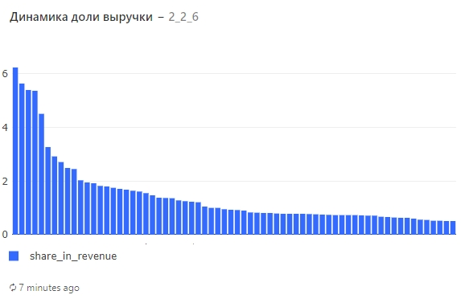
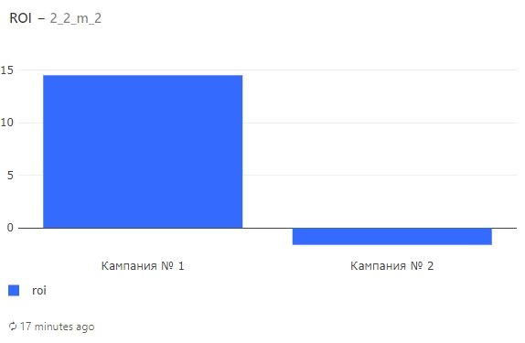

# Анализ продуктовых метрик. Экономика продукта

## Задание 1
Начнём с выручки — наиболее общего показателя, который покажет, какой доход приносит наш сервис.

Для каждого дня в таблице orders рассчитайте следующие показатели:

1. Выручку, полученную в этот день.
2. Суммарную выручку на текущий день.
3. Прирост выручки, полученной в этот день, относительно значения выручки за предыдущий день.

Колонки с показателями назовите соответственно revenue, total_revenue, revenue_change. Колонку с датами назовите date.

Прирост выручки рассчитайте в процентах и округлите значения до двух знаков после запятой.

Результат должен быть отсортирован по возрастанию даты.

Поля в результирующей таблице: date, revenue, total_revenue, revenue_change

**Пояснение:**

Будем считать, что оплата за заказ поступает сразу же после его оформления, т.е. случаи, когда заказ был оформлен в один день, а оплата получена на следующий, возникнуть не могут.

Суммарная выручка на текущий день — это результат сложения выручки, полученной в текущий день, со значениями аналогичного показателя всех предыдущих дней.

При расчёте выручки помните, что не все заказы были оплачены — некоторые были отменены пользователями.

Не забывайте при делении заранее приводить значения к нужному типу данных. Пропущенные значения прироста для самой первой даты не заполняйте — просто оставьте поля в этой строке пустыми.

**Подсказка на случай, если совсем не получается**

Для решения задачи вам потребуется информация о заказах из таблицы orders и ценах на товары из таблицы products. Чтобы посчитать выручку для каждого дня, сначала необходимо посчитать стоимость каждого заказа. Это можно сделать, сложив цены входящих в заказ товаров. Чтобы правильно присоединить данные о ценах на товары, списки с содержимым заказов нужно предварительно расширить с помощью функции unnest. После того как для каждого дня будет посчитана суммарная стоимость всех заказов (выручка), с помощью оконных функций можно посчитать сумму нарастающим итогом (общую выручку) и прирост выручки (разницу между выручкой в текущий день и выручкой в предыдущий день, делённую на выручку в предыдущий день).

После того как составите запрос, попробуйте визуализировать результаты и постройте графики, отражающие динамику рассчитанных показателей.

### Решение:

Вариант 1

    SELECT
      t2.date,
      t2.revenue,
      SUM(t2.revenue) OVER(
        ORDER BY
          t2.date
      ) AS total_revenue,
      ROUND(
        (
          t2.revenue :: DECIMAL / LAG(t2.revenue, 1) OVER(
            ORDER BY
              t2.date
          ) - 1
        ) * 100,
        2
      ) AS revenue_change
    FROM
      (
        SELECT
          t1.date,
          SUM(p.price) AS revenue
        FROM
          (
            SELECT
              creation_time :: DATE AS date,
              UNNEST(product_ids) AS product_id
            FROM
              orders
            WHERE
              order_id NOT IN (
                SELECT
                  order_id
                FROM
                  user_actions
                WHERE
                  action = 'cancel_order'
              )
          ) t1
          LEFT JOIN products p ON p.product_id = t1.product_id
        GROUP BY
          t1.date
      ) t2
    ORDER BY
      t2.date

Вариант 2

    SELECT
      date,
      revenue,
      sum(revenue) OVER (
        ORDER BY
          date
      ) as total_revenue,
      round(
        100 * (
          revenue - lag(revenue, 1) OVER (
            ORDER BY
              date
          )
        ) :: decimal / lag(revenue, 1) OVER (
          ORDER BY
            date
        ),
        2
      ) as revenue_change
    FROM
      (
        SELECT
          creation_time :: date as date,
          sum(price) as revenue
        FROM
          (
            SELECT
              creation_time,
              unnest(product_ids) as product_id
            FROM
              orders
            WHERE
              order_id not in (
                SELECT
                  order_id
                FROM
                  user_actions
                WHERE
                  action = 'cancel_order'
              )
          ) t1
          LEFT JOIN products using (product_id)
        GROUP BY
          date
      ) t2

#### Замечание
Вариант запроса №2 от сервиса karpov, предлагается как верное решение. Его можно сократить, избыточность оконных функции стр. 10, достаточно сделать (revenue / пред. revenue - 1) * 100

### Визуализация

Проанализируйте построенные графики и попробуйте ответить на следующие вопросы:

1. В какие дни наблюдалось заметное снижение ежедневной выручки? 
2. С чем это могло быть связано? (чтобы установить причину падения выручки, можете сопоставить текущие графики с графиками на дашборде из прошлого урока)

## Задание 2
Теперь на основе данных о выручке рассчитаем несколько относительных показателей, которые покажут, сколько в среднем потребители готовы платить за услуги нашего сервиса доставки. Остановимся на следующих метриках:

1. ARPU (Average Revenue Per User) — средняя выручка на одного пользователя за определённый период.
2. ARPPU (Average Revenue Per Paying User) — средняя выручка на одного платящего пользователя за определённый период.
3. AOV (Average Order Value) — средний чек, или отношение выручки за определённый период к общему количеству заказов за это же время.

Если за рассматриваемый период сервис заработал 100 000 рублей и при этом им пользовались 500 уникальных пользователей, из которых 400 сделали в общей сложности 650 заказов, тогда метрики будут иметь следующие значения:

ARPU =100000/500=200

ARPPU =100000/400=250

AOV=100000/650≈153,85

Задание

Для каждого дня в таблицах orders и user_actions рассчитайте следующие показатели:

1. Выручку на пользователя (ARPU) за текущий день.
2. Выручку на платящего пользователя (ARPPU) за текущий день.
3. Выручку с заказа, или средний чек (AOV) за текущий день.
4. Колонки с показателями назовите соответственно arpu, arppu, aov. Колонку с датами назовите date. 

При расчёте всех показателей округляйте значения до двух знаков после запятой.

Результат должен быть отсортирован по возрастанию даты. 

Поля в результирующей таблице: date, arpu, arppu, aov

**Пояснение:**

Будем считать, что оплата за заказ поступает сразу же после его оформления, т.е. случаи, когда заказ был оформлен в один день, а оплата получена на следующий, возникнуть не могут.

Платящими будем считать тех пользователей, которые в данный день оформили хотя бы один заказ, который в дальнейшем не был отменен.

При расчёте выручки помните, что не все заказы были оплачены — некоторые были отменены пользователями.

Не забывайте при делении заранее приводить значения к нужному типу данных.

**Подсказка на случай, если совсем не получается**

Для решения задачи необходимо сначала для каждого дня посчитать выручку, число всех пользователей, число платящих пользователей и число заказов. Затем необходимо объединить полученные таблицы и рассчитать все необходимые относительные показатели. Выручку мы уже считали в прошлом задании.

После того как составите запрос, попробуйте визуализировать результаты и постройте график, отражающий динамику рассчитанных показателей.

Решение:

Варианта 1

    WITH table_revenue AS (
      SELECT
        date,
        SUM(p.price) AS revenue,
        COUNT(DISTINCT ua.user_id) as users,
        COUNT(DISTINCT t1.order_id) AS count_orders
      FROM
        (
          SELECT
            creation_time :: DATE AS date,
            order_id,
            UNNEST(product_ids) AS product_id
          FROM
            orders
          WHERE
            order_id NOT IN (
              SELECT
                order_id
              FROM
                user_actions
              WHERE
                action = 'cancel_order'
            )
        ) t1
        LEFT JOIN products p ON p.product_id = t1.product_id
        LEFT JOIN user_actions ua ON ua.order_id = t1.order_id
      GROUP BY
        date
    ),
    all_users AS (
      SELECT
        time :: DATE as date,
        count(DISTINCT user_id) AS all_users
      FROM
        user_actions
      GROUP BY
        date
    )
    SELECT
      tr.date,
      ROUND(tr.revenue :: decimal / au.all_users, 2) AS arpu,
      ROUND(tr.revenue :: decimal / tr.users, 2) AS arppu,
      ROUND(tr.revenue :: decimal / tr.count_orders, 2) AS aov
    FROM
      table_revenue tr
      LEFT JOIN all_users au ON au.date = tr.date
    ORDER BY
      date

Вариант 2

    SELECT
      date,
      round(revenue :: decimal / users, 2) as arpu,
      round(revenue :: decimal / paying_users, 2) as arppu,
      round(revenue :: decimal / orders, 2) as aov
    FROM
      (
        SELECT
          creation_time :: date as date,
          count(distinct order_id) as orders,
          sum(price) as revenue
        FROM
          (
            SELECT
              order_id,
              creation_time,
              unnest(product_ids) as product_id
            FROM
              orders
            WHERE
              order_id not in (
                SELECT
                  order_id
                FROM
                  user_actions
                WHERE
                  action = 'cancel_order'
              )
          ) t1
          LEFT JOIN products using(product_id)
        GROUP BY
          date
      ) t2
      LEFT JOIN (
        SELECT
          time :: date as date,
          count(distinct user_id) as users
        FROM
          user_actions
        GROUP BY
          date
      ) t3 using (date)
      LEFT JOIN (
        SELECT
          time :: date as date,
          count(distinct user_id) as paying_users
        FROM
          user_actions
        WHERE
          order_id not in (
            SELECT
              order_id
            FROM
              user_actions
            WHERE
              action = 'cancel_order'
          )
        GROUP BY
          date
      ) t4 using (date)
    ORDER BY
      date

### Визуализация

Проанализируйте построенный график и попробуйте ответить на следующие вопросы:

1. Какие метрики имеют больший разброс значений на протяжении рассматриваемого периода ?
2. Можно ли сказать, что отдельные метрики имеют аномально высокие или аномально низкие значения в отдельные дни ?
3. Какой вывод можно сделать о соотношении числа платящих пользователей и всех пользователей сервиса в рассматриваемые дни ?

## Задание 3
Дополним наш анализ ещё более интересными расчётами — вычислим все те же метрики, но для каждого дня будем учитывать накопленную выручку и все имеющиеся на текущий момент данные о числе пользователей и заказов. Таким образом, получим динамический ARPU, ARPPU и AOV и сможем проследить, как он менялся на протяжении времени с учётом поступающих нам данных.

По таблицам orders и user_actions для каждого дня рассчитайте следующие показатели:

1. Накопленную выручку на пользователя (Running ARPU).
2. Накопленную выручку на платящего пользователя (Running ARPPU).
3. Накопленную выручку с заказа, или средний чек (Running AOV).

Колонки с показателями назовите соответственно running_arpu, running_arppu, running_aov. Колонку с датами назовите date. 

При расчёте всех показателей округляйте значения до двух знаков после запятой.

Результат должен быть отсортирован по возрастанию даты. 

Поля в результирующей таблице: date, running_arpu, running_arppu, running_aov

**Пояснение:**

При расчёте числа пользователей и платящих пользователей на текущую дату учитывайте соответствующих пользователей за все предыдущие дни, включая текущий.

Платящими будем считать тех пользователей, которые на текущий день оформили хотя бы один заказ, который в дальнейшем не был отменен.

Будем считать, что оплата за заказ поступает сразу же после его оформления, т.е. случаи, когда заказ был оформлен в один день, а оплата получена на следующий, возникнуть не могут.

При расчёте выручки помните, что не все заказы были оплачены — некоторые были отменены пользователями.

Не забывайте при делении заранее приводить значения к нужному типу данных.

**Подсказка на случай, если совсем не получается**

Для решения этой задачи необходимо дополнить запрос из предыдущего задания и для каждого дня дополнительно рассчитать накопленную выручку, а также накопленное число всех пользователей и отдельно платящих пользователей. Для расчёта числа пользователей с накоплением потребуется информация о новых пользователях и новых платящих пользователях в каждый из рассматриваемых дней. Мы как раз считали это в одной из задач предыдущего урока.

После того как составите запрос, попробуйте визуализировать результаты и постройте график, отражающий динамику рассчитанных показателей.

### Решение:
Варианта 1

    with table_revenue as (
      SELECT
        date,
        sum(p.price) as revenue,
        COUNT(distinct ua.user_id) as users,
        COUNT(distinct t1.order_id) as count_orders
      FROM
        (
          SELECT
            creation_time :: date as date,
            order_id,
            unnest(product_ids) as product_id
          FROM
            orders
          WHERE
            order_id NOT in (
              SELECT
                order_id
              FROM
                user_actions
              WHERE
                action = 'cancel_order'
            )
        ) t1
        LEFT JOIN products p ON p.product_id = t1.product_id
        LEFT JOIN user_actions ua ON ua.order_id = t1.order_id
      GROUP BY
        date
    ),
    new_users_all AS (
      SELECT
        date,
        COUNT(DISTINCT user_id) AS count
      FROM
        (
          SELECT
            min(time) :: DATE AS date,
            user_id
          FROM
            user_actions
          GROUP BY
            user_id
        ) t1
      GROUP BY
        date
    ),
    new_users_payed AS (
      SELECT
        date,
        COUNT(DISTINCT user_id) AS count
      FROM
        (
          SELECT
            min(time) :: DATE AS date,
            user_id
          FROM
            user_actions
          WHERE
            order_id NOT in (
              SELECT
                order_id
              FROM
                user_actions
              WHERE
                action = 'cancel_order'
            )
          GROUP BY
            user_id
        ) t1
      GROUP BY
        date
    )
    SELECT
      tr.date,
      ROUND(
        SUM(tr.revenue) OVER(
          ORDER BY
            tr.date
        ) :: DECIMAL / SUM(nua.count) OVER(
          ORDER BY
            tr.date
        ),
        2
      ) AS running_arpu,
      ROUND(
        SUM(tr.revenue) OVER(
          ORDER BY
            tr.date
        ) :: DECIMAL / SUM(nup.count) OVER(
          ORDER BY
            tr.date
        ),
        2
      ) AS running_arppu,
      ROUND(
        SUM(tr.revenue) OVER(
          ORDER BY
            tr.date
        ) :: DECIMAL / SUM(tr.count_orders) OVER(
          ORDER BY
            tr.date
        ),
        2
      ) AS running_aov
    FROM
      table_revenue tr
      LEFT JOIN new_users_all nua ON nua.date = tr.date
      LEFT JOIN new_users_payed nup ON nup.date = tr.date
    ORDER BY
      date

Вариант 2

    SELECT
      date,
      round(
        sum(revenue) OVER (
          ORDER BY
            date
        ) :: decimal / sum(new_users) OVER (
          ORDER BY
            date
        ),
        2
      ) as running_arpu,
      round(
        sum(revenue) OVER (
          ORDER BY
            date
        ) :: decimal / sum(new_paying_users) OVER (
          ORDER BY
            date
        ),
        2
      ) as running_arppu,
      round(
        sum(revenue) OVER (
          ORDER BY
            date
        ) :: decimal / sum(orders) OVER (
          ORDER BY
            date
        ),
        2
      ) as running_aov
    FROM
      (
        SELECT
          creation_time :: date as date,
          count(distinct order_id) as orders,
          sum(price) as revenue
        FROM
          (
            SELECT
              order_id,
              creation_time,
              unnest(product_ids) as product_id
            FROM
              orders
            WHERE
              order_id not in (
                SELECT
                  order_id
                FROM
                  user_actions
                WHERE
                  action = 'cancel_order'
              )
          ) t1
          LEFT JOIN products using(product_id)
        GROUP BY
          date
      ) t2
      LEFT JOIN (
        SELECT
          time :: date as date,
          count(distinct user_id) as users
        FROM
          user_actions
        GROUP BY
          date
      ) t3 using (date)
      LEFT JOIN (
        SELECT
          time :: date as date,
          count(distinct user_id) as paying_users
        FROM
          user_actions
        WHERE
          order_id not in (
            SELECT
              order_id
            FROM
              user_actions
            WHERE
              action = 'cancel_order'
          )
        GROUP BY
          date
      ) t4 using (date)
      LEFT JOIN (
        SELECT
          date,
          count(user_id) as new_users
        FROM
          (
            SELECT
              user_id,
              min(time :: date) as date
            FROM
              user_actions
            GROUP BY
              user_id
          ) t5
        GROUP BY
          date
      ) t6 using (date)
      LEFT JOIN (
        SELECT
          date,
          count(user_id) as new_paying_users
        FROM
          (
            SELECT
              user_id,
              min(time :: date) as date
            FROM
              user_actions
            WHERE
              order_id not in (
                SELECT
                  order_id
                FROM
                  user_actions
                WHERE
                  action = 'cancel_order'
              )
            GROUP BY
              user_id
          ) t7
        GROUP BY
          date
      ) t8 using (date)

### Визуализация

Проанализируйте построенный график и попробуйте ответить на следующие вопросы:

1. Какая в целом динамика у рассчитанных метрик? Они растут, падают или имеют примерно одинаковое значение в каждый из дней ?
2. Можно ли, учитывая динамику рассчитанных метрик, предположить, что со временем растёт число заказов на одного пользователя ?

## Задание 4

Для каждого дня недели в таблицах orders и user_actions рассчитайте следующие показатели:

1. Выручку на пользователя (ARPU).
2. Выручку на платящего пользователя (ARPPU).
3. Выручку на заказ (AOV).

При расчётах учитывайте данные только за период с 26 августа 2022 года по 8 сентября 2022 года включительно — так, чтобы в анализ попало одинаковое количество всех дней недели (ровно по два дня).

В результирующую таблицу включите как наименования дней недели (например, Monday), так и порядковый номер дня недели (от 1 до 7, где 1 — это Monday, 7 — это Sunday).

Колонки с показателями назовите соответственно arpu, arppu, aov. Колонку с наименованием дня недели назовите weekday, а колонку с порядковым номером дня недели weekday_number.

При расчёте всех показателей округляйте значения до двух знаков после запятой.

Результат должен быть отсортирован по возрастанию порядкового номера дня недели.

Поля в результирующей таблице: 

    weekday, weekday_number, arpu, arppu, aov

**Пояснение:**

Будем считать, что оплата за заказ поступает сразу же после его оформления, т.е. случаи, когда заказ был оформлен в один день, а оплата получена на следующий, возникнуть не могут.

Платящими будем считать тех пользователей, которые в данный день оформили хотя бы один заказ, который в дальнейшем не был отменен.

При расчёте выручки помните, что не все заказы были оплачены — некоторые были отменены пользователями.

Не забывайте при делении заранее приводить значения к нужному типу данных.

В этой задаче порядковый номер дня недели необходим для того, чтобы дни недели были расположены на графике слева направо в правильном порядке — не по возрастанию наименования, а по возрастанию порядкового номера. Для получения корректной визуализации в настройках оси X необходимо отключить сортировку, установленную по умолчанию.

Для получения наименования дня недели из колонки с датой или отметкой времени используйте функцию to_char:

    SELECT to_char(TIMESTAMP '2023-01-13', 'Day')

    Результат:
    Wednesday

Для выделения порядкового номера для недели можно использовать функцию DATE_PART с параметром 'isodow'.

**Подсказка на случай, если совсем не получается**

Для решения задачи необходимо проделать все те же операции, что и в предыдущем задании, только в этот раз для дней недели. Дополнительно необходимо правильно задать фильтрацию по дате, чтобы в анализ попало ровно по два одинаковых дня недели.

После того как составите запрос, попробуйте визуализировать результаты и постройте график, отражающий динамику рассчитанных показателей.

### Решение:

Вариант 1

    WITH table_revenue AS (
      SELECT
        DATE_PART('isodow', date) AS weekday_number,
        to_char(date, 'Day') AS weekday,
        SUM(p.price) AS revenue,
        COUNT(DISTINCT ua.user_id) as users,
        COUNT(DISTINCT t1.order_id) AS count_orders
      FROM
        (
          SELECT
            creation_time :: DATE AS date,
            order_id,
            UNNEST(product_ids) AS product_id
          FROM
            orders
          WHERE
            order_id NOT IN (
              SELECT
                order_id
              FROM
                user_actions
              WHERE
                action = 'cancel_order'
            )
            and creation_time BETWEEN '2022-08-26'
            AND '2022-09-08 23:59:59'
        ) t1
        LEFT JOIN products p ON p.product_id = t1.product_id
        LEFT JOIN user_actions ua ON ua.order_id = t1.order_id
      GROUP BY
        weekday,
        weekday_number
    ),
    all_users AS (
      SELECT
        DATE_PART('isodow', time :: DATE) AS weekday_number,
        to_char(time :: DATE, 'Day') AS weekday,
        count(DISTINCT user_id) AS all_users
      FROM
        user_actions
      WHERE
        time BETWEEN '2022-08-26'
        AND '2022-09-08 23:59:59'
      GROUP BY
        weekday,
        weekday_number
    )
    SELECT
      tr.weekday,
      tr.weekday_number,
      ROUND(
        (SUM(tr.revenue) :: decimal / SUM(au.all_users)),
        2
      ) AS arpu,
      ROUND((SUM(tr.revenue) :: decimal / SUM(tr.users)), 2) AS arppu,
      ROUND(
        (
          SUM(tr.revenue) :: decimal / SUM(tr.count_orders)
        ),
        2
      ) AS aov
    FROM
      table_revenue tr
      LEFT JOIN all_users au ON au.weekday_number = tr.weekday_number
    GROUP BY
      tr.weekday,
      tr.weekday_number
    ORDER BY
      tr.weekday_number

Вариант 2

    SELECT
      weekday,
      t1.weekday_number as weekday_number,
      round(revenue :: decimal / users, 2) as arpu,
      round(revenue :: decimal / paying_users, 2) as arppu,
      round(revenue :: decimal / orders, 2) as aov
    FROM
      (
        SELECT
          to_char(creation_time, 'Day') as weekday,
          max(date_part('isodow', creation_time)) as weekday_number,
          count(distinct order_id) as orders,
          sum(price) as revenue
        FROM
          (
            SELECT
              order_id,
              creation_time,
              unnest(product_ids) as product_id
            FROM
              orders
            WHERE
              order_id not in (
                SELECT
                  order_id
                FROM
                  user_actions
                WHERE
                  action = 'cancel_order'
              )
              and creation_time >= '2022-08-26'
              and creation_time < '2022-09-09'
          ) t4
          LEFT JOIN products using(product_id)
        GROUP BY
          weekday
      ) t1
      LEFT JOIN (
        SELECT
          to_char(time, 'Day') as weekday,
          max(date_part('isodow', time)) as weekday_number,
          count(distinct user_id) as users
        FROM
          user_actions
        WHERE
          time >= '2022-08-26'
          and time < '2022-09-09'
        GROUP BY
          weekday
      ) t2 using (weekday)
      LEFT JOIN (
        SELECT
          to_char(time, 'Day') as weekday,
          max(date_part('isodow', time)) as weekday_number,
          count(distinct user_id) as paying_users
        FROM
          user_actions
        WHERE
          order_id not in (
            SELECT
              order_id
            FROM
              user_actions
            WHERE
              action = 'cancel_order'
          )
          and time >= '2022-08-26'
          and time < '2022-09-09'
        GROUP BY
          weekday
      ) t3 using (weekday)
    ORDER BY
      weekday_number

### Визуализация

Проанализируйте построенный график и попробуйте ответить на следующие вопросы:

1. В какие дни недели метрики ARPU и ARPPU принимали наибольшие значения? Как вы считаете, согласуется ли это в целом со стандартным поведением пользователей сервиса доставки еды?

2. Как вы считаете, почему в те дни, когда метрики ARPU и ARPPU принимали наибольшие значения, метрика AOV оставалась примерно на том же уровне? При каком сценарии такое возможно?

## Задание 5
Немного усложним наш первоначальный запрос и отдельно посчитаем ежедневную выручку с заказов новых пользователей нашего сервиса. Посмотрим, какую долю она составляет в общей выручке с заказов всех пользователей — и новых, и старых.

Для каждого дня в таблицах orders и user_actions рассчитайте следующие показатели:

1. Выручку, полученную в этот день.
2. Выручку с заказов новых пользователей, полученную в этот день.
3. Долю выручки с заказов новых пользователей в общей выручке, полученной за этот день.
4. Долю выручки с заказов остальных пользователей в общей выручке, полученной за этот день.

Колонки с показателями назовите соответственно revenue, new_users_revenue, new_users_revenue_share, old_users_revenue_share. Колонку с датами назовите date. 

Все показатели долей необходимо выразить в процентах. При их расчёте округляйте значения до двух знаков после запятой.

Результат должен быть отсортирован по возрастанию даты.

**Поля в результирующей таблице:**

    date, revenue, new_users_revenue, new_users_revenue_share, old_users_revenue_share

**Пояснение:**

Будем считать, что оплата за заказ поступает сразу же после его оформления, т.е. случаи, когда заказ был оформлен в один день, а оплата получена на следующий, возникнуть не могут.

Новыми будем считать тех пользователей, которые в данный день совершили своё первое действие в нашем сервисе.

При расчёте выручки помните, что не все заказы были оплачены — некоторые были отменены пользователями.

Не забывайте при делении заранее приводить значения к нужному типу данных.

**Подсказка на случай, если совсем не получается**

Для решения задачи необходимо для каждого дня посчитать выручку с новых пользователей. Чтобы это сделать, сначала необходимо для каждого пользователя определить минимальную дату, то есть дату первого действия в нашем сервисе, а также посчитать стоимость каждого заказа в таблице orders. Затем, объединив данные о стоимости заказов с данными о действиях пользователей в таблице user_actions, можно для каждого пользователя посчитать суммарную стоимость его заказов на каждую дату (группировка по двум полям) и объединить эти данные с таблицей с датами начала использования приложения у каждого пользователя (посчитанной ранее). Таким образом, можно получить таблицу с выручкой, полученной с каждого пользователя в его первый день. Далее остается сделать группировку по дате и посчитать суммарную выручку с новых пользователей за каждый день. Общую выручку за каждый день мы считали в предыдущих заданиях.

После того как составите запрос, попробуйте визуализировать результаты и постройте график, отражающий динамику рассчитанных показателей.

### Решение:
Вариант 1

    with table_revenue as (
      SELECT
        date,
        ua.user_id as user_id,
        t1.order_id as order_id,
        p.price as revenue
      FROM
        (
          SELECT
            creation_time :: date as date,
            order_id,
            unnest(product_ids) as product_id
          FROM
            orders
          WHERE
            order_id NOT in (
              SELECT
                order_id
              FROM
                user_actions
              WHERE
                action = 'cancel_order'
            )
        ) t1
        LEFT JOIN products p ON p.product_id = t1.product_id
        LEFT JOIN user_actions ua ON ua.order_id = t1.order_id
    ),
    new_users_revenue AS (
      SELECT
        t1.date,
        SUM(rev.revenue) AS revenue
      FROM
        (
          SELECT
            min(time) :: DATE AS date,
            user_id
          FROM
            user_actions
          GROUP BY
            user_id
        ) t1
        LEFT JOIN table_revenue rev ON rev.user_id = t1.user_id
        AND rev.date = t1.date
      GROUP BY
        t1.date
    )
    SELECT
      t1.date,
      SUM(t1.revenue) AS revenue,
      SUM(nur.revenue) AS new_users_revenue,
      ROUND(SUM(nur.revenue) / SUM(t1.revenue) :: DECIMAL * 100, 2) AS new_users_revenue_share,
      ROUND(
        (SUM(t1.revenue) - SUM(nur.revenue)) :: DECIMAL / SUM(t1.revenue) * 100,
        2
      ) AS old_users_revenue_share
    FROM
      (
        SELECT
          date,
          SUM(revenue) AS revenue
        FROM
          table_revenue
        GROUP BY
          date
      ) t1
      LEFT JOIN new_users_revenue nur ON nur.date = t1.date
    GROUP BY
      t1.date

Вариант 2

    SELECT
      date,
      revenue,
      new_users_revenue,
      round(new_users_revenue / revenue * 100, 2) as new_users_revenue_share,
      100 - round(new_users_revenue / revenue * 100, 2) as old_users_revenue_share
    FROM
      (
        SELECT
          creation_time :: date as date,
          sum(price) as revenue
        FROM
          (
            SELECT
              order_id,
              creation_time,
              unnest(product_ids) as product_id
            FROM
              orders
            WHERE
              order_id not in (
                SELECT
                  order_id
                FROM
                  user_actions
                WHERE
                  action = 'cancel_order'
              )
          ) t3
          LEFT JOIN products using (product_id)
        GROUP BY
          date
      ) t1
      LEFT JOIN (
        SELECT
          start_date as date,
          sum(revenue) as new_users_revenue
        FROM
          (
            SELECT
              t5.user_id,
              t5.start_date,
              coalesce(t6.revenue, 0) as revenue
            FROM
              (
                SELECT
                  user_id,
                  min(time :: date) as start_date
                FROM
                  user_actions
                GROUP BY
                  user_id
              ) t5
              LEFT JOIN (
                SELECT
                  user_id,
                  date,
                  sum(order_price) as revenue
                FROM
                  (
                    SELECT
                      user_id,
                      time :: date as date,
                      order_id
                    FROM
                      user_actions
                    WHERE
                      order_id not in (
                        SELECT
                          order_id
                        FROM
                          user_actions
                        WHERE
                          action = 'cancel_order'
                      )
                  ) t7
                  LEFT JOIN (
                    SELECT
                      order_id,
                      sum(price) as order_price
                    FROM
                      (
                        SELECT
                          order_id,
                          unnest(product_ids) as product_id
                        FROM
                          orders
                        WHERE
                          order_id not in (
                            SELECT
                              order_id
                            FROM
                              user_actions
                            WHERE
                              action = 'cancel_order'
                          )
                      ) t9
                      LEFT JOIN products using (product_id)
                    GROUP BY
                      order_id
                  ) t8 using (order_id)
                GROUP BY
                  user_id,
                  date
              ) t6 ON t5.user_id = t6.user_id
              and t5.start_date = t6.date
          ) t4
        GROUP BY
          start_date
      ) t2 using (date)

### Визуализация

Можно ли сказать, что спустя две недели после запуска нашего сервиса показатель выручки от новых пользователей по-прежнему на довольно высоком уровне?

## Задание 6
Также было бы интересно посмотреть, какие товары пользуются наибольшим спросом и приносят нам основной доход.

Для каждого товара, представленного в таблице products, за весь период времени в таблице orders рассчитайте следующие показатели:

1. Суммарную выручку, полученную от продажи этого товара за весь период.
2. Долю выручки от продажи этого товара в общей выручке, полученной за весь период.
3. Колонки с показателями назовите соответственно revenue и share_in_revenue. Колонку с наименованиями товаров назовите product_name.

Долю выручки с каждого товара необходимо выразить в процентах. При её расчёте округляйте значения до двух знаков после запятой.

Товары, округлённая доля которых в выручке составляет менее 0.5%, объедините в общую группу с названием «ДРУГОЕ» (без кавычек), просуммировав округлённые доли этих товаров.

Результат должен быть отсортирован по убыванию выручки от продажи товара.

Поля в результирующей таблице: product_name, revenue, share_in_revenue

**Пояснение:**

Будем считать, что оплата за заказ поступает сразу же после его оформления, т.е. случаи, когда заказ был оформлен в один день, а оплата получена на следующий, возникнуть не могут.

При расчёте выручки помните, что не все заказы были оплачены — некоторые были отменены пользователями.

Товары с небольшой долей в выручке необходимо объединить в одну группу, чтобы не выводить на графике абсолютно все товары из таблицы products.

После того как составите запрос, попробуйте визуализировать результаты и постройте график, отражающий динамику рассчитанных показателей.

### Решение:

Вариант 1

    with table_revenue as (
      SELECT
        p.name,
        SUM(p.price) as revenue
      FROM
        (
          SELECT
            unnest(product_ids) as product_id
          FROM
            orders
          WHERE
            order_id NOT in (
              SELECT
                order_id
              FROM
                user_actions
              WHERE
                action = 'cancel_order'
            )
        ) t1
        LEFT JOIN products p ON p.product_id = t1.product_id
      GROUP BY
        p.name
    )
    SELECT
      name AS product_name,
      sum(revenue) AS revenue,
      sum(revenue_share) AS share_in_revenue
    FROM
      (
        SELECT
          CASE
            WHEN (revenue :: DECIMAL / SUM(revenue) OVER () * 100) < 0.5 THEN 'ДРУГОЕ'
            ELSE name
          END AS name,          
          revenue,
          ROUND(
            revenue :: DECIMAL / SUM(revenue) OVER () * 100,
            2
          ) AS revenue_share
        FROM
          table_revenue
      ) t1
    GROUP BY
      name
    ORDER BY
      revenue DESC

Вариант 2

    SELECT
      product_name,
      sum(revenue) as revenue,
      sum(share_in_revenue) as share_in_revenue
    FROM
      (
        SELECT
          case
            when round(100 * revenue / sum(revenue) OVER (), 2) >= 0.5 then name
            else 'ДРУГОЕ'
          end as product_name,
          revenue,
          round(100 * revenue / sum(revenue) OVER (), 2) as share_in_revenue
        FROM
          (
            SELECT
              name,
              sum(price) as revenue
            FROM
              (
                SELECT
                  order_id,
                  unnest(product_ids) as product_id
                FROM
                  orders
                WHERE
                  order_id not in (
                    SELECT
                      order_id
                    FROM
                      user_actions
                    WHERE
                      action = 'cancel_order'
                  )
              ) t1
              LEFT JOIN products using(product_id)
            GROUP BY
              name
          ) t2
      ) t3
    GROUP BY
      product_name
    ORDER BY
      revenue desc

### Визуализация

Посмотрите на построенный график и определите товары с наибольшей долей в выручке. Если бы мы объединили товары в более широкие группы, то какая, по вашему мнению, оказалась бы на первом месте по доле в выручке?

## Задание 7
Теперь попробуем учесть в наших расчётах затраты с налогами и посчитаем валовую прибыль, то есть ту сумму, которую мы фактически получили в результате реализации товаров за рассматриваемый период.

Для каждого дня в таблицах orders и courier_actions рассчитайте следующие показатели:

1. Выручку, полученную в этот день.
2. Затраты, образовавшиеся в этот день.
3. Сумму НДС с продажи товаров в этот день.
4. Валовую прибыль в этот день (выручка за вычетом затрат и НДС).
5. Суммарную выручку на текущий день.
6. Суммарные затраты на текущий день.
7. Суммарный НДС на текущий день.
8. Суммарную валовую прибыль на текущий день.
9. Долю валовой прибыли в выручке за этот день (долю п.4 в п.1).
10. Долю суммарной валовой прибыли в суммарной выручке на текущий день (долю п.8 в п.5).

Колонки с показателями назовите соответственно revenue, costs, tax, gross_profit, total_revenue, total_costs, total_tax, total_gross_profit, gross_profit_ratio, total_gross_profit_ratio

Колонку с датами назовите date.

Долю валовой прибыли в выручке необходимо выразить в процентах, округлив значения до двух знаков после запятой.

Результат должен быть отсортирован по возрастанию даты.

Поля в результирующей таблице: date, revenue, costs, tax, gross_profit, total_revenue, total_costs, total_tax, total_gross_profit, gross_profit_ratio,total_gross_profit_ratio

Чтобы посчитать затраты, в этой задаче введём дополнительные условия.

В упрощённом виде затраты нашего сервиса будем считать как сумму постоянных и переменных издержек. К постоянным издержкам отнесём аренду складских помещений, а к переменным — стоимость сборки и доставки заказа. Таким образом, переменные затраты будут напрямую зависеть от числа заказов.

Из данных, которые нам предоставил финансовый отдел, известно, что в августе 2022 года постоянные затраты составляли 120 000 рублей в день. Однако уже в сентябре нашему сервису потребовались дополнительные помещения, и поэтому постоянные затраты возросли до 150 000 рублей в день.

Также известно, что в августе 2022 года сборка одного заказа обходилась нам в 140 рублей, при этом курьерам мы платили по 150 рублей за один доставленный заказ и ещё 400 рублей ежедневно в качестве бонуса, если курьер доставлял не менее 5 заказов в день. В сентябре продакт-менеджерам удалось снизить затраты на сборку заказа до 115 рублей, но при этом пришлось повысить бонусную выплату за доставку 5 и более заказов до 500 рублей, чтобы обеспечить более конкурентоспособные условия труда. При этом в сентябре выплата курьерам за один доставленный заказ осталась неизменной.

**Пояснение:**

При расчёте переменных затрат учитывайте следующие условия:

1. Затраты на сборку учитываются в том же дне, когда был оформлен заказ. Сборка отменённых заказов не производится.
2. Выплата курьерам за доставленный заказ начисляется сразу же после его доставки, поэтому если курьер доставит заказ на следующий день, то и выплата будет учтена в следующем дне.
3. Для получения бонусной выплаты курьерам необходимо доставить не менее 5 заказов в течение одного дня, поэтому если курьер примет 5 заказов в течение дня, но последний из них доставит после полуночи, бонусную выплату он не получит.

При расчёте НДС учитывайте, что для некоторых товаров налог составляет 10%, а не 20%. Список товаров со сниженным НДС:

    'сахар', 'сухарики', 'сушки', 'семечки', 
    'масло льняное', 'виноград', 'масло оливковое', 
    'арбуз', 'батон', 'йогурт', 'сливки', 'гречка', 
    'овсянка', 'макароны', 'баранина', 'апельсины', 
    'бублики', 'хлеб', 'горох', 'сметана', 'рыба копченая', 
    'мука', 'шпроты', 'сосиски', 'свинина', 'рис', 
    'масло кунжутное', 'сгущенка', 'ананас', 'говядина', 
    'соль', 'рыба вяленая', 'масло подсолнечное', 'яблоки', 
    'груши', 'лепешка', 'молоко', 'курица', 'лаваш', 'вафли', 'мандарины'

Также при расчёте величины НДС по каждому товару округляйте значения до двух знаков после запятой.

При расчёте выручки по-прежнему будем считать, что оплата за заказ поступает сразу же после его оформления, т.е. случаи, когда заказ был оформлен в один день, а оплата получена на следующий, возникнуть не могут.

Также помните, что не все заказы были оплачены — некоторые были отменены пользователями.

**Подсказка на случай, если совсем не получается**

Для решения задачи необходимо для каждого дня отдельно посчитать выручку, затраты и величину НДС, а затем объединить полученные таблицы для проведения дальнейших расчётов с помощью оконных функций. Выручку мы считали в прошлых заданиях, величину НДС мы также считали в первых уроках - теперь это необходимо сделать для всех товаров, купленных в течение каждого дня. Самое сложное в этой задаче - правильно вычислить затраты. Для этого необходимо для каждого дня посчитать количество оформленных заказов, количество доставленных заказов и количество курьеров, доставивших 5 и более заказов. Затем необходимо для каждого дня посчитать общие затраты. Это можно сделать с помощью конструкции CASE, подставив постоянные и переменные затраты в несложную формулу, описанную в условии.

После того как составите запрос, попробуйте визуализировать результаты и постройте графики, отражающие динамику рассчитанных показателей.

### Решение:
Вариант 1

    with product_tax10 AS (
      SELECT
        prod AS prod_tax10
      FROM
        UNNEST(
          ARRAY [
                'сахар', 'сухарики', 'сушки', 'семечки', 
                'масло льняное', 'виноград', 'масло оливковое', 
                'арбуз', 'батон', 'йогурт', 'сливки', 'гречка', 
                'овсянка', 'макароны', 'баранина', 'апельсины', 
                'бублики', 'хлеб', 'горох', 'сметана', 'рыба копченая', 
                'мука', 'шпроты', 'сосиски', 'свинина', 'рис', 
                'масло кунжутное', 'сгущенка', 'ананас', 'говядина', 
                'соль', 'рыба вяленая', 'масло подсолнечное', 'яблоки', 
                'груши', 'лепешка', 'молоко', 'курица', 'лаваш', 'вафли', 'мандарины'
            ]
        ) AS prod
    ),
    table_revenue as (
      SELECT
        date,
        SUM(p.price) as price,
        SUM(
          CASE
            WHEN p.name IN (
              SELECT
                *
              FROM
                product_tax10
            ) = TRUE THEN ROUND(p.price * 10 / (10 + 100), 2)
            ELSE ROUND(p.price * 20 / (20 + 100), 2)
          END
        ) AS tax,
        COUNT(DISTINCT t1.order_id) AS deliver_order,
        CASE
          WHEN EXTRACT(
            MONTH
            FROM
              date
          ) :: INT = 8 THEN COUNT(DISTINCT t1.order_id) * 140
          ELSE COUNT(DISTINCT t1.order_id) * 115
        END AS cost_courier_deliver_order,
        MAX(
          CASE
            WHEN EXTRACT(
              MONTH
              FROM
                date
            ) :: INT = 8 THEN 120000
            ELSE 150000
          END
        ) AS fix_costs
      FROM
        (
          SELECT
            creation_time :: date as date,
            order_id,
            unnest(product_ids) as product_id
          FROM
            orders
          WHERE
            order_id NOT in (
              SELECT
                order_id
              FROM
                user_actions
              WHERE
                action = 'cancel_order'
            )
        ) t1
        LEFT JOIN products p ON p.product_id = t1.product_id
      GROUP BY
        date
    ),
    all_date AS(
      SELECT
        creation_time :: date as date
      FROM
        orders
      GROUP BY
        date
    ),
    courier_cost AS (
      SELECT
        date,
        SUM(
          CASE
            WHEN courier_deliver_order < 5 THEN courier_deliver_order * 150
            WHEN courier_deliver_order >= 5
            AND EXTRACT(
              MONTH
              FROM
                date
            ) :: INT < 9 THEN courier_deliver_order * 150 + 400
            WHEN courier_deliver_order >= 5
            AND EXTRACT(
              MONTH
              FROM
                date
            ) :: INT > 8 THEN courier_deliver_order * 150 + 500
            ELSE 0
          END
        ) AS cost_more_5_delivery_order
      FROM
        (
          SELECT
            time :: DATE as date,
            courier_id,
            COUNT(DISTINCT order_id) FILTER (
              WHERE
                action = 'accept_order'
            ) AS courier_accept_order,
            COUNT(DISTINCT order_id) FILTER (
              WHERE
                action = 'deliver_order'
            ) AS courier_deliver_order
          FROM
            courier_actions
          GROUP BY
            date,
            courier_id
        ) t1
      GROUP BY
        date
    )
    SELECT
      date,
      revenue,
      costs,
      tax,
      gross_profit,
      SUM(revenue) OVER(
        ORDER BY
          date
      ) AS total_revenue,
      SUM(costs) OVER(
        ORDER BY
          date
      ) AS total_costs,
      SUM(tax) OVER(
        ORDER BY
          date
      ) AS total_tax,
      SUM(gross_profit) OVER(
        ORDER BY
          date
      ) AS total_gross_profit,
      ROUND(gross_profit :: DECIMAL / revenue * 100, 2) AS gross_profit_ratio,
      ROUND(
        SUM(gross_profit) OVER(
          ORDER BY
            date
        ) :: DECIMAL / SUM(revenue) OVER(
          ORDER BY
            date
        ) * 100,
        2
      ) AS total_gross_profit_ratio
    FROM
      (
        SELECT
          ad.date,
          tr.price AS revenue,
          tr.fix_costs + cc.cost_more_5_delivery_order + tr.cost_courier_deliver_order AS costs,
          tr.tax,
          tr.price - (
            tr.fix_costs + cc.cost_more_5_delivery_order + tr.cost_courier_deliver_order + tr.tax
          ) AS gross_profit
        FROM
          all_date ad
          LEFT JOIN table_revenue tr ON tr.date = ad.date
          LEFT JOIN courier_cost cc ON cc.date = ad.date
      ) t2

Вариант 2

    SELECT
      date,
      revenue,
      costs,
      tax,
      gross_profit,
      total_revenue,
      total_costs,
      total_tax,
      total_gross_profit,
      round(gross_profit / revenue * 100, 2) as gross_profit_ratio,
      round(total_gross_profit / total_revenue * 100, 2) as total_gross_profit_ratio
    FROM
      (
        SELECT
          date,
          revenue,
          costs,
          tax,
          revenue - costs - tax as gross_profit,
          sum(revenue) OVER (
            ORDER BY
              date
          ) as total_revenue,
          sum(costs) OVER (
            ORDER BY
              date
          ) as total_costs,
          sum(tax) OVER (
            ORDER BY
              date
          ) as total_tax,
          sum(revenue - costs - tax) OVER (
            ORDER BY
              date
          ) as total_gross_profit
        FROM
          (
            SELECT
              date,
              orders_packed,
              orders_delivered,
              couriers_count,
              revenue,
              case
                when date_part(
                  'month',
                  date
                ) = 8 then 120000.0 + 140 * coalesce(orders_packed, 0) + 150 * coalesce(orders_delivered, 0) + 400 * coalesce(couriers_count, 0)
                when date_part(
                  'month',
                  date
                ) = 9 then 150000.0 + 115 * coalesce(orders_packed, 0) + 150 * coalesce(orders_delivered, 0) + 500 * coalesce(couriers_count, 0)
              end as costs,
              tax
            FROM
              (
                SELECT
                  creation_time :: date as date,
                  count(distinct order_id) as orders_packed,
                  sum(price) as revenue,
                  sum(tax) as tax
                FROM
                  (
                    SELECT
                      order_id,
                      creation_time,
                      product_id,
                      name,
                      price,
                      case
                        when name in (
                          'сахар',
                          'сухарики',
                          'сушки',
                          'семечки',
                          'масло льняное',
                          'виноград',
                          'масло оливковое',
                          'арбуз',
                          'батон',
                          'йогурт',
                          'сливки',
                          'гречка',
                          'овсянка',
                          'макароны',
                          'баранина',
                          'апельсины',
                          'бублики',
                          'хлеб',
                          'горох',
                          'сметана',
                          'рыба копченая',
                          'мука',
                          'шпроты',
                          'сосиски',
                          'свинина',
                          'рис',
                          'масло кунжутное',
                          'сгущенка',
                          'ананас',
                          'говядина',
                          'соль',
                          'рыба вяленая',
                          'масло подсолнечное',
                          'яблоки',
                          'груши',
                          'лепешка',
                          'молоко',
                          'курица',
                          'лаваш',
                          'вафли',
                          'мандарины'
                        ) then round(
                          price / 110 * 10,
                          2
                        )
                        else round(price / 120 * 20, 2)
                      end as tax
                    FROM
                      (
                        SELECT
                          order_id,
                          creation_time,
                          unnest(product_ids) as product_id
                        FROM
                          orders
                        WHERE
                          order_id not in (
                            SELECT
                              order_id
                            FROM
                              user_actions
                            WHERE
                              action = 'cancel_order'
                          )
                      ) t1
                      LEFT JOIN products using (product_id)
                  ) t2
                GROUP BY
                  date
              ) t3
              LEFT JOIN (
                SELECT
                  time :: date as date,
                  count(distinct order_id) as orders_delivered
                FROM
                  courier_actions
                WHERE
                  order_id not in (
                    SELECT
                      order_id
                    FROM
                      user_actions
                    WHERE
                      action = 'cancel_order'
                  )
                  and action = 'deliver_order'
                GROUP BY
                  date
              ) t4 using (date)
              LEFT JOIN (
                SELECT
                  date,
                  count(courier_id) as couriers_count
                FROM
                  (
                    SELECT
                      time :: date as date,
                      courier_id,
                      count(distinct order_id) as orders_delivered
                    FROM
                      courier_actions
                    WHERE
                      order_id not in (
                        SELECT
                          order_id
                        FROM
                          user_actions
                        WHERE
                          action = 'cancel_order'
                      )
                      and action = 'deliver_order'
                    GROUP BY
                      date,
                      courier_id
                    having
                      count(distinct order_id) >= 5
                  ) t5
                GROUP BY
                  date
              ) t6 using (date)
          ) t7
      ) t8

### Визуализация

Проанализируйте построенные графики и попробуйте ответить на следующие вопросы:

1. Начиная с какого дня ежедневная валовая прибыль нашего сервиса стала положительной?
2. В какой день суммарная валовая прибыль превысила нулевую отметку и сервис впервые «вышел в плюс» по этому показателю?
3. Можно ли сказать, что оптимизация стоимости сборки заказа в сентябре позволила увидеть в этом месяце положительную валовую прибыль?

# Анализ продуктовых метрик. Маркетинговые метрики.
Познакомимся с метриками, которые помогают оценить эффективность нашего маркетинга — то, насколько эффективно мы привлекаем пользователей в наше приложение. 

Сперва рассмотрим метрику CAC (Customer Acquisition Cost), которая отражает затраты на привлечение одного покупателя.

Представим ситуацию: к нам обратились маркетологи с просьбой сравнить две рекламные кампании.

В рекламной кампании № 1 о нашем приложении рассказал известный блогер на Youtube-канале о кулинарии. На эту интеграцию суммарно потратили 250 тысяч рублей. В результате этой кампании 1 сентября в приложении зарегистрировался 171 человек.

В рамках рекламной кампании № 2 пользователям показывали таргетированную рекламу в социальных сетях. На это тоже суммарно потратили 250 тысяч рублей, и в результате 1 сентября у нас появилось 236 новых пользователей.

Как нам оценить, какой из каналов привлечения сработал лучше? На первый взгляд, вторая кампания показала себя лучше, поскольку нам удалось привлечь больше людей за те же деньги. Но не будем торопиться с выводами — давайте сначала проведём более подробный анализ и рассчитаем CAC для двух рекламных кампаний.

## Задание 1
На основе таблицы user_actions рассчитайте метрику CAC для двух рекламных кампаний.

Список id пользователей, пришедших после рекламной кампании № 1:

    8631, 8632, 8638, 8643, 8657, 8673, 8706, 8707, 8715, 8723, 8732, 8739, 8741, 
    8750, 8751, 8752, 8770, 8774, 8788, 8791, 8804, 8810, 8815, 8828, 8830, 8845, 
    8853, 8859, 8867, 8869, 8876, 8879, 8883, 8896, 8909, 8911, 8933, 8940, 8972, 
    8976, 8988, 8990, 9002, 9004, 9009, 9019, 9020, 9035, 9036, 9061, 9069, 9071, 
    9075, 9081, 9085, 9089, 9108, 9113, 9144, 9145, 9146, 9162, 9165, 9167, 9175, 
    9180, 9182, 9197, 9198, 9210, 9223, 9251, 9257, 9278, 9287, 9291, 9313, 9317, 
    9321, 9334, 9351, 9391, 9398, 9414, 9420, 9422, 9431, 9450, 9451, 9454, 9472, 
    9476, 9478, 9491, 9494, 9505, 9512, 9518, 9524, 9526, 9528, 9531, 9535, 9550, 
    9559, 9561, 9562, 9599, 9603, 9605, 9611, 9612, 9615, 9625, 9633, 9652, 9654, 
    9655, 9660, 9662, 9667, 9677, 9679, 9689, 9695, 9720, 9726, 9739, 9740, 9762, 
    9778, 9786, 9794, 9804, 9810, 9813, 9818, 9828, 9831, 9836, 9838, 9845, 9871, 
    9887, 9891, 9896, 9897, 9916, 9945, 9960, 9963, 9965, 9968, 9971, 9993, 9998, 
    9999, 10001, 10013, 10016, 10023, 10030, 10051, 10057, 10064, 10082, 10103, 
    10105, 10122, 10134, 10135

Список id пользователей, пришедших после рекламной кампании № 2:

    8629, 8630, 8644, 8646, 8650, 8655, 8659, 8660, 8663, 8665, 8670, 8675, 8680, 8681, 
    8682, 8683, 8694, 8697, 8700, 8704, 8712, 8713, 8719, 8729, 8733, 8742, 8748, 8754, 
    8771, 8794, 8795, 8798, 8803, 8805, 8806, 8812, 8814, 8825, 8827, 8838, 8849, 8851, 
    8854, 8855, 8870, 8878, 8882, 8886, 8890, 8893, 8900, 8902, 8913, 8916, 8923, 8929, 
    8935, 8942, 8943, 8949, 8953, 8955, 8966, 8968, 8971, 8973, 8980, 8995, 8999, 9000, 
    9007, 9013, 9041, 9042, 9047, 9064, 9068, 9077, 9082, 9083, 9095, 9103, 9109, 9117, 
    9123, 9127, 9131, 9137, 9140, 9149, 9161, 9179, 9181, 9183, 9185, 9190, 9196, 9203, 
    9207, 9226, 9227, 9229, 9230, 9231, 9250, 9255, 9259, 9267, 9273, 9281, 9282, 9289, 
    9292, 9303, 9310, 9312, 9315, 9327, 9333, 9335, 9337, 9343, 9356, 9368, 9370, 9383, 
    9392, 9404, 9410, 9421, 9428, 9432, 9437, 9468, 9479, 9483, 9485, 9492, 9495, 9497, 
    9498, 9500, 9510, 9527, 9529, 9530, 9538, 9539, 9545, 9557, 9558, 9560, 9564, 9567, 
    9570, 9591, 9596, 9598, 9616, 9631, 9634, 9635, 9636, 9658, 9666, 9672, 9684, 9692, 
    9700, 9704, 9706, 9711, 9719, 9727, 9735, 9741, 9744, 9749, 9752, 9753, 9755, 9757, 
    9764, 9783, 9784, 9788, 9790, 9808, 9820, 9839, 9841, 9843, 9853, 9855, 9859, 9863, 
    9877, 9879, 9880, 9882, 9883, 9885, 9901, 9904, 9908, 9910, 9912, 9920, 9929, 9930, 
    9935, 9939, 9958, 9959, 9961, 9983, 10027, 10033, 10038, 10045, 10047, 10048, 10058, 
    10059, 10067, 10069, 10073, 10075, 10078, 10079, 10081, 10092, 10106, 10110, 10113, 10131

Колонку с наименованиями кампаний назовите ads_campaign, а колонку со значением метрики — cac.

Наименования кампаний выведите в следующем виде:

    Кампания № 1
    Кампания № 2

Пояснение: 

Покупателями будем считать тех пользователей, которые сделали хотя бы один заказ, который в дальнейшем не был отменён. Например, если человек сделал только один заказ, а потом отменил его, то покупателем мы его не считаем.

Не забывайте при делении заранее приводить значения к нужному типу данных.

**Подсказка на случай, если совсем не получается**

Для решения задачи сначала необходимо отобрать пользователей, пришедших после проведения рекламных кампаний, а затем среди них отобрать тех, кто стал покупателем, то есть совершил хотя бы один заказ. Далее для каждой группы по несложной формуле можно рассчитать метрику CAC.

После того как составите запрос, попробуйте визуализировать результаты анализа.
### Решение:

Вариант 1

    WITH camp1 AS(
      SELECT
        'Кампания № 1' AS campaign,
        users AS user_id
      FROM
        UNNEST(
          ARRAY [8631, 8632, 8638, 8643, 8657, 8673, 8706, 8707, 8715, 8723, 8732, 8739, 8741, 
            8750, 8751, 8752, 8770, 8774, 8788, 8791, 8804, 8810, 8815, 8828, 8830, 8845, 
            8853, 8859, 8867, 8869, 8876, 8879, 8883, 8896, 8909, 8911, 8933, 8940, 8972, 
            8976, 8988, 8990, 9002, 9004, 9009, 9019, 9020, 9035, 9036, 9061, 9069, 9071, 
            9075, 9081, 9085, 9089, 9108, 9113, 9144, 9145, 9146, 9162, 9165, 9167, 9175, 
            9180, 9182, 9197, 9198, 9210, 9223, 9251, 9257, 9278, 9287, 9291, 9313, 9317, 
            9321, 9334, 9351, 9391, 9398, 9414, 9420, 9422, 9431, 9450, 9451, 9454, 9472, 
            9476, 9478, 9491, 9494, 9505, 9512, 9518, 9524, 9526, 9528, 9531, 9535, 9550, 
            9559, 9561, 9562, 9599, 9603, 9605, 9611, 9612, 9615, 9625, 9633, 9652, 9654, 
            9655, 9660, 9662, 9667, 9677, 9679, 9689, 9695, 9720, 9726, 9739, 9740, 9762, 
            9778, 9786, 9794, 9804, 9810, 9813, 9818, 9828, 9831, 9836, 9838, 9845, 9871, 
            9887, 9891, 9896, 9897, 9916, 9945, 9960, 9963, 9965, 9968, 9971, 9993, 9998, 
            9999, 10001, 10013, 10016, 10023, 10030, 10051, 10057, 10064, 10082, 10103, 
            10105, 10122, 10134, 10135]
        ) AS users
    ),
    camp2 AS (
      SELECT
        'Кампания № 2' AS campaign,
        users AS user_id
      FROM
        UNNEST(
          ARRAY [8629, 8630, 8644, 8646, 8650, 8655, 8659, 8660, 8663, 8665, 8670, 8675, 8680, 8681, 
            8682, 8683, 8694, 8697, 8700, 8704, 8712, 8713, 8719, 8729, 8733, 8742, 8748, 8754, 
            8771, 8794, 8795, 8798, 8803, 8805, 8806, 8812, 8814, 8825, 8827, 8838, 8849, 8851, 
            8854, 8855, 8870, 8878, 8882, 8886, 8890, 8893, 8900, 8902, 8913, 8916, 8923, 8929, 
            8935, 8942, 8943, 8949, 8953, 8955, 8966, 8968, 8971, 8973, 8980, 8995, 8999, 9000, 
            9007, 9013, 9041, 9042, 9047, 9064, 9068, 9077, 9082, 9083, 9095, 9103, 9109, 9117, 
            9123, 9127, 9131, 9137, 9140, 9149, 9161, 9179, 9181, 9183, 9185, 9190, 9196, 9203, 
            9207, 9226, 9227, 9229, 9230, 9231, 9250, 9255, 9259, 9267, 9273, 9281, 9282, 9289, 
            9292, 9303, 9310, 9312, 9315, 9327, 9333, 9335, 9337, 9343, 9356, 9368, 9370, 9383, 
            9392, 9404, 9410, 9421, 9428, 9432, 9437, 9468, 9479, 9483, 9485, 9492, 9495, 9497, 
            9498, 9500, 9510, 9527, 9529, 9530, 9538, 9539, 9545, 9557, 9558, 9560, 9564, 9567, 
            9570, 9591, 9596, 9598, 9616, 9631, 9634, 9635, 9636, 9658, 9666, 9672, 9684, 9692, 
            9700, 9704, 9706, 9711, 9719, 9727, 9735, 9741, 9744, 9749, 9752, 9753, 9755, 9757, 
            9764, 9783, 9784, 9788, 9790, 9808, 9820, 9839, 9841, 9843, 9853, 9855, 9859, 9863, 
            9877, 9879, 9880, 9882, 9883, 9885, 9901, 9904, 9908, 9910, 9912, 9920, 9929, 9930, 
            9935, 9939, 9958, 9959, 9961, 9983, 10027, 10033, 10038, 10045, 10047, 10048, 10058, 
            10059, 10067, 10069, 10073, 10075, 10078, 10079, 10081, 10092, 10106, 10110, 10113, 10131]
        ) AS users
    )
    SELECT
      'Кампания № 1' AS ads_campaign,
      ROUND(250000 / COUNT(DISTINCT user_id) :: decimal, 2) AS cac
    FROM
      user_actions
    WHERE
      user_id IN(
        SELECT
          user_id
        FROM
          camp1
      )
      AND order_id NOT IN(
        SELECT
          order_id
        FROM
          user_actions
        WHERE
          action = 'cancel_order'
      )
      AND time :: DATE >= '2022-09-01'
    union
    SELECT
      'Кампания № 2' AS ads_campaign,
      ROUND(250000 / COUNT(DISTINCT user_id) :: decimal, 2) AS cac
    FROM
      user_actions
    WHERE
      user_id IN(
        SELECT
          user_id
        FROM
          camp2
      )
      AND order_id NOT IN(
        SELECT
          order_id
        FROM
          user_actions
        WHERE
          action = 'cancel_order'
      )
      AND time :: DATE >= '2022-09-01'

Вариант 2

    SELECT concat('Кампания № ', ads_campaign) as ads_campaign,
           round(250000.0 / count(distinct user_id), 2) as cac
    FROM   (SELECT user_id,
               order_id,
               action,
               case when user_id in (8631, 8632, 8638, 8643, 8657, 8673, 8706, 8707, 8715, 8723, 8732,
                                     8739, 8741, 8750, 8751, 8752, 8770, 8774, 8788, 8791,
                                     8804, 8810, 8815, 8828, 8830, 8845, 8853, 8859, 8867,
                                     8869, 8876, 8879, 8883, 8896, 8909, 8911, 8933, 8940,
                                     8972, 8976, 8988, 8990, 9002, 9004, 9009, 9019, 9020,
                                     9035, 9036, 9061, 9069, 9071, 9075, 9081, 9085, 9089,
                                     9108, 9113, 9144, 9145, 9146, 9162, 9165, 9167, 9175,
                                     9180, 9182, 9197, 9198, 9210, 9223, 9251, 9257, 9278,
                                     9287, 9291, 9313, 9317, 9321, 9334, 9351, 9391, 9398,
                                     9414, 9420, 9422, 9431, 9450, 9451, 9454, 9472, 9476,
                                     9478, 9491, 9494, 9505, 9512, 9518, 9524, 9526, 9528,
                                     9531, 9535, 9550, 9559, 9561, 9562, 9599, 9603, 9605,
                                     9611, 9612, 9615, 9625, 9633, 9652, 9654, 9655, 9660,
                                     9662, 9667, 9677, 9679, 9689, 9695, 9720, 9726, 9739,
                                     9740, 9762, 9778, 9786, 9794, 9804, 9810, 9813, 9818,
                                     9828, 9831, 9836, 9838, 9845, 9871, 9887, 9891, 9896,
                                     9897, 9916, 9945, 9960, 9963, 9965, 9968, 9971, 9993,
                                     9998, 9999, 10001, 10013, 10016, 10023, 10030, 10051,
                                     10057, 10064, 10082, 10103, 10105, 10122, 10134, 10135) then 1
                    when user_id in (8629, 8630, 8644, 8646, 8650, 8655, 8659, 8660, 8663, 8665, 8670,
                                     8675, 8680, 8681, 8682, 8683, 8694, 8697, 8700, 8704,
                                     8712, 8713, 8719, 8729, 8733, 8742, 8748, 8754, 8771,
                                     8794, 8795, 8798, 8803, 8805, 8806, 8812, 8814, 8825,
                                     8827, 8838, 8849, 8851, 8854, 8855, 8870, 8878, 8882,
                                     8886, 8890, 8893, 8900, 8902, 8913, 8916, 8923, 8929,
                                     8935, 8942, 8943, 8949, 8953, 8955, 8966, 8968, 8971,
                                     8973, 8980, 8995, 8999, 9000, 9007, 9013, 9041, 9042,
                                     9047, 9064, 9068, 9077, 9082, 9083, 9095, 9103, 9109,
                                     9117, 9123, 9127, 9131, 9137, 9140, 9149, 9161, 9179,
                                     9181, 9183, 9185, 9190, 9196, 9203, 9207, 9226, 9227,
                                     9229, 9230, 9231, 9250, 9255, 9259, 9267, 9273, 9281,
                                     9282, 9289, 9292, 9303, 9310, 9312, 9315, 9327, 9333,
                                     9335, 9337, 9343, 9356, 9368, 9370, 9383, 9392, 9404,
                                     9410, 9421, 9428, 9432, 9437, 9468, 9479, 9483, 9485,
                                     9492, 9495, 9497, 9498, 9500, 9510, 9527, 9529, 9530,
                                     9538, 9539, 9545, 9557, 9558, 9560, 9564, 9567, 9570,
                                     9591, 9596, 9598, 9616, 9631, 9634, 9635, 9636, 9658,
                                     9666, 9672, 9684, 9692, 9700, 9704, 9706, 9711, 9719,
                                     9727, 9735, 9741, 9744, 9749, 9752, 9753, 9755, 9757,
                                     9764, 9783, 9784, 9788, 9790, 9808, 9820, 9839, 9841,
                                     9843, 9853, 9855, 9859, 9863, 9877, 9879, 9880, 9882,
                                     9883, 9885, 9901, 9904, 9908, 9910, 9912, 9920, 9929,
                                     9930, 9935, 9939, 9958, 9959, 9961, 9983, 10027, 10033,
                                     10038, 10045, 10047, 10048, 10058, 10059, 10067, 10069,
                                     10073, 10075, 10078, 10079, 10081, 10092, 10106, 10110,
                                     10113, 10131) then 2
                    else 0 end as ads_campaign,
               count(action) filter (WHERE action = 'cancel_order') OVER (PARTITION BY order_id) as is_canceled
            FROM   user_actions) t1
    WHERE  ads_campaign in (1, 2)
       and is_canceled = 0
    GROUP BY ads_campaign
    ORDER BY cac desc

### Визуализация

У какой рекламной кампании затраты на привлечение одного покупателя оказались ниже?

## Задание 2

Отлично, CAC мы рассчитали, но можем ли мы теперь утверждать, что вторая рекламная кампания лучше только потому, что позволяет привлекать платящих пользователей за меньшие деньги?

Нет, делать такие выводы рано — давайте оценим ещё один показатель, который отражает рентабельность инвестиций и показывает, насколько выгодным является тот или иной проект или продукт. Эта метрика называется ROI (Return on Investment), в маркетинге её часто применяют для подсчёта окупаемости рекламных кампаний.

Приведём пример. Допустим, мы вложили в рекламу 100 рублей, и в результате продали товаров на 220 рублей. Тогда ROI будет рассчитан следующим образом:

ROI=(220−100)/100∗100%=120%

Таким образом, на каждый вложенный в рекламу рубль мы получили 1,2 рубля дохода.

Давайте сравним две рекламные кампании по значениям метрики ROI и сделаем вывод о том, какой из рекламных каналов в большей мере окупает расходы на привлечение новых пользователей.

Рассчитайте ROI для каждого рекламного канала.

Колонку с наименованиями кампаний назовите ads_campaign, а колонку со значением метрики — roi.

Наименования кампаний выведите в следующем виде:

    Кампания № 1
    Кампания № 2

Полученные значения метрики необходимо выразить в процентах и округлить до двух знаков после запятой.

Результат должен быть отсортирован по убыванию значения метрики.

Поля в результирующей таблице: ads_campaign, roi

Пояснение: 

Покупателями будем считать тех пользователей, которые сделали хотя бы один заказ, который в дальнейшем не был отменён. Например, если человек сделал только один заказ, а потом отменил его, то покупателем мы его не считаем.

Не забывайте при делении заранее приводить значения к нужному типу данных.

Списки зарегистрировавшихся пользователей те же, что и на предыдущем шаге.

**Подсказка на случай, если совсем не получается**

Возьмите всех пользователей, привлечённых через рекламный канал. Затем посчитайте суммарную стоимость всех неотменённых заказов этих пользователей за всё время. Далее отнимите от полученной суммы рекламные затраты и разделите полученную разность на рекламные затраты.

После того как составите запрос, попробуйте визуализировать результаты анализа.

### Решение:

Вариант 1

    WITH camp1 AS(
      SELECT
        'Кампания № 1' AS campaign,
        users AS user_id
      FROM
        UNNEST(
          ARRAY [8631, 8632, 8638, 8643, 8657, 8673, 8706, 8707, 8715, 8723, 8732, 8739, 8741, 
                8750, 8751, 8752, 8770, 8774, 8788, 8791, 8804, 8810, 8815, 8828, 8830, 8845, 
                8853, 8859, 8867, 8869, 8876, 8879, 8883, 8896, 8909, 8911, 8933, 8940, 8972, 
                8976, 8988, 8990, 9002, 9004, 9009, 9019, 9020, 9035, 9036, 9061, 9069, 9071, 
                9075, 9081, 9085, 9089, 9108, 9113, 9144, 9145, 9146, 9162, 9165, 9167, 9175, 
                9180, 9182, 9197, 9198, 9210, 9223, 9251, 9257, 9278, 9287, 9291, 9313, 9317, 
                9321, 9334, 9351, 9391, 9398, 9414, 9420, 9422, 9431, 9450, 9451, 9454, 9472, 
                9476, 9478, 9491, 9494, 9505, 9512, 9518, 9524, 9526, 9528, 9531, 9535, 9550, 
                9559, 9561, 9562, 9599, 9603, 9605, 9611, 9612, 9615, 9625, 9633, 9652, 9654, 
                9655, 9660, 9662, 9667, 9677, 9679, 9689, 9695, 9720, 9726, 9739, 9740, 9762, 
                9778, 9786, 9794, 9804, 9810, 9813, 9818, 9828, 9831, 9836, 9838, 9845, 9871, 
                9887, 9891, 9896, 9897, 9916, 9945, 9960, 9963, 9965, 9968, 9971, 9993, 9998, 
                9999, 10001, 10013, 10016, 10023, 10030, 10051, 10057, 10064, 10082, 10103, 
                10105, 10122, 10134, 10135]
        ) AS users
    ),
    camp2 AS (
      SELECT
        'Кампания № 2' AS campaign,
        users AS user_id
      FROM
        UNNEST(
          ARRAY [8629, 8630, 8644, 8646, 8650, 8655, 8659, 8660, 8663, 8665, 8670, 8675, 8680, 8681, 
                8682, 8683, 8694, 8697, 8700, 8704, 8712, 8713, 8719, 8729, 8733, 8742, 8748, 8754, 
                8771, 8794, 8795, 8798, 8803, 8805, 8806, 8812, 8814, 8825, 8827, 8838, 8849, 8851, 
                8854, 8855, 8870, 8878, 8882, 8886, 8890, 8893, 8900, 8902, 8913, 8916, 8923, 8929, 
                8935, 8942, 8943, 8949, 8953, 8955, 8966, 8968, 8971, 8973, 8980, 8995, 8999, 9000, 
                9007, 9013, 9041, 9042, 9047, 9064, 9068, 9077, 9082, 9083, 9095, 9103, 9109, 9117, 
                9123, 9127, 9131, 9137, 9140, 9149, 9161, 9179, 9181, 9183, 9185, 9190, 9196, 9203, 
                9207, 9226, 9227, 9229, 9230, 9231, 9250, 9255, 9259, 9267, 9273, 9281, 9282, 9289, 
                9292, 9303, 9310, 9312, 9315, 9327, 9333, 9335, 9337, 9343, 9356, 9368, 9370, 9383, 
                9392, 9404, 9410, 9421, 9428, 9432, 9437, 9468, 9479, 9483, 9485, 9492, 9495, 9497, 
                9498, 9500, 9510, 9527, 9529, 9530, 9538, 9539, 9545, 9557, 9558, 9560, 9564, 9567, 
                9570, 9591, 9596, 9598, 9616, 9631, 9634, 9635, 9636, 9658, 9666, 9672, 9684, 9692, 
                9700, 9704, 9706, 9711, 9719, 9727, 9735, 9741, 9744, 9749, 9752, 9753, 9755, 9757, 
                9764, 9783, 9784, 9788, 9790, 9808, 9820, 9839, 9841, 9843, 9853, 9855, 9859, 9863, 
                9877, 9879, 9880, 9882, 9883, 9885, 9901, 9904, 9908, 9910, 9912, 9920, 9929, 9930, 
                9935, 9939, 9958, 9959, 9961, 9983, 10027, 10033, 10038, 10045, 10047, 10048, 10058, 
                10059, 10067, 10069, 10073, 10075, 10078, 10079, 10081, 10092, 10106, 10110, 10113, 10131]
        ) AS users
    ),
    revenue AS (
      SELECT
        t1.order_id,
        CASE
          WHEN ua.user_id IN (
            SELECT
              user_id
            FROM
              camp1
          ) THEN 'Кампания № 1'
          WHEN ua.user_id IN (
            SELECT
              user_id
            FROM
              camp2
          ) THEN 'Кампания № 2'
          ELSE 'другое'
        END AS ads_campaign,
        SUM(p.price) AS revenue
      FROM
        (
          SELECT
            order_id,
            UNNEST(product_ids) AS product_id
          FROM
            orders
          WHERE
            order_id NOT IN (
              SELECT
                order_id
              FROM
                user_actions
              WHERE
                action = 'cancel_order'
            )
            AND creation_time :: DATE >= '2022-09-01'
        ) t1
        LEFT JOIN products p ON p.product_id = t1.product_id
        LEFT JOIN user_actions ua ON ua.order_id = t1.order_id
      GROUP BY
        t1.order_id,
        ads_campaign
    )
    SELECT
      ads_campaign,
      ROUND((SUM(revenue) - 250000) :: DECIMAL / 250000 * 100,2) AS roi
    FROM
      revenue
    WHERE
      ads_campaign <> 'другое'
    GROUP BY
      ads_campaign
    ORDER BY
      roi DESC

Вариант 2

    SELECT
      concat('Кампания № ', ads_campaign) as ads_campaign,
      round((sum(price) - 250000.0) / 250000.0 * 100, 2) as roi
    FROM
      (
        SELECT
          ads_campaign,
          user_id,
          order_id,
          product_id,
          price
        FROM
          (
            SELECT
              ads_campaign,
              user_id,
              order_id
            FROM
              (
                SELECT
                  user_id,
                  order_id,
                  case
                    when user_id in (
                        8631, 8632, 8638, 8643, 8657, 8673, 8706, 8707, 8715, 8723, 8732, 8739, 8741, 
                        8750, 8751, 8752, 8770, 8774, 8788, 8791, 8804, 8810, 8815, 8828, 8830, 8845, 
                        8853, 8859, 8867, 8869, 8876, 8879, 8883, 8896, 8909, 8911, 8933, 8940, 8972, 
                        8976, 8988, 8990, 9002, 9004, 9009, 9019, 9020, 9035, 9036, 9061, 9069, 9071, 
                        9075, 9081, 9085, 9089, 9108, 9113, 9144, 9145, 9146, 9162, 9165, 9167, 9175, 
                        9180, 9182, 9197, 9198, 9210, 9223, 9251, 9257, 9278, 9287, 9291, 9313, 9317, 
                        9321, 9334, 9351, 9391, 9398, 9414, 9420, 9422, 9431, 9450, 9451, 9454, 9472, 
                        9476, 9478, 9491, 9494, 9505, 9512, 9518, 9524, 9526, 9528, 9531, 9535, 9550, 
                        9559, 9561, 9562, 9599, 9603, 9605, 9611, 9612, 9615, 9625, 9633, 9652, 9654, 
                        9655, 9660, 9662, 9667, 9677, 9679, 9689, 9695, 9720, 9726, 9739, 9740, 9762, 
                        9778, 9786, 9794, 9804, 9810, 9813, 9818, 9828, 9831, 9836, 9838, 9845, 9871, 
                        9887, 9891, 9896, 9897, 9916, 9945, 9960, 9963, 9965, 9968, 9971, 9993, 9998, 
                        9999, 10001, 10013, 10016, 10023, 10030, 10051, 10057, 10064, 10082, 10103, 
                        10105, 10122, 10134, 10135
                    ) then 1
                    when user_id in (
                        8629, 8630, 8644, 8646, 8650, 8655, 8659, 8660, 8663, 8665, 8670, 8675, 8680, 8681, 
                        8682, 8683, 8694, 8697, 8700, 8704, 8712, 8713, 8719, 8729, 8733, 8742, 8748, 8754, 
                        8771, 8794, 8795, 8798, 8803, 8805, 8806, 8812, 8814, 8825, 8827, 8838, 8849, 8851, 
                        8854, 8855, 8870, 8878, 8882, 8886, 8890, 8893, 8900, 8902, 8913, 8916, 8923, 8929, 
                        8935, 8942, 8943, 8949, 8953, 8955, 8966, 8968, 8971, 8973, 8980, 8995, 8999, 9000, 
                        9007, 9013, 9041, 9042, 9047, 9064, 9068, 9077, 9082, 9083, 9095, 9103, 9109, 9117, 
                        9123, 9127, 9131, 9137, 9140, 9149, 9161, 9179, 9181, 9183, 9185, 9190, 9196, 9203, 
                        9207, 9226, 9227, 9229, 9230, 9231, 9250, 9255, 9259, 9267, 9273, 9281, 9282, 9289, 
                        9292, 9303, 9310, 9312, 9315, 9327, 9333, 9335, 9337, 9343, 9356, 9368, 9370, 9383, 
                        9392, 9404, 9410, 9421, 9428, 9432, 9437, 9468, 9479, 9483, 9485, 9492, 9495, 9497, 
                        9498, 9500, 9510, 9527, 9529, 9530, 9538, 9539, 9545, 9557, 9558, 9560, 9564, 9567, 
                        9570, 9591, 9596, 9598, 9616, 9631, 9634, 9635, 9636, 9658, 9666, 9672, 9684, 9692, 
                        9700, 9704, 9706, 9711, 9719, 9727, 9735, 9741, 9744, 9749, 9752, 9753, 9755, 9757, 
                        9764, 9783, 9784, 9788, 9790, 9808, 9820, 9839, 9841, 9843, 9853, 9855, 9859, 9863, 
                        9877, 9879, 9880, 9882, 9883, 9885, 9901, 9904, 9908, 9910, 9912, 9920, 9929, 9930, 
                        9935, 9939, 9958, 9959, 9961, 9983, 10027, 10033, 10038, 10045, 10047, 10048, 10058, 
                        10059, 10067, 10069, 10073, 10075, 10078, 10079, 10081, 10092, 10106, 10110, 10113, 10131
                    ) then 2
                    else 0
                  end as ads_campaign,
                  count(action) filter (
                    WHERE
                      action = 'cancel_order'
                  ) OVER (PARTITION BY order_id) as is_canceled
                FROM
                  user_actions
              ) t1
            WHERE
              ads_campaign in (1, 2)
              and is_canceled = 0
          ) t2
          LEFT JOIN (
            SELECT
              order_id,
              unnest(product_ids) as product_id
            FROM
              orders
          ) t3 using(order_id)
          LEFT JOIN products using(product_id)
      ) t4
    GROUP BY
      ads_campaign
    ORDER BY
      roi desc

### Визуализация

Какой вывод об эффективности рекламных кампаний можно сделать? В какой канал привлечения имеет смысл вкладывать больше бюджета?

## Задание 3
Итак, мы выяснили, что первая рекламная кампания позволяет привлекать более качественных лидов. Но причина этих различий пока не совсем ясна. Почему пользователи из первого рекламного канала приносят нам больше денег? Может быть, у них выше средний чек? 

Давайте проведём более детальный анализ, чтобы выяснить, чем отличаются два рекламных канала с точки зрения пользовательских метрик.

Для каждой рекламной кампании посчитайте среднюю стоимость заказа привлечённых пользователей за первую неделю использования приложения с 1 по 7 сентября 2022 года.

Колонку с наименованиями кампаний назовите ads_campaign, а колонку со значением метрики — avg_check.

Наименования кампаний выведите в следующем виде:

    Кампания № 1
    Кампания № 2

Полученные значения метрики необходимо округлить до двух знаков после запятой.

Результат должен быть отсортирован по убыванию значения метрики.

Поля в результирующей таблице: ads_campaign, avg_check

**Пояснение:**

Покупателями будем считать тех пользователей, которые сделали хотя бы один заказ, который в дальнейшем не был отменён. Например, если человек сделал только один заказ, а потом отменил его, то покупателем мы его не считаем.

Не забывайте при делении заранее приводить значения к нужному типу данных.

Списки зарегистрировавшихся пользователей те же, что и на предыдущих шагах.

**Подсказка на случай, если совсем не получается**

Возьмите всех пользователей, привлечённых через каждый рекламный канал. Затем для каждого пользователя посчитайте среднюю стоимость всех его заказов. Затем еще раз усредните полученные значения по рекламным каналам.

После того как составите запрос, попробуйте визуализировать результаты анализа.

### Решение:

Вариант 1

    WITH camp1 AS(
      SELECT
        'Кампания № 1' AS campaign,
        users AS user_id
      FROM
        UNNEST(
          ARRAY [8631, 8632, 8638, 8643, 8657, 8673, 8706, 8707, 8715, 8723, 8732, 8739, 8741, 
                    8750, 8751, 8752, 8770, 8774, 8788, 8791, 8804, 8810, 8815, 8828, 8830, 8845, 
                    8853, 8859, 8867, 8869, 8876, 8879, 8883, 8896, 8909, 8911, 8933, 8940, 8972, 
                    8976, 8988, 8990, 9002, 9004, 9009, 9019, 9020, 9035, 9036, 9061, 9069, 9071, 
                    9075, 9081, 9085, 9089, 9108, 9113, 9144, 9145, 9146, 9162, 9165, 9167, 9175, 
                    9180, 9182, 9197, 9198, 9210, 9223, 9251, 9257, 9278, 9287, 9291, 9313, 9317, 
                    9321, 9334, 9351, 9391, 9398, 9414, 9420, 9422, 9431, 9450, 9451, 9454, 9472, 
                    9476, 9478, 9491, 9494, 9505, 9512, 9518, 9524, 9526, 9528, 9531, 9535, 9550, 
                    9559, 9561, 9562, 9599, 9603, 9605, 9611, 9612, 9615, 9625, 9633, 9652, 9654, 
                    9655, 9660, 9662, 9667, 9677, 9679, 9689, 9695, 9720, 9726, 9739, 9740, 9762, 
                    9778, 9786, 9794, 9804, 9810, 9813, 9818, 9828, 9831, 9836, 9838, 9845, 9871, 
                    9887, 9891, 9896, 9897, 9916, 9945, 9960, 9963, 9965, 9968, 9971, 9993, 9998, 
                    9999, 10001, 10013, 10016, 10023, 10030, 10051, 10057, 10064, 10082, 10103, 
                    10105, 10122, 10134, 10135]
        ) AS users
    ),
    camp2 AS (
      SELECT
        'Кампания № 2' AS campaign,
        users AS user_id
      FROM
        UNNEST(
          ARRAY [8629, 8630, 8644, 8646, 8650, 8655, 8659, 8660, 8663, 8665, 8670, 8675, 8680, 8681, 
                    8682, 8683, 8694, 8697, 8700, 8704, 8712, 8713, 8719, 8729, 8733, 8742, 8748, 8754, 
                    8771, 8794, 8795, 8798, 8803, 8805, 8806, 8812, 8814, 8825, 8827, 8838, 8849, 8851, 
                    8854, 8855, 8870, 8878, 8882, 8886, 8890, 8893, 8900, 8902, 8913, 8916, 8923, 8929, 
                    8935, 8942, 8943, 8949, 8953, 8955, 8966, 8968, 8971, 8973, 8980, 8995, 8999, 9000, 
                    9007, 9013, 9041, 9042, 9047, 9064, 9068, 9077, 9082, 9083, 9095, 9103, 9109, 9117, 
                    9123, 9127, 9131, 9137, 9140, 9149, 9161, 9179, 9181, 9183, 9185, 9190, 9196, 9203, 
                    9207, 9226, 9227, 9229, 9230, 9231, 9250, 9255, 9259, 9267, 9273, 9281, 9282, 9289, 
                    9292, 9303, 9310, 9312, 9315, 9327, 9333, 9335, 9337, 9343, 9356, 9368, 9370, 9383, 
                    9392, 9404, 9410, 9421, 9428, 9432, 9437, 9468, 9479, 9483, 9485, 9492, 9495, 9497, 
                    9498, 9500, 9510, 9527, 9529, 9530, 9538, 9539, 9545, 9557, 9558, 9560, 9564, 9567, 
                    9570, 9591, 9596, 9598, 9616, 9631, 9634, 9635, 9636, 9658, 9666, 9672, 9684, 9692, 
                    9700, 9704, 9706, 9711, 9719, 9727, 9735, 9741, 9744, 9749, 9752, 9753, 9755, 9757, 
                    9764, 9783, 9784, 9788, 9790, 9808, 9820, 9839, 9841, 9843, 9853, 9855, 9859, 9863, 
                    9877, 9879, 9880, 9882, 9883, 9885, 9901, 9904, 9908, 9910, 9912, 9920, 9929, 9930, 
                    9935, 9939, 9958, 9959, 9961, 9983, 10027, 10033, 10038, 10045, 10047, 10048, 10058, 
                    10059, 10067, 10069, 10073, 10075, 10078, 10079, 10081, 10092, 10106, 10110, 10113, 10131]
        ) AS users
    ),
    revenue AS (
      SELECT
        t1.order_id,
        ua.user_id,
        CASE
          WHEN ua.user_id IN (
            SELECT
              user_id
            FROM
              camp1
          ) THEN 'Кампания № 1'
          WHEN ua.user_id IN (
            SELECT
              user_id
            FROM
              camp2
          ) THEN 'Кампания № 2'
          ELSE 'другое'
        END AS ads_campaign,
        SUM(p.price) AS revenue
      FROM
        (
          SELECT
            order_id,
            UNNEST(product_ids) AS product_id
          FROM
            orders
          WHERE
            order_id NOT IN (
              SELECT
                order_id
              FROM
                user_actions
              WHERE
                action = 'cancel_order'
            )
            AND creation_time :: DATE BETWEEN '2022-09-01'
            AND '2022-09-07 23:59:59'
        ) t1
        LEFT JOIN products p ON p.product_id = t1.product_id
        LEFT JOIN user_actions ua ON ua.order_id = t1.order_id
        and ua.action = 'create_order'
      GROUP BY
        t1.order_id,
        ua.user_id,
        ads_campaign
    )
    SELECT
      ads_campaign,
      ROUND(AVG(ao), 2) as avg_check
    FROM
      (
        SELECT
          ads_campaign,
          user_id,
          SUM(revenue) :: decimal / COUNT(DISTINCT order_id) AS ao
        FROM
          revenue
        WHERE
          ads_campaign <> 'другое'
        GROUP BY
          ads_campaign,
          user_id
      ) t1
    GROUP by
      ads_campaign
    ORDER BY
      avg_check DESC

Вариант 2

    SELECT
      concat('Кампания № ', ads_campaign) as ads_campaign,
      round(avg(user_avg_check), 2) as avg_check
    FROM
      (
        SELECT
          ads_campaign,
          user_id,
          round(avg(order_price), 2) as user_avg_check
        FROM
          (
            SELECT
              ads_campaign,
              user_id,
              order_id,
              sum(price) as order_price
            FROM
              (
                SELECT
                  ads_campaign,
                  user_id,
                  order_id,
                  product_id,
                  price
                FROM
                  (
                    SELECT
                      ads_campaign,
                      user_id,
                      order_id
                    FROM
                      (
                        SELECT
                          user_id,
                          order_id,
                          time,
                          case
                            when user_id in (
                                8631, 8632, 8638, 8643, 8657, 8673, 8706, 8707, 8715, 8723, 8732, 8739, 8741, 
                                8750, 8751, 8752, 8770, 8774, 8788, 8791, 8804, 8810, 8815, 8828, 8830, 8845, 
                                8853, 8859, 8867, 8869, 8876, 8879, 8883, 8896, 8909, 8911, 8933, 8940, 8972, 
                                8976, 8988, 8990, 9002, 9004, 9009, 9019, 9020, 9035, 9036, 9061, 9069, 9071, 
                                9075, 9081, 9085, 9089, 9108, 9113, 9144, 9145, 9146, 9162, 9165, 9167, 9175, 
                                9180, 9182, 9197, 9198, 9210, 9223, 9251, 9257, 9278, 9287, 9291, 9313, 9317, 
                                9321, 9334, 9351, 9391, 9398, 9414, 9420, 9422, 9431, 9450, 9451, 9454, 9472, 
                                9476, 9478, 9491, 9494, 9505, 9512, 9518, 9524, 9526, 9528, 9531, 9535, 9550, 
                                9559, 9561, 9562, 9599, 9603, 9605, 9611, 9612, 9615, 9625, 9633, 9652, 9654, 
                                9655, 9660, 9662, 9667, 9677, 9679, 9689, 9695, 9720, 9726, 9739, 9740, 9762, 
                                9778, 9786, 9794, 9804, 9810, 9813, 9818, 9828, 9831, 9836, 9838, 9845, 9871, 
                                9887, 9891, 9896, 9897, 9916, 9945, 9960, 9963, 9965, 9968, 9971, 9993, 9998, 
                                9999, 10001, 10013, 10016, 10023, 10030, 10051, 10057, 10064, 10082, 10103, 
                                10105, 10122, 10134, 10135
                            ) then 1
                            when user_id in (
                                8629, 8630, 8644, 8646, 8650, 8655, 8659, 8660, 8663, 8665, 8670, 8675, 8680, 8681, 
                                8682, 8683, 8694, 8697, 8700, 8704, 8712, 8713, 8719, 8729, 8733, 8742, 8748, 8754, 
                                8771, 8794, 8795, 8798, 8803, 8805, 8806, 8812, 8814, 8825, 8827, 8838, 8849, 8851, 
                                8854, 8855, 8870, 8878, 8882, 8886, 8890, 8893, 8900, 8902, 8913, 8916, 8923, 8929, 
                                8935, 8942, 8943, 8949, 8953, 8955, 8966, 8968, 8971, 8973, 8980, 8995, 8999, 9000, 
                                9007, 9013, 9041, 9042, 9047, 9064, 9068, 9077, 9082, 9083, 9095, 9103, 9109, 9117, 
                                9123, 9127, 9131, 9137, 9140, 9149, 9161, 9179, 9181, 9183, 9185, 9190, 9196, 9203, 
                                9207, 9226, 9227, 9229, 9230, 9231, 9250, 9255, 9259, 9267, 9273, 9281, 9282, 9289, 
                                9292, 9303, 9310, 9312, 9315, 9327, 9333, 9335, 9337, 9343, 9356, 9368, 9370, 9383, 
                                9392, 9404, 9410, 9421, 9428, 9432, 9437, 9468, 9479, 9483, 9485, 9492, 9495, 9497, 
                                9498, 9500, 9510, 9527, 9529, 9530, 9538, 9539, 9545, 9557, 9558, 9560, 9564, 9567, 
                                9570, 9591, 9596, 9598, 9616, 9631, 9634, 9635, 9636, 9658, 9666, 9672, 9684, 9692, 
                                9700, 9704, 9706, 9711, 9719, 9727, 9735, 9741, 9744, 9749, 9752, 9753, 9755, 9757, 
                                9764, 9783, 9784, 9788, 9790, 9808, 9820, 9839, 9841, 9843, 9853, 9855, 9859, 9863, 
                                9877, 9879, 9880, 9882, 9883, 9885, 9901, 9904, 9908, 9910, 9912, 9920, 9929, 9930, 
                                9935, 9939, 9958, 9959, 9961, 9983, 10027, 10033, 10038, 10045, 10047, 10048, 10058, 
                                10059, 10067, 10069, 10073, 10075, 10078, 10079, 10081, 10092, 10106, 10110, 10113, 10131
                            ) then 2
                            else 0
                          end as ads_campaign,
                          count(action) filter (
                            WHERE
                              action = 'cancel_order'
                          ) OVER (PARTITION BY order_id) as is_canceled
                        FROM
                          user_actions
                      ) t1
                    WHERE
                      ads_campaign in (1, 2)
                      and is_canceled = 0
                      and time :: date >= '2022-09-01'
                      and time :: date < '2022-09-08'
                  ) t2
                  LEFT JOIN (
                    SELECT
                      order_id,
                      unnest(product_ids) as product_id
                    FROM
                      orders
                  ) t3 using(order_id)
                  LEFT JOIN products using(product_id)
              ) t4
            GROUP BY
              ads_campaign,
              user_id,
              order_id
          ) t5
        GROUP BY
          ads_campaign,
          user_id
      ) t6
    GROUP BY
      ads_campaign
    ORDER BY
      avg_check desc

### Визуализация

Что можно сказать о среднем чеке пользователей в двух группах? Можно ли сказать, что в одной из групп он значительно выше, чем во второй?

## Задание 4
На основе данных в таблице user_actions рассчитайте показатель дневного Retention для всех пользователей, разбив их на когорты по дате первого взаимодействия с нашим приложением.

В результат включите четыре колонки: месяц первого взаимодействия, дату первого взаимодействия, количество дней, прошедших с даты первого взаимодействия (порядковый номер дня начиная с 0), и само значение Retention.

Колонки со значениями назовите соответственно start_month, start_date, day_number, retention.

Метрику необходимо выразить в виде доли, округлив полученные значения до двух знаков после запятой.

Месяц первого взаимодействия укажите в виде даты, округлённой до первого числа месяца.

Результат должен быть отсортирован сначала по возрастанию даты первого взаимодействия, затем по возрастанию порядкового номера дня.

Поля в результирующей таблице: start_month, start_date, day_number, retention

**Пояснение:**

В этой задаче учитывайте всех уникальных пользователей в таблице user_actions.

Не забывайте при делении заранее приводить значения к нужному типу данных.

**Алгоритм расчёта Retention**

Сначала для каждого пользователя посчитайте дату самого первого действия в приложении (это можно сделать с помощью оконной функции). Затем сделайте группировку по двум полям: дате первого действия и каждой дате, представленной в данных. Далее по сгруппированным данным в каждый из дней посчитайте количество уникальных пользователей с определённой датой первого действия. После этого для каждой пары "дата первого взаимодействия - дата" необходимо посчитать сам Retention, то есть долю уникальных пользователей в общем числе пользователей в когорте (число пользователей в нулевой день). Затем останется только извлечь месяц из дат и вычислить разницу в днях между каждой датой и датой первого взаимодействия.

После того как составите запрос, попробуйте визуализировать результаты анализа с помощью сводной таблицы.

### Решение:
Вариант 1

    SELECT
      ROUND(
        (
          COUNT(DISTINCT user_id) :: FLOAT / MAX(COUNT(DISTINCT user_id)) OVER(PARTITION BY first_date)
        ) :: decimal,
        2
      ) AS retention,
      first_date AS start_date,
      dt - first_date AS day_number,
      DATE_TRUNC('month', first_date) :: DATE AS start_month
    FROM
      (
        SELECT
          user_id,
          time :: DATE AS dt,
          MIN(time :: DATE) OVER(PARTITION BY user_id) AS first_date
        FROM
          user_actions
      ) t1
    GROUP BY
      first_date,
      day_number
    ORDER BY
      start_date,
      day_number

Вариант 2

    SELECT
      date_trunc('month', start_date) :: date as start_month,
      start_date,
      date - start_date as day_number,
      round(
        users :: decimal / max(users) OVER (PARTITION BY start_date),
        2
      ) as retention
    FROM
      (
        SELECT
          start_date,
          time :: date as date,
          count(distinct user_id) as users
        FROM
          (
            SELECT
              user_id,
              time :: date,
              min(time :: date) OVER (PARTITION BY user_id) as start_date
            FROM
              user_actions
          ) t1
        GROUP BY
          start_date,
          time :: date
      ) t2

### Визуализация

## Задание 5
А теперь вернёмся к анализу рекламных кампаний и посчитаем Retention для двух групп пользователей. Возможно, дело именно в том, что один из каналов привёл более активных и заинтересованных пользователей. Давайте это выясним!

Для каждой рекламной кампании посчитайте Retention 1-го и 7-го дня у привлечённых пользователей. 

В результат включите четыре колонки: колонку с наименованиями кампаний, дату первого взаимодействия с приложением, количество дней, прошедших с даты первого взаимодействия (порядковый номер), и само значение Retention.

Колонки со значениями назовите соответственно ads_campaign, start_date, day_number, retention.

Наименования кампаний выведите в следующем виде:

    Кампания № 1
    Кампания № 2

Метрику необходимо выразить в виде доли, округлив полученные значения до двух знаков после запятой.

Результат должен быть отсортирован сначала по наименованию кампании (по возрастанию), затем по возрастанию порядкового номера дня.

В результат должны попасть следующие дни: нулевой, первый и седьмой.

Поля в результирующей таблице: ads_campaign, start_date, day_number, retention

**Пояснение:**

Не забывайте при делении заранее приводить значения к нужному типу данных.

Списки зарегистрировавшихся пользователей те же, что и на предыдущих шагах.

**Подсказка на случай, если совсем не получается**

Алгоритм расчёта Retention тот же, что и в предыдущем задании, только теперь необходимо добавить в группировку рекламную кампанию и затем отфильтровать требуемые дни.

После того как составите запрос, попробуйте визуализировать результаты анализа с помощью сводной таблицы.

### Решение

Вариант 1

    with camp1 as(
      SELECT
        'Кампания № 1' as campaign,
        users as user_id
      FROM
        unnest(
          array [
            8631, 8632, 8638, 8643, 8657, 8673, 8706, 8707, 8715, 8723, 8732, 8739, 8741, 
            8750, 8751, 8752, 8770, 8774, 8788, 8791, 8804, 8810, 8815, 8828, 8830, 8845, 
            8853, 8859, 8867, 8869, 8876, 8879, 8883, 8896, 8909, 8911, 8933, 8940, 8972, 
            8976, 8988, 8990, 9002, 9004, 9009, 9019, 9020, 9035, 9036, 9061, 9069, 9071, 
            9075, 9081, 9085, 9089, 9108, 9113, 9144, 9145, 9146, 9162, 9165, 9167, 9175, 
            9180, 9182, 9197, 9198, 9210, 9223, 9251, 9257, 9278, 9287, 9291, 9313, 9317, 
            9321, 9334, 9351, 9391, 9398, 9414, 9420, 9422, 9431, 9450, 9451, 9454, 9472, 
            9476, 9478, 9491, 9494, 9505, 9512, 9518, 9524, 9526, 9528, 9531, 9535, 9550, 
            9559, 9561, 9562, 9599, 9603, 9605, 9611, 9612, 9615, 9625, 9633, 9652, 9654, 
            9655, 9660, 9662, 9667, 9677, 9679, 9689, 9695, 9720, 9726, 9739, 9740, 9762, 
            9778, 9786, 9794, 9804, 9810, 9813, 9818, 9828, 9831, 9836, 9838, 9845, 9871, 
            9887, 9891, 9896, 9897, 9916, 9945, 9960, 9963, 9965, 9968, 9971, 9993, 9998, 
            9999, 10001, 10013, 10016, 10023, 10030, 10051, 10057, 10064, 10082, 10103, 
            10105, 10122, 10134, 10135
          ]
        ) as users
    ),
    camp2 as (
      SELECT
        'Кампания № 2' as campaign,
        users as user_id
      FROM
        unnest(
          array [
            8629, 8630, 8644, 8646, 8650, 8655, 8659, 8660, 8663, 8665, 8670, 8675, 8680, 8681, 
            8682, 8683, 8694, 8697, 8700, 8704, 8712, 8713, 8719, 8729, 8733, 8742, 8748, 8754, 
            8771, 8794, 8795, 8798, 8803, 8805, 8806, 8812, 8814, 8825, 8827, 8838, 8849, 8851, 
            8854, 8855, 8870, 8878, 8882, 8886, 8890, 8893, 8900, 8902, 8913, 8916, 8923, 8929, 
            8935, 8942, 8943, 8949, 8953, 8955, 8966, 8968, 8971, 8973, 8980, 8995, 8999, 9000, 
            9007, 9013, 9041, 9042, 9047, 9064, 9068, 9077, 9082, 9083, 9095, 9103, 9109, 9117, 
            9123, 9127, 9131, 9137, 9140, 9149, 9161, 9179, 9181, 9183, 9185, 9190, 9196, 9203, 
            9207, 9226, 9227, 9229, 9230, 9231, 9250, 9255, 9259, 9267, 9273, 9281, 9282, 9289, 
            9292, 9303, 9310, 9312, 9315, 9327, 9333, 9335, 9337, 9343, 9356, 9368, 9370, 9383, 
            9392, 9404, 9410, 9421, 9428, 9432, 9437, 9468, 9479, 9483, 9485, 9492, 9495, 9497, 
            9498, 9500, 9510, 9527, 9529, 9530, 9538, 9539, 9545, 9557, 9558, 9560, 9564, 9567, 
            9570, 9591, 9596, 9598, 9616, 9631, 9634, 9635, 9636, 9658, 9666, 9672, 9684, 9692, 
            9700, 9704, 9706, 9711, 9719, 9727, 9735, 9741, 9744, 9749, 9752, 9753, 9755, 9757, 
            9764, 9783, 9784, 9788, 9790, 9808, 9820, 9839, 9841, 9843, 9853, 9855, 9859, 9863, 
            9877, 9879, 9880, 9882, 9883, 9885, 9901, 9904, 9908, 9910, 9912, 9920, 9929, 9930, 
            9935, 9939, 9958, 9959, 9961, 9983, 10027, 10033, 10038, 10045, 10047, 10048, 10058, 
            10059, 10067, 10069, 10073, 10075, 10078, 10079, 10081, 10092, 10106, 10110, 10113, 10131
          ]
        ) as users
    )
    SELECT
      ads_campaign,
      first_date as start_date,
      dt - first_date as day_number,
      round(
        (
          count(distinct user_id) :: float / max(count(distinct user_id)) OVER(
            PARTITION BY ads_campaign,
            first_date
          )
        ) :: decimal,
        2
      ) as retention
    FROM
      (
        SELECT
          user_id,
          case
            WHEN user_id IN(SELECT user_id FROM camp1) THEN 'Кампания № 1'
            WHEN user_id in(SELECT user_id FROM camp2) THEN 'Кампания № 2'
            else 'другое'
          end as ads_campaign,
          time :: date as dt,
          min(time :: date) OVER(PARTITION BY user_id) as first_date
        FROM
          user_actions
      ) t1
    WHERE
      ads_campaign <> 'другое'
      AND (dt - first_date) in(0, 1, 7)
    GROUP BY
      ads_campaign,
      first_date,
      day_number
    ORDER BY
      ads_campaign,
      day_number

Вариант 2

    SELECT
      concat('Кампания № ', ads_campaign) as ads_campaign,
      start_date,
      day_number,
      round(
        users :: decimal / max(users) OVER (
          PARTITION BY ads_campaign,
          start_date
        ),
        2
      ) as retention
    FROM
      (
        SELECT
          ads_campaign,
          start_date,
          date - start_date as day_number,
          count(distinct user_id) as users
        FROM
          (
            SELECT
              ads_campaign,
              user_id,
              date,
              min(date) OVER (
                PARTITION BY ads_campaign,
                user_id
              ) as start_date
            FROM
              (
                SELECT
                  user_id,
                  time :: date as date,
                  case
                    when user_id in (
                        8631, 8632, 8638, 8643, 8657, 8673, 8706, 8707, 8715, 8723, 8732, 8739, 8741, 
                        8750, 8751, 8752, 8770, 8774, 8788, 8791, 8804, 8810, 8815, 8828, 8830, 8845, 
                        8853, 8859, 8867, 8869, 8876, 8879, 8883, 8896, 8909, 8911, 8933, 8940, 8972, 
                        8976, 8988, 8990, 9002, 9004, 9009, 9019, 9020, 9035, 9036, 9061, 9069, 9071, 
                        9075, 9081, 9085, 9089, 9108, 9113, 9144, 9145, 9146, 9162, 9165, 9167, 9175, 
                        9180, 9182, 9197, 9198, 9210, 9223, 9251, 9257, 9278, 9287, 9291, 9313, 9317, 
                        9321, 9334, 9351, 9391, 9398, 9414, 9420, 9422, 9431, 9450, 9451, 9454, 9472, 
                        9476, 9478, 9491, 9494, 9505, 9512, 9518, 9524, 9526, 9528, 9531, 9535, 9550, 
                        9559, 9561, 9562, 9599, 9603, 9605, 9611, 9612, 9615, 9625, 9633, 9652, 9654, 
                        9655, 9660, 9662, 9667, 9677, 9679, 9689, 9695, 9720, 9726, 9739, 9740, 9762, 
                        9778, 9786, 9794, 9804, 9810, 9813, 9818, 9828, 9831, 9836, 9838, 9845, 9871, 
                        9887, 9891, 9896, 9897, 9916, 9945, 9960, 9963, 9965, 9968, 9971, 9993, 9998, 
                        9999, 10001, 10013, 10016, 10023, 10030, 10051, 10057, 10064, 10082, 10103, 
                        10105, 10122, 10134, 10135
                    ) then 1
                    when user_id in (
                        8629, 8630, 8644, 8646, 8650, 8655, 8659, 8660, 8663, 8665, 8670, 8675, 8680, 8681, 
                        8682, 8683, 8694, 8697, 8700, 8704, 8712, 8713, 8719, 8729, 8733, 8742, 8748, 8754, 
                        8771, 8794, 8795, 8798, 8803, 8805, 8806, 8812, 8814, 8825, 8827, 8838, 8849, 8851, 
                        8854, 8855, 8870, 8878, 8882, 8886, 8890, 8893, 8900, 8902, 8913, 8916, 8923, 8929, 
                        8935, 8942, 8943, 8949, 8953, 8955, 8966, 8968, 8971, 8973, 8980, 8995, 8999, 9000, 
                        9007, 9013, 9041, 9042, 9047, 9064, 9068, 9077, 9082, 9083, 9095, 9103, 9109, 9117, 
                        9123, 9127, 9131, 9137, 9140, 9149, 9161, 9179, 9181, 9183, 9185, 9190, 9196, 9203, 
                        9207, 9226, 9227, 9229, 9230, 9231, 9250, 9255, 9259, 9267, 9273, 9281, 9282, 9289, 
                        9292, 9303, 9310, 9312, 9315, 9327, 9333, 9335, 9337, 9343, 9356, 9368, 9370, 9383, 
                        9392, 9404, 9410, 9421, 9428, 9432, 9437, 9468, 9479, 9483, 9485, 9492, 9495, 9497, 
                        9498, 9500, 9510, 9527, 9529, 9530, 9538, 9539, 9545, 9557, 9558, 9560, 9564, 9567, 
                        9570, 9591, 9596, 9598, 9616, 9631, 9634, 9635, 9636, 9658, 9666, 9672, 9684, 9692, 
                        9700, 9704, 9706, 9711, 9719, 9727, 9735, 9741, 9744, 9749, 9752, 9753, 9755, 9757, 
                        9764, 9783, 9784, 9788, 9790, 9808, 9820, 9839, 9841, 9843, 9853, 9855, 9859, 9863, 
                        9877, 9879, 9880, 9882, 9883, 9885, 9901, 9904, 9908, 9910, 9912, 9920, 9929, 9930, 
                        9935, 9939, 9958, 9959, 9961, 9983, 10027, 10033, 10038, 10045, 10047, 10048, 10058, 
                        10059, 10067, 10069, 10073, 10075, 10078, 10079, 10081, 10092, 10106, 10110, 10113, 10131
                    ) then 2
                    else 0
                  end as ads_campaign
                FROM
                  user_actions
              ) t1
            WHERE
              ads_campaign in (1, 2)
          ) t2
        GROUP BY
          ads_campaign,
          start_date,
          date
      ) t3
    WHERE
      day_number in (0, 1, 7)

### Визуализация

Так почему же две рекламные кампании отличаются по значению метрики ROI? Какой теперь вывод можно сделать?

## Задание 6
И напоследок давайте выясним, на какой день доход от заказов покупателей, пришедших после первой рекламной кампании, превысил расходы на их привлечение. Для этого рассчитаем накопительный ARPPU и сравним его с уже посчитанной ранее метрикой CAC. Сделаем это для двух кампаний, чтобы точно убедиться, что в случае второй рекламной кампании затраты мы пока не окупили.

Суть расчёта накопительного ARPPU заключается в том, что для каждого дня число покупателей в когорте будет оставаться неизменным, а полученный от их заказов доход — расти. В результате накопительный ARPPU будет постепенно увеличиваться и в какой-то момент превысит сумму изначальных затрат на привлечение одного покупателя.

**Задача**

Для каждой рекламной кампании для каждого дня посчитайте две метрики:

1. Накопительный ARPPU.
2. Затраты на привлечение одного покупателя (CAC).

Колонку с наименованиями кампаний назовите ads_campaign, колонку с днями — day, а колонки со значениями метрик — cumulative_arppu и cac.

Значения метрики CAC укажите одинаковым для всех дней (это необходимо для наглядной визуализации).

Наименования кампаний выведите в следующем виде:

    Кампания № 1
    Кампания № 2

Дни пронумеруйте начиная с 0 и отобразите в следующем формате:

    Day 0
    Day 1
    Day 2
    и т.д.

Полученные значения метрик необходимо округлить до двух знаков после запятой.

Результат должен быть отсортирован сначала по наименованию кампании (по возрастанию), затем по наименованию дня (также по возрастанию).

Поля в результирующей таблице: ads_campaign, day, cumulative_arppu, cac

**Пояснение:**

Покупателями будем считать тех пользователей, которые сделали хотя бы один заказ, который в дальнейшем не был отменён. Например, если человек сделал только один заказ, а потом отменил его, то покупателем мы его не считаем.

Не забывайте при делении заранее приводить значения к нужному типу данных.

Списки зарегистрировавшихся пользователей те же, что и на предыдущих шагах.

**Подсказка на случай, если совсем не получается**

Чтобы получить необходимую таблицу, нужно для каждой рекламной кампании для каждого дня посчитать суммарную стоимость заказов пользователей, пришедших по соответствующему каналу, и разделить её на число пользователей, пришедших в нулевой день. В колонке со значением метрики CAC необходимо проставить одно и то же значение для каждого дня. Метрику CAC мы считали на первом шаге.

После того как составите запрос, попробуйте визуализировать результаты анализа.