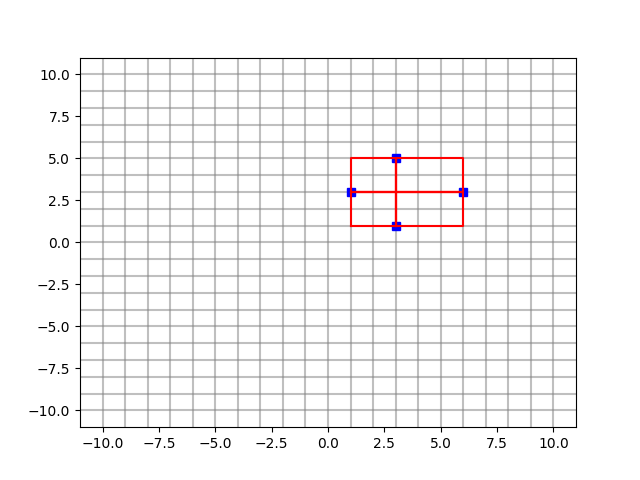

# Алгоритмы
## Минимальный прямоугольник
На клетчатой плоскости закрашено K клеток. Требуется найти минимальный по площади прямоугольник, со сторонами, параллельными линиям сетки, покрывающий все закрашенные клетки.

Формат ввода:

Во входном файле, на первой строке, находится число K (1 ≤ K ≤ 100). На следующих K строках находятся пары чисел Xi и Yi — координаты закрашенных клеток (|Xi|, |Yi| ≤ 109).

Формат вывода:

Выведите в выходной файл координаты левого нижнего и правого верхнего углов прямоугольника.

Пример:

    Ввод    Вывод
    4       1 1 6 5
    1 3
    3 1
    3 5
    6 3

### Решение
```python
def min_rectangle(k, points):
  """
  Находит минимальный прямоугольник, покрывающий все закрашенные клетки.

  Args:
    k: Количество закрашенных клеток.
    points: Список пар чисел (x, y) - координаты закрашенных клеток.

  Returns:
    Список из 4 чисел: (x1, y1, x2, y2) - координаты левого нижнего и 
    правого верхнего углов прямоугольника.
  """

  # Находим минимальные и максимальные координаты по X и Y.
  min_x = min(point[0] for point in points)
  max_x = max(point[0] for point in points)
  min_y = min(point[1] for point in points)
  max_y = max(point[1] for point in points)

  # Возвращаем координаты прямоугольника.
  return min_x, min_y, max_x, max_y

# Считываем данные из входного файла.
with open("input.txt", "r") as f:
  k = int(f.readline())
  points = [list(map(int, line.split())) for line in f]

# Находим минимальный прямоугольник.
result = min_rectangle(k, points)

# Записываем результат в выходной файл.
with open("output.txt", "w") as f:
  f.write(" ".join(map(str, result)))
```

Визуально это можно представить так:


*P.S. Правда мне понятно почему задача называется мининальный прямоугольник, при этом мы находим координаты самого большого прямоугольника.*

## Петя, Маша и верёвочки
На столе лежали две одинаковые верёвочки целой положительной длины.

Петя разрезал одну из верёвочек на N частей, каждая из которых имеет целую положительную длину, так что на столе стало N+1 верёвочек. Затем в комнату зашла Маша и взяла одну из лежащих на столе верёвочек. По длинам оставшихся на столе N верёвочек определите, какую наименьшую длину может иметь верёвочка, взятая Машей.

Формат ввода:

Первая строка входных данных содержит одно целое число N — количество верёвочек, оставшихся на столе (2 ≤ N ≤ 1000). Во второй строке содержится N целых чисел li — длины верёвочек (1 ≤ li ≤ 1000).

Формат вывода:

Выведите одно целое число — наименьшую длину, которую может иметь верёвочка, взятая Машей.

Пример 1:

    ввод      вывод
    4         1
    1 5 2 1

Пример 2:

    ввод      вывод
    4         24
    5 12 4 3

### Решение
```python
def missing_rope(lengths):
  
  # Сумма длин всех веревок
  total_length = sum(lengths)
  
  missing_rope_length = total_length

  for v in lengths:
    sum_other = total_length - v
    if v > sum_other:
      # найдена полная веревка, вычисляем разницу
      # и прекращаем цикл
      missing_rope_length = v - sum_other
      break

  return missing_rope_length

# Считываем данные из входного файла.
with open("input.txt", "r") as f:
  k = int(f.readline())
  points = list(map(int, f.readline().split()))

# Находим минимальный прямоугольник.
print(missing_rope(points))
```

## Продавец рыбы
Вася решил заняться торговлей рыбой. С помощью методов машинного обучения он предсказал цены на рыбу на N дней вперёд. Он решил, что в один день он купит рыбу, а в один из следующих дней — продаст (то есть совершит или ровно одну покупку и продажу или вообще не совершит покупок и продаж, если это не принесёт ему прибыли). К сожалению, рыба — товар скоропортящийся и разница между номером дня продажи и номером дня покупки не должна превышать K.

Определите, какую максимальную прибыль получит Вася.

Формат ввода:

В первой строке входных данных задаются числа N и K (1 ≤ N ≤ 10000, 1 ≤ K ≤ 100).

Во второй строке задаются цены на рыбу в каждый из N дней. Цена — целое число, которое может находится в пределах от 1 до 10^9.

Формат вывода:

Выведите одно число — максимальную прибыль, которую получит Вася


Пример 1:

    ввод        вывод
    5 2         2
    1 2 3 4 5

Пример 2:

    ввод        вывод
    5 2         0
    5 4 3 2 1

### Решение

```python
def max_revenue(N, K, prices):
  max_profit = 0

  # 1 2 3 4 5
  for buy_day in range(N):
    for sell_day in range(buy_day + 1, min(N, buy_day + K + 1)):    
      profit = prices[sell_day] - prices[buy_day]
      if (profit > max_profit):
        max_profit = profit
  
  return max_profit

# Считываем данные из входного файла.
with open("input.txt", "r") as f:
  N, K = map(int, f.readline().split())
  prices = list(map(int, f.readline().split()))  

# Вызываем функцию и выводим результат
print(max_revenue(N, K, prices))
```

## Шахматная доска
Из шахматной доски по границам клеток выпилили связную (не распадающуюся на части) фигуру без дыр. Требуется определить ее периметр.

Формат ввода:

Сначала вводится число N (1 ≤ N ≤ 64) – количество выпиленных клеток. В следующих N строках вводятся координаты выпиленных клеток, разделенные пробелом (номер строки и столбца – числа от 1 до 8). Каждая выпиленная клетка указывается один раз.

Формат вывода:

Выведите одно число – периметр выпиленной фигуры (сторона клетки равна единице).

Пример 1
    
    ввод    вывод
    3       8
    1 1
    1 2
    2 1

Пример 2

    ввод    вывод
    1       4
    8 8

### Решение

```python
def calculate_perimeter(N, cells):
  perimeter = 0
  for i in range(N):
    row, col = cells[i]
    # Проверяем клетки вокруг текущей клетки
    for dr, dc in [(1, 0), (-1, 0), (0, 1), (0, -1)]:
      nr, nc = row + dr, col + dc
      # Если клетка вне границы или пустая, увеличиваем периметр
      if nr < 1 or nr > 8 or nc < 1 or nc > 8 or (nr, nc) not in cells:
        perimeter += 1
  return perimeter

cells = []

# Считываем данные из входного файла.
with open("input.txt", "r") as f:
  N = int(f.readline())

  for line in f:
    val = map(int, line.split())
    cells.append(tuple(list(val)))  

# Вызываем функцию и выводим результат
print(calculate_perimeter(N, cells))
```